# ice-web-components

Canvas-native UI components for [`ice-render`](https://github.com/ice-render/ice-render) —
Swing-style widgets with a Bootstrap-flavoured look, rendered entirely on a single
`<canvas>`. No DOM widgets, no CSS framework: every pixel (including popups, focus
rings and shadows) is drawn by the engine.


> ⚠️ **Just for fun.** This project is created purely for fun and exploration. It is
> not intended as a production-ready or battle-tested UI library.

## 1. Architecture at a glance

`ice-web-components` sits on top of the `ice-render` engine: the engine draws the
canvas and runs the scene graph, layout and hit-testing; this package adds managers,
components and pure logic models on top of it.

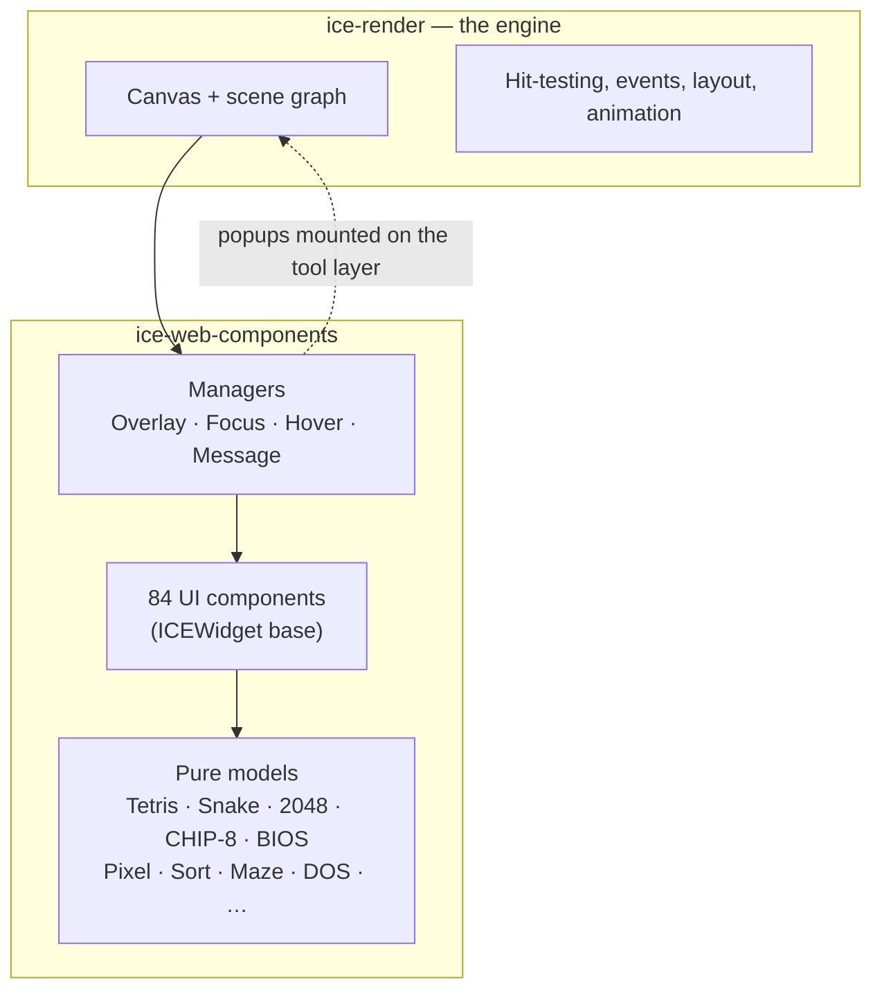

## 2. Highlights

- **84 UI components** (+20 pure models, 5 managers, 2 base classes → 111 exported
  classes; the count in
  [`docs/components.md`](./docs/components.md) is generated from the source, so it
  cannot drift) — buttons, inputs, selects, tables, trees, menus, modals, drawers,
  notifications, uploads, date/time pickers, cascader, transfer, carousel, colour
  picker… and the small stuff (tags, badges, avatars, skeletons, spins).
- **One overlay stack for every popup** — Modal / Drawer / Dropdown / Tooltip /
  Popover / Popconfirm / Select / DatePicker / Cascader all go through
  `ICEOverlayManager`: 12 placements, auto flip + clamp to the visible area,
  Esc / outside-click closing, focus trap, enter/exit animation.
- **Forms with sync + async validation** — `ICEFormModel` (required / min / max /
  length / pattern / custom / **asyncValidator**), `ICEFormItem` shows errors and a
  “validating…” state, `submitAsync()` waits for the async rules.
- **Keyboard & focus** — Tab / Shift+Tab rotation, Enter/Space activation,
  arrow keys for sliders, menus, tabs and rate; ring drawn above everything.
- **Bootstrap 5 token theme** (plus a dark theme) — swap with one call.
- **No name collisions with the engine** — the package’s runtime exports are
  disjoint from `ice-render`’s (there is a regression test for it).
- **Actually tested** — 1356 unit tests (192 suites, as of 2026-09-17: form validation, overlay
  positioning, keyboard navigation, sort/hover/focus edge cases, the Minesweeper,
  Tetris, Snake, 2048 and CHIP-8 rule/machine models, the pixel canvas and the undo
  stack, the console BIOS, the trace player + sorting/pathfinding and the DOS terminal)
  plus eight browser QA suites (`qa:admin`, `qa:gallery`, `qa:workbench`, `qa:xp`,
  `qa:arcade`, `qa:pixel`, `qa:algo`, `qa:dos` — 303 assertions) that drive the demo pages with
  real mouse and keyboard events and fail on any console error.

## 3. Core systems

Two subsystems are worth a closer look before the examples.

### 3.1 One overlay stack

Every popup — Modal / Drawer / Dropdown / Tooltip / Popover / Popconfirm / Select /
DatePicker / Cascader — opens through `getICEOverlayManager(ice)` and is mounted on the
engine’s tool layer, above the scene and excluded from scene hit-testing. The manager
owns placement, the close policy and the enter/exit animation:

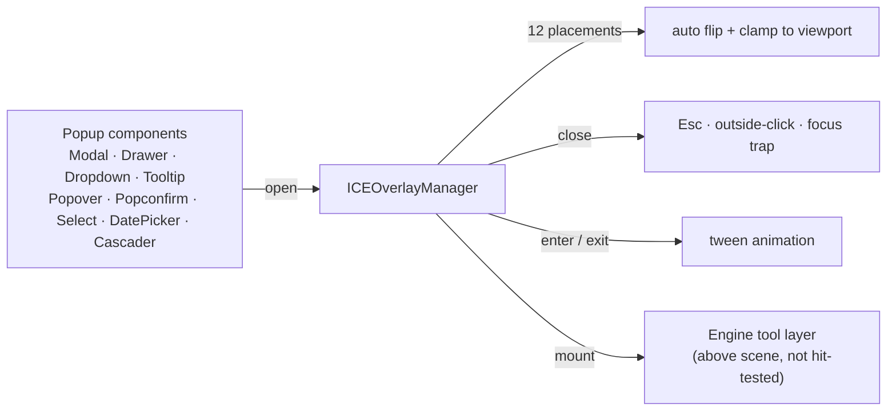

### 3.2 Forms: sync + async validation

`ICEFormModel` holds the rules, `ICEFormItem` renders the error (or a “validating…”
state), and `submitAsync()` waits for the async rules to settle before resolving:

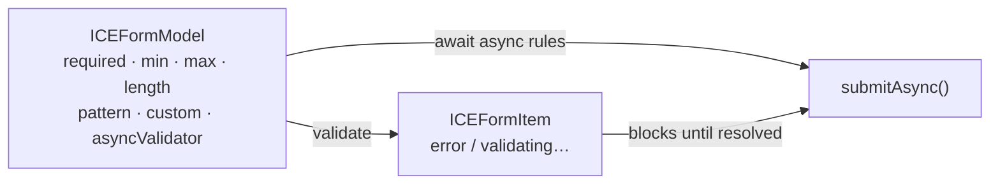

## 4. Quick start

> **Install**: both packages are on npm now — `npm install ice-web-components` (it pulls
> `ice-render` as a dependency). `1.0.0` is the first published release; from a checkout you
> can also `npm install /path/to/ice-web-components` or `npm install git+https://github.com/ice-render/ice-web-components.git`.

```bash
npm install ice-web-components   # + ice-render, pulled automatically
```

The published tarball contains `dist/` only (cjs + esm + umd + type declarations).

```ts
import { ICE } from 'ice-render';
import {
  ICEButton,
  ICEHoverManager,
  ICELabel,
  ICEMessage,
  ICEPanel,
  getICEFocusManager,
} from 'ice-web-components';

const ice = new ICE().init('canvas');
new ICEHoverManager(ice).start();   // canvas has no native hover: opt in
getICEFocusManager(ice).start();    // Tab / Enter / Esc handling

const panel = new ICEPanel({ left: 24, top: 24, width: 372, height: 192 });
panel.addChild(new ICELabel({ left: 24, top: 20, text: 'Quick start' }));

const button = new ICEButton({ left: 24, top: 64, width: 140, text: 'Click me' });
const hint = new ICELabel({ left: 24, top: 112, text: 'clicked 0 times' });
let count = 0;
button.on('click', () => {
  count += 1;
  hint.setText(`clicked ${count} times`);
  ICEMessage.success(ice, `clicked ${count} times`);
});

panel.addChildren([button, hint]);
ice.addChild(panel);
```


### 4.1 From a script to a page

The snippet above is the right shape for a **demo**: a canvas, a few components, a module-level
counter. But the moment it becomes an actual **page** — several components that must update when
data changes, a second page in the same app, a host that pushes fresh data — stop stacking
`ice.addChild(...)` calls and wrap it in one class. That is the family-wide convention
(one page = one class):

```ts
import { ICE } from 'ice-render';
import { ICEContainer, ICELabel, ICETable } from 'ice-web-components';

const ice = new ICE().init('canvas');

class DataPage extends ICEContainer {
  private readonly table: ICETable;                 // ① build the tree once, in the constructor

  constructor() {
    super({ left: 0, top: 0, width: 960, height: 640 });
    this.addChild(new ICELabel({ left: 16, top: 12, text: 'Run data' }));
    this.table = new ICETable({ left: 16, top: 48, width: 928 });
    this.addChild(this.table);
  }

  /** ② the single place that writes new data — the host calls it once fresh data is in place */
  onUpdate(snapshot: { rows: any[] }): void {
    this.table.setData(snapshot.rows);
  }
}

ice.addChild(new DataPage());
```

Three signs it is time to upgrade from script to page: **a second page**, **data pushed by a host**,
and **the same structure being re-filled over and over**. A page never calls back into its host —
it *declares* what it needs (`headerActions()` / `statusTags()` / `islandSpecs()`) and the host asks.

The full contract — who calls `onUpdate()` and when, which layer to pick for what, where the line
between stable structure and mutable content sits, the acceptance checklist and the pitfalls we
actually hit — is written up as
[应用层：一个页面怎么写](https://ice-render.github.io/ice-render-doc/docs/conventions/app-pages)
(Chinese), with the container contract itself in
[`docs/guides/layout.md`](./docs/guides/layout.md) §6.

## 5. Documentation

Full docs live in [`docs/`](./docs/README.md):

| | |
|---|---|
| [Architecture](./docs/architecture.md) | Layers, component model, rendering & repaint, events & hover, overlays / focus / forms / theming, plus a “pitfalls” table |
| [Component cheat sheet](./docs/components.md) | 80 component classes, one line each, grouped, with links into the API |
| [API reference](./docs/api/README.md) | Constructor props and public methods for every component (**generated from source**, so it cannot drift) |
| [Examples & scenarios](./docs/guides/examples.md) | What each of the six demo pages shows, which components it uses, and a checklist for building your own |
| [Theming & colour](./docs/guides/theming.md) | Token groups, status colours, `*TextEmphasis`, custom themes |
| [Forms & validation](./docs/guides/forms.md) | The three layers, the rule list, async validation, wiring a custom control |
| [Overlay guide](./docs/guides/overlays.md) | The three ways to use popups, positioning, close policies, content factories |
| [Canvas layout](./docs/guides/layout.md) | Coordinates & zIndex, cluster + shelf layout, clipping & scrolling, when sizes are ready |
| [Writing your own component](./docs/guides/custom-components.md) | Three levels of effort, constructor conventions, interaction / form / overlay / theme hooks, type registration and pitfalls |
| [Testing](./docs/guides/testing.md) | Unit-test recipes (fake ICE + real components) and the browser QA scripts |
| [Migration](./docs/guides/migration.md) | `UI*` → `ICE*`, token theming, other breaking changes |

> The guide pages themselves are written in Chinese for now; this README is English-only.

## 6. Demos

All pages under `examples/` are plain HTML — build the package, then open them
(or serve the folder with any static server).

### 6.1 `gallery.html` — every component in one page

Rendered with a small hand-rolled flow layout (clusters keep their internal
geometry, clusters wrap like shelves), so adding a demo never requires hunting for
free coordinates.


### 6.2 `admin.html` — a six-page back-office

A small “ICE Shop” admin: sidebar with submenus, breadcrumb + page search +
notifications/user menu in the header, a floating action button, a first-run tour,
and six pages that switch inside a scroll pane.

The business flow is deliberately complete: order filtering (keyword / region /
amount range / abnormal-only) with a batch toolbar, an order drawer with
fulfilment steps and a service timeline, inventory warnings with pagination,
product gallery preview, customer insights with satisfaction scoring, a
splitter-based fulfilment workbench with anchors, and a settings pane whose
password form validates across fields.

| Dashboard | Orders |
|---|---|
|  |  |
|  |  |
|  |  |

Popup layers used by that demo:

| Order detail drawer | New-order dialog | Notification dropdown |
|---|---|---|
|  |  |  |

### 6.3 `custom-component.html` — write your own component

The same “write a component and plug it into ICE” story as
[`docs/guides/custom-components.md`](./docs/guides/custom-components.md), but
runnable: a hand-written `ICEMetric` card that reacts to clicks, hover and
keyboard, and participates in `ICEForm` validation.


### 6.4 `workbench.html` — customer-support workbench

A second end-to-end scenario (deliberately *not* a dashboard): a three-pane support
workbench built with `ICESplitter` — ticket queue with filters and skeleton loading,
conversation pane with reply composer / quick-reply dropdown / attachment upload /
ticket tags, and a customer profile pane with satisfaction rating, history timeline
and knowledge base. Session log: ticket selection drives the profile, sending a
reply appends a message, the floating button opens a 3-step tour, and the
back-to-top button appears once the conversation scrolls.


### 6.5 `windows-xp.html` — a full-screen Windows XP desktop

The fun one: a canvas-only XP desktop that **boots**. Turn it on and you get the black
boot splash (self-drawn four-colour flag + the running progress blocks), then the blue
welcome screen: pick a user tile, type anything (or nothing) into the password box and
press Enter — *any* credentials are accepted, this is a toy. Then the desktop fades in
with a synthesized startup chime.

The sound is generated live with WebAudio (startup / logoff / shutdown / click cues) —
original tones, no audio files, no Microsoft assets. Hover the tray speaker in the
taskbar to mute it. Log off from the Start menu and you drop back to the welcome
screen; shut down and you get the black "it is now safe to turn off your computer"
screen with a power button that boots the machine all over again.

The desktop itself: wallpaper, desktop icons, taskbar with a
working clock, a Start menu, and draggable windows with minimise / maximise / close.
Seven tiny apps are wired up (My Computer, My Documents, Notepad, Paint, Minesweeper,
Internet Explorer, Display Properties), and switching the wallpaper in Display
Properties repaints the desktop immediately.

Looks the part too: it switches to the library's built-in `ICE_XP_THEME` (Luna blue +
classic grey controls), draws every icon with engine primitives (no bitmap assets, no
Microsoft artwork), and initialises with `dpr` so text stays crisp on Retina screens.

Minesweeper is the full game: beginner / intermediate / expert, first-click-safe mine
placement, flood fill, right-click flag cycle (🚩 / ❓), chord on double click, LED
counters, a timer that starts on the first click, and per-difficulty best times. Its
rules live in a tested pure model (`ICEMinesweeperModel`) — the UI only draws it.


Internet Explorer is a **real** browser too: the address bar `fetch()`es the URL,
`DOMParser` parses the HTML, and the title / headings / paragraphs / links / images are
drawn with canvas components inside a scroll pane (with back / forward / refresh).
Same-origin pages always work; other sites obey CORS like any browser, and failures
land on an XP-style error page. Serve the folder over http (`npx serve .`) — `fetch`
does not work from `file://`.
Right-click works because `ICE.init()` no longer stops the `contextmenu` event on its
way to the dispatcher (ice-render 1.4.1).


Two new generic components came out of it: `ICEWindow` (window chrome with an XP Luna
title bar, drag, resize, maximise/restore, activate event) and `ICEIconTile`
(selectable icon tile that opens on double click).

The eighth app is **ICE Arcade** — the handheld console from `arcade.html`, running
inside an XP window. It reuses the same two pure models and the same `ICETileMap`
(so the board is still one node), and the desktop routes the keyboard to it only while
that window is active; closing the window stops its step timer.


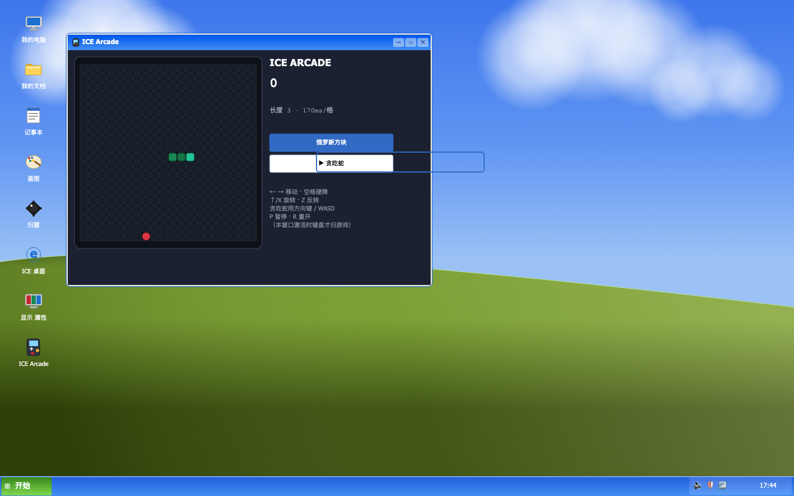

| Boot splash | Welcome screen | Password page |
|---|---|---|
|  |  |  |


### 6.6 `arcade.html` — ICE Arcade (a handheld console)

Not a web page but a **handheld console**: the shell, the screen bezel, the HUD cards,
the buttons and the sound switch are all ICE components, and there is not a single
bitmap asset in the picture. Four cartridges are plugged in, and the cartridge row at
the top switches between them (a fifth slot, Chinese chess, is disabled for now).

Before any cartridge runs, the console boots through its own **BIOS**: a power-on
self-test (CPU / RAM / VRAM / SOUND / CART, each line going grey → amber → green with a
beep) followed by a classic boot menu, exactly like the real thing.

| POST (power-on self-test) | BIOS boot menu |
|---|---|
| 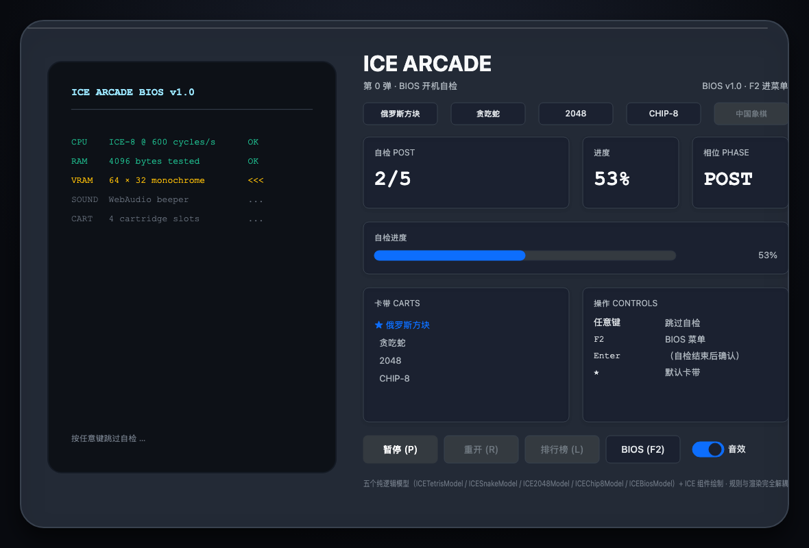 | 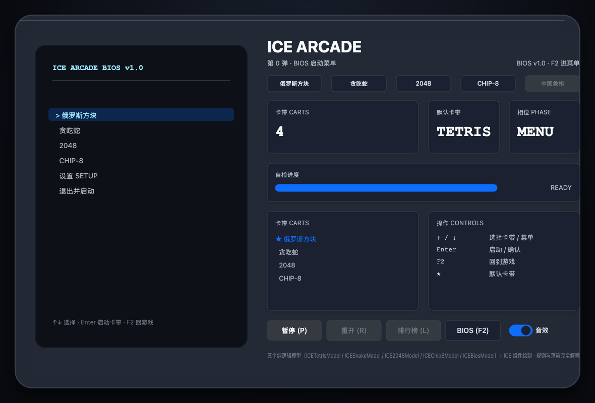 |

`ICEBiosModel` is the state machine behind it (pure logic, 17 unit tests): the self-test
is a **timed sequence** the page advances with `tick(dt)` — each step owns its duration and
reports `pending` / `running` / `ok`; the menu is a cursor + confirm console UI with a
**wrapping** cursor; `confirm()` returns an *action* (`boot` / `settings` / `menu`) instead
of executing it, so the whole flow is testable in node. Settings (quick boot + default
cartridge) persist through an injected storage that degrades gracefully on corrupt JSON
or a full quota.

The boot flow is a small state machine the page drives (`tick(dt)` advances the
self-test; the menu is a cursor + confirm console):

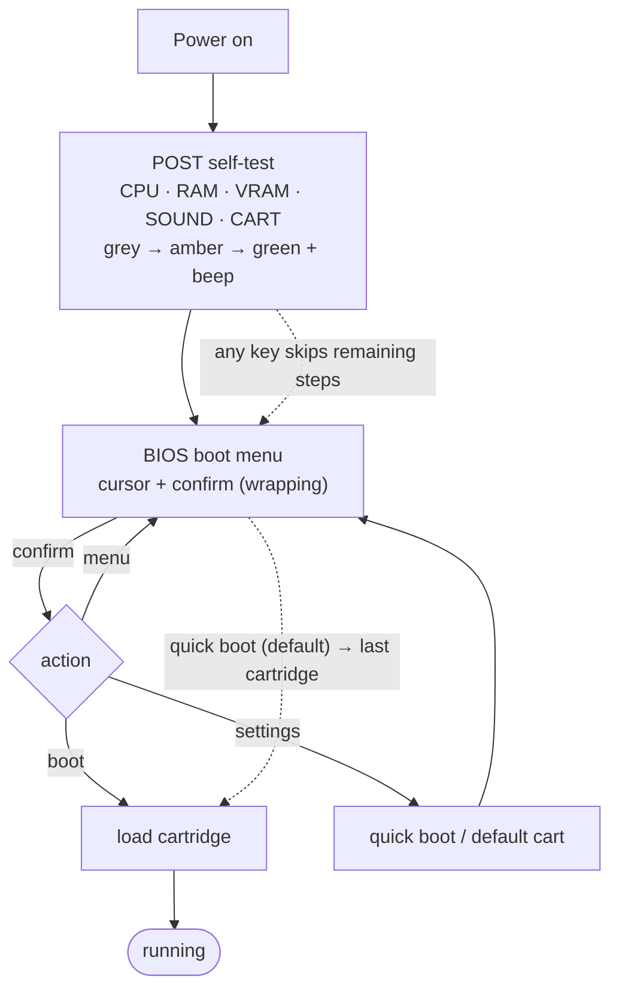

F2 (or the BIOS button) returns to the menu at any time — on a game page that *is* the
reset button. Any key during POST skips the rest of the self-test, and with quick boot on
(the factory default) the console goes straight back to the last cartridge after POST.

| | |
|---|---|
|  |  |

**Cartridge 1 — Tetris** (`ICETetrisModel`, 16 unit tests). Modern-standard rules:
7-bag fairness, simple wall kicks (0 / ±1 / ±2), a ghost landing preview, soft drop
+1/cell, hard drop +2/cell, line scores of 100/300/500/800 × level, a level-up every 10
lines, and a gravity interval that starts at 800 ms and shrinks with the level.
Keyboard: `←` / `→` move, `↓` soft drop, `Space` hard drop, `↑` / `X` rotate clockwise,
`Z` rotate counter-clockwise, `P` pause, `R` restart.

**Cartridge 2 — Snake** (`ICESnakeModel`, 18 unit tests). Classic rules: the snake grows
on every meal (+10 points × level), 5 meals per level, an interval that drops from
170 ms per cell towards 70 ms, a two-deep turn queue that refuses 180° reversals (and
lets you survive moving into the tail cell that is about to vacate), and walls that
kill. Keyboard: arrows or `W` / `A` / `S` / `D` to steer, `P` pause, `R` restart.
Clicking a cell on the board steers towards it — that is the tile map’s `cellclick`,
i.e. a real hit test inside a single component.

**Cartridge 3 — 2048** (`ICE2048Model`, 21 unit tests). The classic rules: two starting
tiles, merges score their own value, each tile merges at most once per move (so `2 2 2 2`
becomes `4 4`, not `8`), a move that changes nothing spawns nothing, and filling the board
without any merge left is game over. Reaching 2048 wins but lets you keep playing.
Arrows or `W` / `A` / `S` / `D` slide, `P` pauses, `R` restarts. The numbers are drawn by
the tile map’s **label layer** — the palette entry for each value carries its font size,
weight and text colour, so a 4×4 board with 16 numbers is still one node.


**Cartridge 4 — CHIP-8** (`ICEChip8Model`, 19 unit tests). The odd one out: instead of
“the rules of a game” it is **an actual virtual machine** — 4 KB of memory, `V0`–`VF`,
the 16-bit `I` register, a 64×32 monochrome framebuffer, two 60 Hz timers and a 16-key
keypad. 35 opcodes are implemented (`00E0` / `1NNN` / `2NNN` / `DXYN` / `EX9E` / `FX0A` /
`FX29` / `FX33` / `FX55` …), including `DXYN`’s XOR drawing with the classic
`VF = collision` flag and `FX0A` blocking key waits.

The console ships a **self-written demo ROM** (no external ROM, no copyright questions):
it clears the screen, draws an 8×8 smiley, moves it, flips its velocity when a wall is
reached, and loops — which exercises conditional skips and two’s-complement arithmetic
as well as drawing. Both the 2048-cell framebuffer and the 4×4 machine keypad are single
`ICETileMap` nodes; the keys light up while pressed, which makes the `keydown` / `keyup`
path visible. On that cartridge the machine owns its 16 keys (`1 2 3 4 / Q W E R / A S D F
/ Z X C V`), so the console hands even `R` to the ROM and keeps `P` for pause.

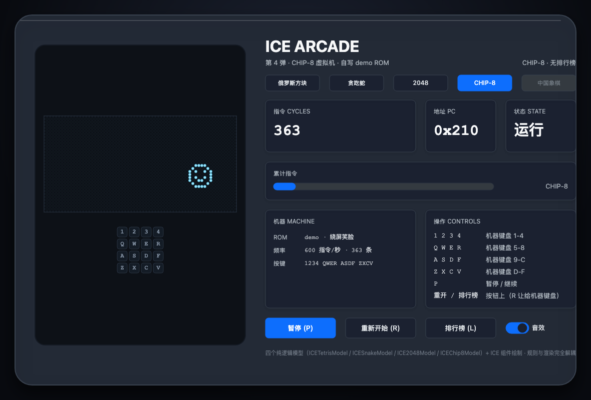

All four games are pure models that never touch the canvas; the page only reads the model
and paints cells. Switching a cartridge tears the old board down, builds the new one
and re-captions the HUD, so another game is a registry entry plus a `mount()`.
Switching away from the tab pauses whatever is running (CHIP-8 also drops its pressed
keys, otherwise a lost `keyup` would leave `FX0A` waiting forever).

Switching cartridges is a teardown-and-rebuild, not a mutation of a shared board:

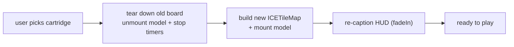

| Pause overlay (`Paused`) |
|---|
| 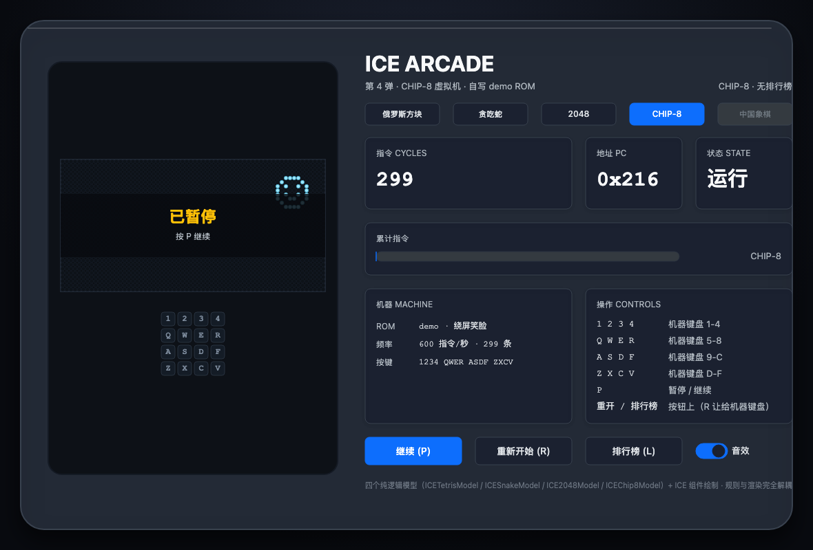 |

Under the hood this page is where the engine work happens:

- **`ICETileMap`** paints a whole board (10×20 or 20×20 cells) inside **one** node —
  it extends the widget base, draws the grid in `doRender()` with the engine context and
  keeps its own dirty flag, so a 400-cell snake board is 1 node instead of 400 (the QA
  asserts `childNodes.length === 0`). Ghost landing spots go through its highlight layer,
  line clears and meals go through `pulse()`, which fades the overlay with a `tween`.
- **`registerTheme('arcade', ICE_ARCADE_THEME)`** moves the game palette into tokens:
  pieces and snake colours ship as `ICE_ARCADE_PALETTE`, so the board re-skins with the
  rest of the UI instead of hard-coded hex values in the page.
- **`ICEHighScoreModel`** keeps a per-cartridge top-5 (sorting, capping, corrupt-storage
  tolerance, injected storage) and the **Leaderboard (L)** button opens an `ICEModal`
  containing an `ICETable` inside an `ICEScrollPane`.
- `fadeIn` on cartridge switch, `scaleIn` on game over, `pulse` on line clears — all
  from `ICEAnimation`, so the “juice” is library code rather than hand-rolled decay.
- Toasts are **replaced, not stacked**: a console only needs one status line, and the QA
  caught a stack of three toasts covering the cartridge row (the click never reached the
  button). `ICEMessage` still supports stacking for pages that want it.
- CHIP-8 also drove two engine fixes: an offscreen-cache bug where a bitmap baked the
  *ancestor’s* opacity (so the pause plate faded in but its “Paused” text never appeared —
  translucent subtrees are no longer cached, and stale bitmaps are dropped), and
  keyboard routing that lets a cartridge declare the keys it owns.

| Leaderboard (`ICEModal` + `ICETable` + `ICEScrollPane`) |
|---|
|  |

> This page deliberately does **not** start `ICEFocusManager` — it activates the
> focused button with Enter/Space, which collides head-on with “Space = hard drop”.
> A game page keeps the keyboard for itself; mouse hover still goes through
> `ICEHoverManager`.

### 6.7 `pixel-editor.html` — ICE Pixel Studio (a real pixel editor)

The other direction: instead of “draw a business screen”, this page is a **tool**.
The canvas, tool palette, colour swatches and status bar are all components — only the
pixels themselves are self-drawn, as a single `ICETileMap` node. Pencil, eraser, line,
rectangle and flood fill, undo/redo, and PNG + SVG export.

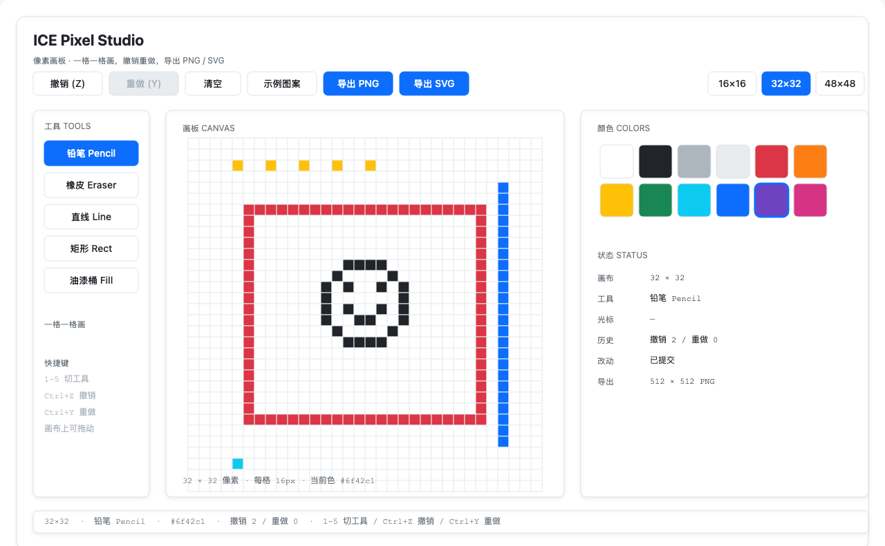

Two pure models carry it (no canvas involved):

```ts
import { ICEPixelModel, ICEHistoryModel } from 'ice-web-components';

const model = new ICEPixelModel({ rows: 32, cols: 32, palette: PALETTE, background: 0 });
model.setPixel(4, 4, 1);        // live change; returns whether it really changed
model.drawLine(0, 0, 0, 7, 2);  // Bresenham
model.fill(3, 3, 5);            // 4-neighbour flood fill (iterative, no recursion)
model.commit();                 // one commit = one undo step
model.toSVG({ cellSize: 16 });  // run-length merged SVG string
model.toRGBA(16);               // feed it straight into ImageData for PNG export
```

The three decisions worth stealing:

1. **History is per *operation*, not per pixel** — a 20-cell drag pushes exactly one
   snapshot (`mousedown` paints, `mouseup` commits). Otherwise undo would need 20
   presses to walk one stroke back, which decides whether a 1024-cell editor is usable.
   `ICEHistoryModel` itself is a plain generic stack (push clears redo, trims to a limit,
   notifies with a reason) — reusable for kanban or table editing too.
2. **Preview via the highlight layer, not “draw then undo”** — dragging a line or a
   rectangle lights up `ICETileMap.setHighlights()` from `getLineCells()` /
   `getRectCells()`, and only `mouseup` commits. Preview and painting share the same
   coordinate API, so the preview is exactly what you get (a unit test paints both and
   compares cell by cell).
3. **Export is pure** — `toSVG()` merges horizontal runs into single `<rect>`s (the
   32×32 smiley emits 20 elements, not 1024), and `toRGBA(scale)` hands the page an
   `ImageData` buffer; only the page touches `canvas.toDataURL()`. The QA asserts on the
   data: the PNG check decodes the **IHDR** chunk to prove the bitmap is 512×512.

The edit loop keeps history per *operation*, not per pixel:

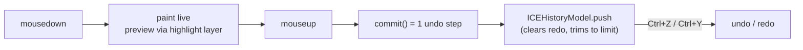

> A component gap this page closed: `ICETileMap` cached `rows`/`cols`/`cellSize` in
> instance fields, so resizing with only `setState({ rows, cols })` left the internals
> stale and the next `setTiles` threw (“expected 1024 cells, got 256”). There is now a
> proper `setSize(rows, cols, cellSize?)` that updates the internals, the state and the
> default width/height in one go, and clears the old cell data.

### 6.8 `algorithm-sandbox.html` — ICE Algorithm Sandbox

Sorting and pathfinding, visualised as **recorded traces**: each algorithm runs to
completion up front and produces a list of frames; the page then plays them back with
play / pause / single-step / rewind / speed control.

| Sorting (`quick sort`, mid-run) | Pathfinding (`A*`) |
|---|---|
| 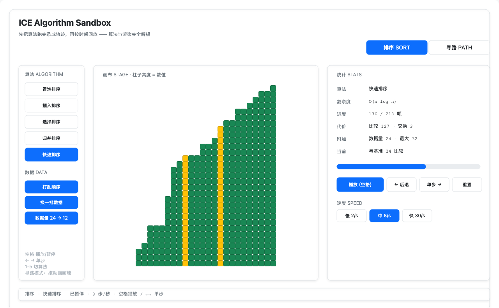 | 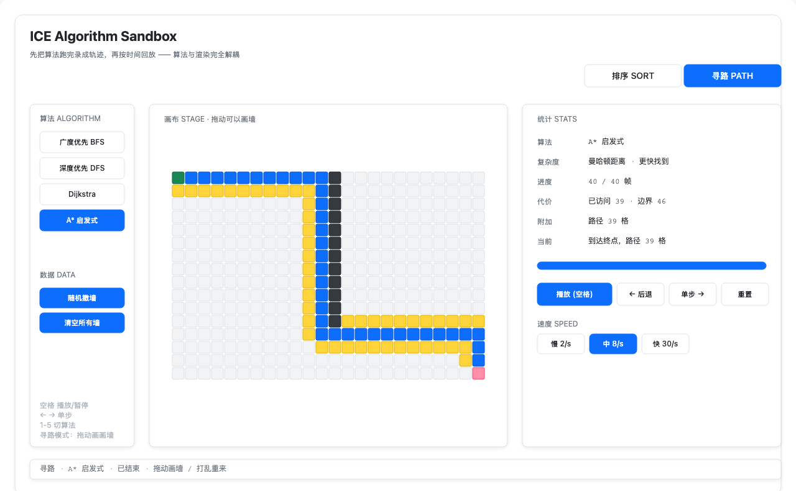 |

```ts
import { ICESortModel, ICEMazeModel, ICETracePlayerModel } from 'ice-web-components';

const sort = new ICESortModel({ size: 24, max: 32 });
const frames = sort.run('quick');     // one frame = current array + indices being compared/swapped + settled positions
const player = new ICETracePlayerModel({ speed: 8 });
player.load(frames);                  // playback: play / pause / stepForward / seek / setSpeed / tick(dt)

const maze = new ICEMazeModel({ rows: 16, cols: 24 });
maze.randomWalls(0.24);
maze.solve('astar');                  // also a series of frames: visited cells / frontier / final path
```

Why “record a trace first, play it back later” instead of painting while the algorithm
runs: the algorithm becomes a plain function with a testable output (is the last frame
sorted? does every frame contain the same multiset? do BFS and A* agree on the shortest
path?), and the player gives pause/step/rewind for free. Four algorithms are covered on
each side — bubble / insertion / selection / merge / quick, and BFS / DFS / Dijkstra / A* —
with `ICETracePlayerModel` owning the clock (1–60 steps per second, auto-stop at the end).

The split is: an algorithm model produces a list of frames, then a player owns the
clock and renders them — so the algorithm is a plain testable function and the player
gives pause / step / rewind for free:

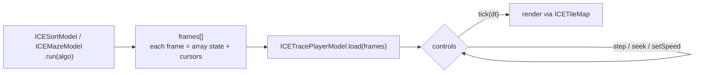

Both visualisations are single `ICETileMap` nodes: the sorting bars are a `max × n` grid
where each column is filled from the bottom (blue = untouched, amber = comparing, red =
swapping, green = settled), and the maze is a grid of cell states. The A* comparison in
the QA is the honest one: same shortest path as BFS, **fewer cells visited** (the tie-break
among equal `f` values is what makes A* actually faster on an open grid).

### 6.9 `dos-terminal.html` — ICE-DOS Terminal

A terminal you can actually type into: a virtual filesystem plus 16 commands, all in a
pure model (`ICEDosModel`) that never touches the DOM.

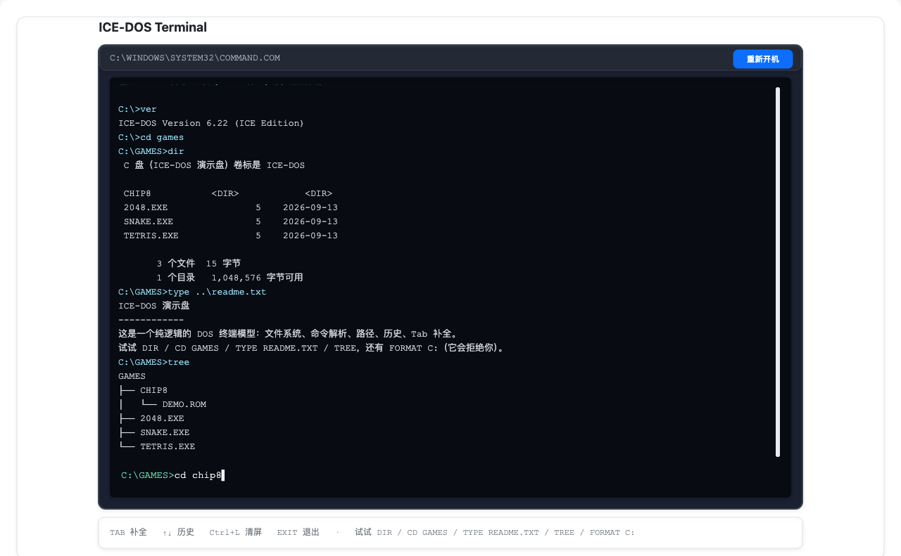

```ts
import { ICEDosModel } from 'ice-web-components';

const dos = new ICEDosModel();
dos.run('cd games');            // path resolution: \ / .. . and case-insensitive
dos.run('dir');                 // { lines: [{ text, type: 'output' | 'error' }], effect? }
dos.run('echo hi > note.txt');  // redirection (> overwrite / >> append)
dos.complete('type TET');       // Tab completion → 'type TETRIS.EXE'
dos.historyPrev();              // ↑ history
```

`run()` never throws — a typo becomes one `error` line, so the terminal cannot be crashed
by typing. The page owns the three things a terminal needs on top of that: echoing the
command line, auto-scrolling to the bottom, and a blinking cursor that **simulates** a
keyboard buffer (TAB is completion, ↑↓ is history, `Ctrl+L` clears, `exit` shows a
“powered off” overlay, any key boots again).

> This page deliberately does **not** start `ICEFocusManager` (same call as the arcade
> page): the focus manager treats TAB as “rotate focus”, which steals the terminal’s
> completion key — and once focus lands on the window’s “reboot” button, pressing Enter
> to run a command reboots the machine instead.

## 7. Components

| Group | Components |
|---|---|
| Basic | `ICEPanel` `ICEButton` `ICELabel` `ICETypography` `ICEIcon` `ICESvgIcon` `ICEIconTile` `ICESeparator` |
| Layout | `ICESpace` `ICEGrid` `ICEGridCol` `ICESplitter` `ICEScrollPane` |
| Data entry | `ICETextField` `ICETextArea` `ICEPasswordField` `ICEInputNumber` `ICESelect` `ICEAutoComplete` `ICECascader` `ICETreeSelect` `ICEDatePicker` `ICETimePicker` `ICECheckBox` `ICECheckboxGroup` `ICERadioButton` `ICERadioGroup` `ICESwitch` `ICESlider` `ICESegmented` `ICERate` `ICEColorPicker` `ICETransfer` `ICEUpload` `ICEForm` `ICEFormItem` |
| Data display | `ICEVirtualList` `ICEKanban` `ICETable` `ICEList` `ICETree` `ICEStatCard` `ICEStatistic` `ICECard` `ICEComment` `ICEDescriptions` `ICETimeline` `ICEProgressBar` `ICEAvatar` `ICEAvatarGroup` `ICETag` `ICEBadge` `ICEImageView` `ICEImagePreview` `ICECalendar` `ICECarousel` `ICECollapse` `ICEWatermark` `ICETileMap` |
| Feedback & status | `ICEAlert` `ICEModal` `ICEDrawer` `ICETooltip` `ICEPopover` `ICEPopconfirm` `ICETour` `ICEFloatButton` `ICEEmpty` `ICESkeleton` `ICESpin` `ICEResult` `ICESteps` |
| Feedback & status (static APIs) | `ICEMessage` `ICENotification` — not classes: namespace objects with static methods (`ICEMessage.show(ice, …)`) |
| Navigation | `ICEMenu` `ICEBreadcrumb` `ICEAnchor` `ICEBackTop` `ICEDropdown` `ICEPagination` `ICETabs` |
| Layout & core | `ICEWidget` `ICEContainer` `ICEHoverManager` `ICEFocusManager` `ICEMessageManager` `ICEManager` `ICEOverlayManager` (`ICEPainter` / `ICELayoutManager` are types) |
| Desktop & canvas-native | `ICEWindow` (draggable/resizable/XP chrome), `ICETileMap` (a whole board in one node — 2048 cells, 1 node) |
| Models | `ICEButtonModel` `ICEToggleModel` `ICEBoundedRangeModel` `ICESelectionModel` `ICEFormModel` `ICEBiosModel` `ICEHistoryModel` `ICEPixelModel` `ICETracePlayerModel` `ICESortModel` `ICEMazeModel` `ICEDosModel` `ICETetrisModel` `ICESnakeModel` `ICE2048Model` `ICEChip8Model` `ICEMinesweeperModel` `ICEHighScoreModel` |

Helper functions: `attachTooltip` `attachPopover` `attachPopconfirm` `attachDropdown`
`openModal` `openDrawer` `getICEOverlayManager` `getICEFocusManager` `getICEMessageManager`
`formatStatisticValue` `formatCountdown` `truncateTextLines` `buildMonthGrid` `formatCalendarDate`
`openImagePreview` `icePixelParseColor` `tween` `fadeIn` `fadeOut` `slideIn` `scaleIn` and friends.

## 8. Theme

A compact **Bootstrap 5-style** token set (see `ICE_LIGHT_THEME` / `ICE_DARK_THEME`):

- semantic colours — `primary` `#0d6efd`, `success` `#198754`, `warning` `#ffc107`,
  `error` `#dc3545`, `info` `#0dcaf0`;
- subtle pairs for soft surfaces — `primaryBg` / `primaryBorder`, `successBg` /
  `successBorder`, … plus `*TextEmphasis` (Bootstrap’s `*-text-emphasis`) for text
  sitting on those subtle backgrounds;
- neutrals — `surface`, `elevated`, `background`, `border`, `borderSecondary`;
- text hierarchy — `text`, `textSecondary`, `textTertiary`, `textDisabled`;
- spacing / radius / control sizes, Bootstrap’s three shadows (`sm` / `md` / `lg`,
  expressed as explicit `shadowColor` `shadowBlur` `shadowOffset*` numbers), and a
  `focusRing` colour for focused controls.

```ts
import { iceUIManager } from 'ice-web-components';

iceUIManager.setTheme('dark'); // hot-swaps: component styles hold theme refs, resolved at paint time
```

Component styles store **theme references** (`token('ui.colors.text')`, from the engine
`ice-render`) rather than copying colours at construction time — so switching themes does
**not** require rebuilding the component tree. App code that computes derived colours
(`mix` / `shade` / alpha) reads the current theme in `ICEWidget.onThemeChange()`.

Status chips default to Bootstrap’s solid `.text-bg-*` look (white text, black text
on the light `warning` / `info` colours). Pass `variant: 'soft'` for the subtle
background + emphasis text variant:

```ts
new ICETag({ text: 'Paid', status: 'success' });                     // solid green
new ICETag({ text: 'Paid', status: 'success', variant: 'soft' });    // #d1e7dd / #0a3622
```

## 9. Naming & exports

Everything exported by this package uses the **`ICE`** prefix (same convention as
`ice-render`), and the package’s runtime exports do **not overlap** with the
engine’s — you can import both namespaces, or name-import from both, without
ambiguity:

| concept | this package | `ice-render` |
|---|---|---|
| base class | `ICEWidget` (UI widget base, extends `ICEGroup`) | `ICEComponent` (graphic component base) |
| image | `ICEImageView` (widget, wraps the primitive) | `ICEImage` (image primitive) |

Layout classes are **not** re-exported — they belong to the engine:

```ts
import { ICEFlowLayout } from 'ice-render';
import { ICEPanel } from 'ice-web-components';

panel.setLayout(new ICEFlowLayout({ gap: 8 }));
```

## 10. Interaction notes

- **Hover** — ICE deliberately skips full hit-testing on `mousemove`, so canvas
  components have no native `mouseenter` / `mouseleave`. Attach
  `new ICEHoverManager(ice).start()` once and components get lightweight hover
  states (table rows, menu/tree items, buttons, chips…).
- **Popups** — always open through `getICEOverlayManager(ice)`; overlay content is
  mounted on the engine’s tool layer, so it renders above the scene, follows the
  anchor, and is excluded from scene hit-testing.
- **Focus** — `getICEFocusManager(ice).start()` gives Tab / Shift+Tab rotation,
  Enter/Space activation, and a ring drawn on the tool layer. The ring follows
  `:focus-visible` semantics: it only appears for **keyboard** focus, so mouse
  clicks and thumb drags stay clean. Text-entry controls (text field, number,
  select, date/time/cascader, colour picker…) opt into `focusRing: 'always'`;
  any component can declare `focusRing: 'keyboard' | 'always' | 'never'` (or
  `setFocusRingMode()`). Overlays that own the keyboard declare `keyboardCaptured`
  so the scene yields Enter/Space.
- **Rendering pitfalls worth knowing** — the engine sorts by **global zIndex**
  (creation order), so build containers before their children; components that wrap
  caller-provided nodes (carousel slides, card `extra`, modal content) raise those
  subtrees above themselves.
- **Container hit-testing** — a container that is created *after* its children and
  stays interactive will swallow every click inside it (`ICESplitter` and plain
  layout wrappers therefore ship with `interactive: false`; if you build your own
  wrapper, do the same).
- **Focus ring vs. hit-testing** — the two rules above bite together: a form item
  wrapper left interactive hides its own input from `ice.hitTest()`, so the focus
  manager can't focus it (no ring, and `getFocused()` returns null while the field
  still accepts typing through its own point-in-box check). `ICEFormItem`,
  `ICEForm`, `ICESpace`, `ICEGrid` and `ICESplitter` are all `interactive: false`.
- **Accessibility** — the engine hands you an accessibility snapshot
  (`getAccessibilityTree()`: role suggestion, `state.ariaLabel`, screen box, tab order);
  this library wires the other half: controls carry meaningful labels (buttons use their text,
  text fields fall back to the placeholder, checkboxes to their label), and
  `mountICEAccessibilityMirror(ice)` renders that snapshot into invisible-but-real DOM
  (`role` / `aria-label` / `tabindex`, positioned over the canvas). Clicking or focusing a
  mirror element focuses and activates the canvas component, so screen readers and keyboard
  users can drive a canvas UI.
- **i18n (built-in component text)** — the few strings the components render
  themselves (table empty state, OK / Cancel, upload hints, the “N items” pagination
  label, calendar month and weekday headings, default form validation messages…) come
  from a locale pack: `zh-CN` + `en-US` are built in, `registerICELocale()` adds your
  own, and `setICELocale('en-US')` changes the **global default**.
  Components read the strings when they are constructed / laid out, so after switching
  locale you must rebuild or trigger a relayout.
  **Per-instance override**: any component with built-in text accepts a `locale`
  (`new ICEUpload({ locale: 'en-US' })`, or `new ICEFormModel({ locale: 'en-US' })` for
  the form model), so two panels on the same page can each use their own language — the
  library holds no global state. `tFor('en-US')` / `t('key', vars)` let your app reuse
  the same fallback chain (requested language → default language → the key itself).
  **Priority**: instance `locale` > global `setICELocale()` (the latter is only an
  “app-level default” that applies when no instance language is set).
  **First day of the week** for calendars / date pickers is derived from the locale
  (`Intl.Locale(...).weekInfo.firstDay`: `en-US` starts on Sunday, `zh-CN` on Monday;
  falls back to Monday when the API is unavailable or the language is unknown), or
  override explicitly with `weekStart: 0..6`.
  **Boundary**: business copy does **not** go through this system — your app passes the
  **final string** to the component via any i18n library (`Intl` / ICU / i18next); line
  breaking, text direction (`direction` / `textAlign: 'start' | 'end'`) and IME are the
  engine’s responsibility.
  The full contract lives in ice-render’s `docs/architecture/17-i18n-boundary.md`.
- **Text input & IME** — focusing a text field mounts a **fully transparent native
  `<input>` / `<textarea>`** over it (`ICENativeInput`): the browser and the IME do the
  typing, `input` / `compositionend` write the value back, and `change` / form binding
  keep working. So Chinese / Japanese / Korean input works, paste works, and the caret
  is a real DOM caret — the canvas still draws every pixel (the element is invisible).
  In a runtime without `document` (Node / mini-program) it degrades to the old
  per-key `keydown` path. Pressing Enter emits `submit` on single-line fields.

## 11. Development

```bash
npm install
npm run types:check      # tsc --noEmit
npm test                 # jest (unit tests, node env)
npm run build            # cjs + esm + umd + d.ts

# examples smoke: every demo page must render (no console/pageerror, canvas painted)
npm run test:e2e
npm run verify:full      # verify + test:e2e (the pre-release one-shot)

# browser QA for examples/admin.html: layout consistency + popup open/close
# (needs playwright; point PLAYWRIGHT_PATH at an existing install if needed)
npm run qa:admin

# browser QA for examples/gallery.html: zero overlap + real interactions of the
# newest components (breadcrumb collapse, countdown, radio/checkbox groups,
# splitter drag, watermark tiling)
npm run qa:gallery

# browser QA for examples/workbench.html: queue → profile, reply composer,
# quick replies, tags/rating, tour, back-to-top, splitter drag
npm run qa:workbench

# browser QA for examples/windows-xp.html: icons, windows (drag/minimise/restore),
# boot → login (any password) → desktop, logoff/shutdown/power-on, tray mute,
# start menu, minesweeper, paint strokes, wallpaper switch, clock
npm run qa:xp

# browser QA for examples/arcade.html: both cartridges played with real key presses,
# cartridge switching, the self-drawn tile map, tweens, the leaderboard modal, and
# real clicks on the HUD
npm run qa:arcade

# browser QA for examples/pixel-editor.html: drawing with a real mouse (pencil drag,
# line/rect preview, flood fill, eraser), undo/redo via buttons and Ctrl+Z/Y, and the
# PNG (IHDR-checked) / SVG exports
npm run qa:pixel

# browser QA for examples/algorithm-sandbox.html: playback (play/pause/step/space),
# switching algorithms, the A*-vs-BFS comparison, and painting walls with a real drag
npm run qa:algo

# browser QA for examples/dos-terminal.html: typing commands, TAB completion, history,
# redirection, Ctrl+L, exit/reboot and auto-scroll
npm run qa:dos

# performance gate: per-page node budget, idle self-draw count and frame time
# (it pins today's numbers so the "single-node canvas" advantage cannot be eaten silently)
npm run qa:perf

# docs: regenerate the API reference and check relative links
npm run docs
```

`npm run qa:admin` drives a real browser: it asserts every page has zero overlapping
top-level nodes and identical first-element offsets, opens every popup layer and
asserts it can be closed again, checks that clicking an in-row action button does
not select the row, then walks the business scenario — breadcrumb follows the page,
the floating button opens the tour, the back-to-top button returns to the top, the
inventory table pages, the order queue drives the detail pane, anchors scroll the
detail, the image preview opens/zooms, and the settings password form revalidates
across fields. Every popup is screenshotted to `/tmp/qa-*.png`, and any console
error fails the run.

`npm run qa:gallery` does the same for the full gallery page with real mouse
events (hit-test path): it asserts no two top-level clusters overlap, drives the
breadcrumb collapse, the radio / checkbox groups, drags the splitter divider and
checks the watermark tiling, then screenshots to `/tmp/qa-gallery*.png`.

`npm run qa:workbench` covers the support workbench (queue → profile, reply composer,
quick replies, tags, rating, tour, back-to-top, splitter drag) and `npm run qa:xp`
covers the Windows XP desktop: the boot splash → welcome screen → typing a password and
pressing Enter (the run asserts the startup cue actually fired), log off back to the
welcome screen, shut down, power back on, logging in again with the **Log in** button, the
tray mute toggle, icons, window drag/minimise/restore, Start menu,
Minesweeper (first-click-safe, flag cycle, difficulty, timer, win), the Paint canvas,
the wallpaper switch, the clock — and the IE window really fetching pages (plus its
404 page, back button, `about:xp` table and bookmarks). `qa:xp` starts a small static
server itself, because `fetch` does not work from `file://`.

`npm run qa:arcade` plays the arcade page with **real key presses**. On the Tetris
cartridge it moves, rotates, soft-drops, hard-drops, asserts that `P` really stops
gravity, builds a deterministic board to force a line clear, keeps dropping until game
over (the best score lands in `localStorage`) and restarts with `R`. Then it clicks the
Snake cartridge and checks the swap (new board, re-captioned HUD, a fresh model), steers
with arrow keys, feeds the snake to grow it, drives it into a wall, and switches back —
plus real clicks on the pause / restart buttons and the sound switch. Layout assertions
keep both boards inside the screen bezel and the panels from overlapping.

See [ROADMAP.md](./ROADMAP.md) for the component backlog and what is still missing
per component.

## 12. License

[MIT](./LICENSE)
