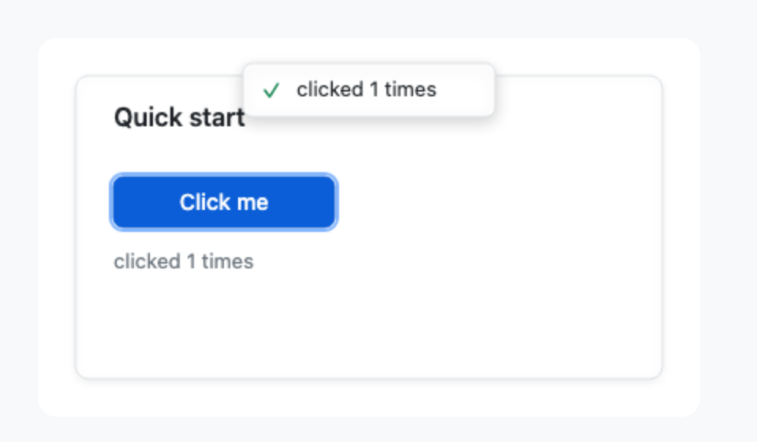
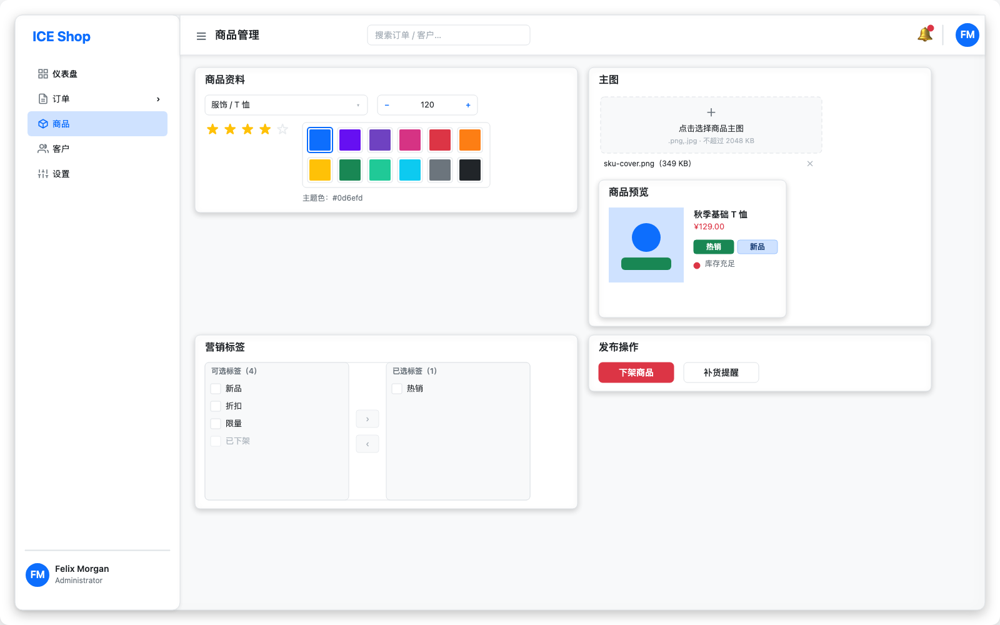
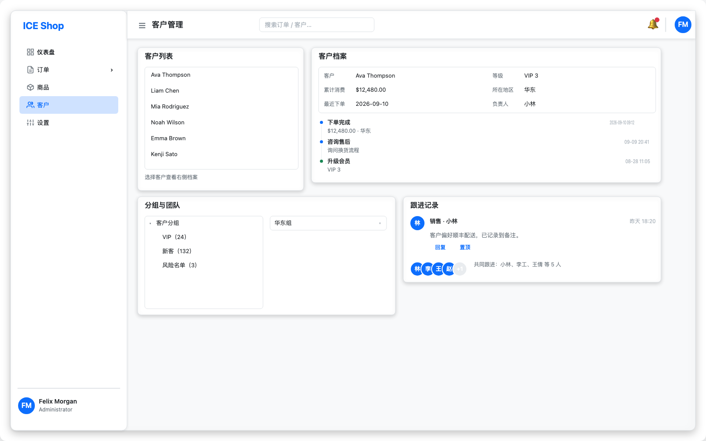
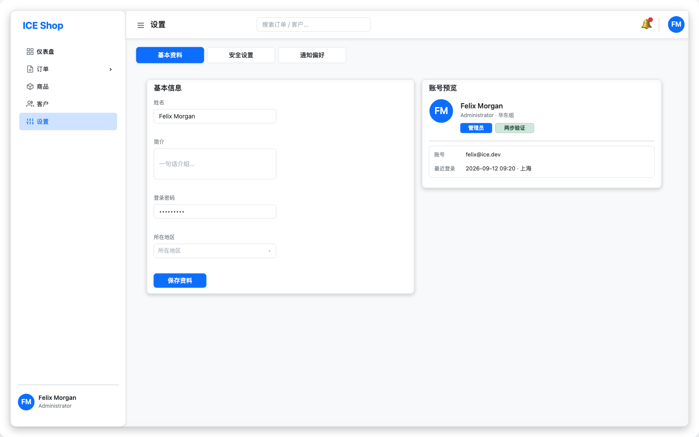
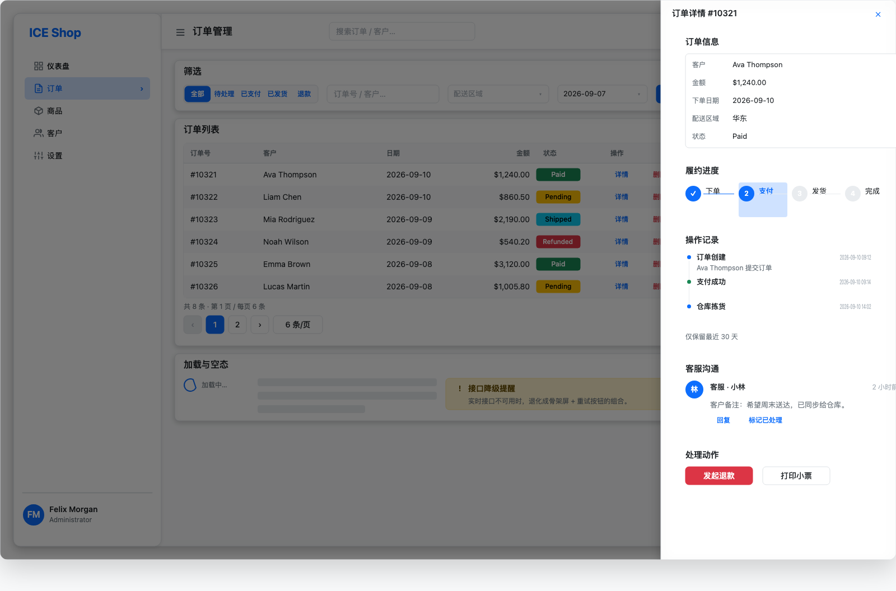
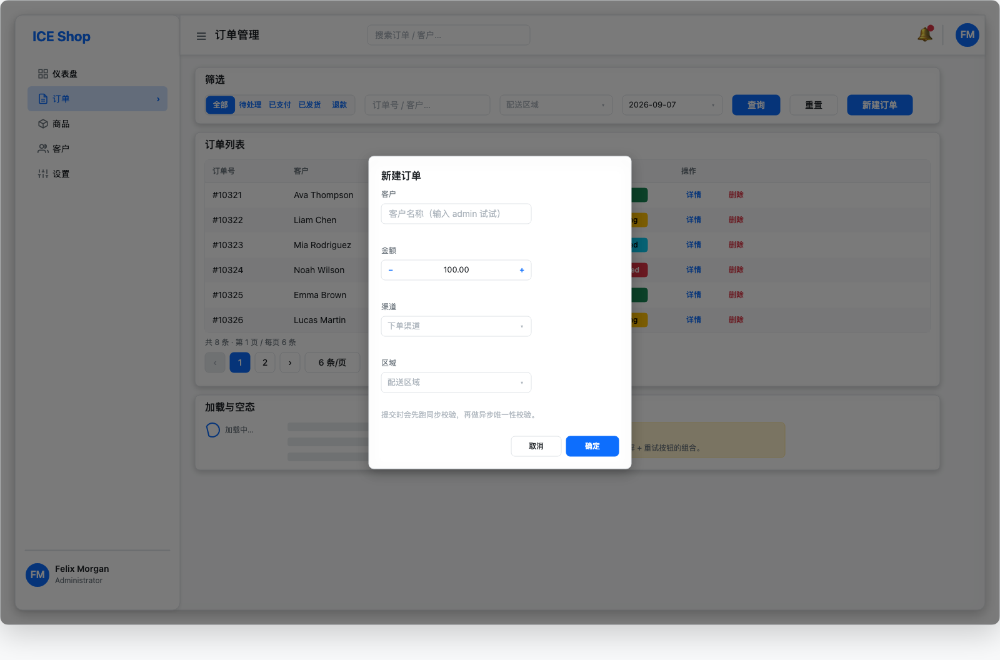
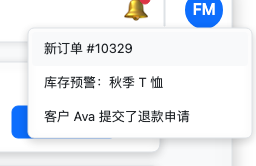
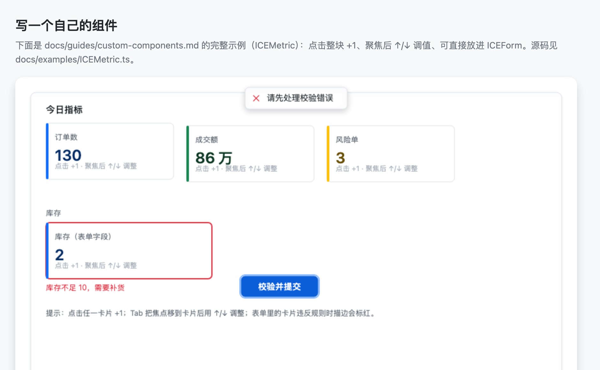
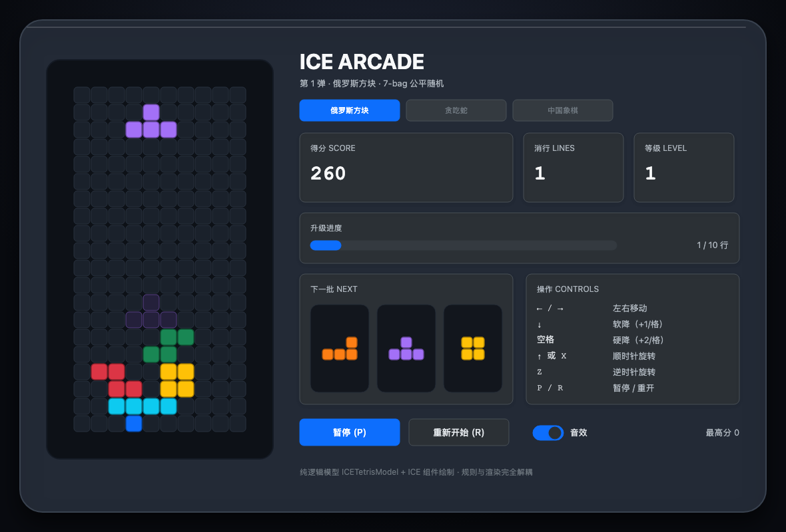

# ice-web-components

Canvas-native UI components for [`ice-render`](https://github.com/ice-render/ice-render) —
Swing-style widgets with a Bootstrap-flavoured look, rendered entirely on a single
`<canvas>`. No DOM widgets, no CSS framework: every pixel (including popups, focus
rings and shadows) is drawn by the engine.


> ⚠️ **Just for fun.** This project is created purely for fun and exploration. It is
> not intended as a production-ready or battle-tested UI library.

## Highlights

- **84 components** — buttons, inputs, selects, tables, trees, menus, modals,
  drawers, notifications, uploads, date/time pickers, cascader, transfer, carousel,
  colour picker… and the small stuff (tags, badges, avatars, skeletons, spins).
- **One overlay stack for every popup** — Modal / Drawer / Dropdown / Tooltip /
  Popover / Popconfirm / Select / DatePicker / Cascader all go through
  `ICEOverlayManager`: 12 placements, auto flip + clamp to the visible area,
  Esc / outside-click closing, focus trap, enter/exit animation.
- **Forms with sync + async validation** — `ICEFormModel` (required / min / max /
  length / pattern / custom / **asyncValidator**), `ICEFormItem` shows errors and a
  “validating…” state, `submitAsync()` waits for the async rules.
- **Keyboard & focus** — Tab / Shift+Tab rotation, Enter/Space activation,
  arrow keys for sliders, menus, tabs and rate; ring drawn above everything.
- **Bootstrap 5 token theme** (plus a dark theme) — swap with one call.
- **No name collisions with the engine** — the package’s runtime exports are
  disjoint from `ice-render`’s (there is a regression test for it).
- **Actually tested** — 539 unit tests (81 suites: form validation, overlay
  positioning, keyboard navigation, sort/hover/focus edge cases, the Minesweeper and
  Tetris rule models) plus five browser QA suites (`qa:admin`, `qa:gallery`,
  `qa:workbench`, `qa:xp`, `qa:tetris` — 149 assertions) that drive the demo pages with
  real mouse and keyboard events and fail on any console error.

## Quick start

> **Install**: the engine (`ice-render`) is on npm, but this library is not published
> yet — use one of the following:

```bash
# ① a local path (the usual thing inside a monorepo / workspace)
npm install /path/to/ice-web-components

# ② straight from git
npm install git+https://github.com/ice-render/ice-web-components.git

# ③ pack it, then install the tarball
(cd /path/to/ice-web-components && npm pack)     # produces ice-web-components-0.0.1.tgz
npm install /path/to/ice-web-components-0.0.1.tgz
```

All three pull the `ice-render@^1.3.0` dependency from npm. The published tarball
contains `dist/` only (cjs + esm + umd + type declarations).

```ts
import { ICE } from 'ice-render';
import {
  ICEButton,
  ICEHoverManager,
  ICELabel,
  ICEMessage,
  ICEPanel,
  getICEFocusManager,
} from 'ice-web-components';

const ice = new ICE().init('canvas');
new ICEHoverManager(ice).start();   // canvas has no native hover: opt in
getICEFocusManager(ice).start();    // Tab / Enter / Esc handling

const panel = new ICEPanel({ left: 24, top: 24, width: 372, height: 192 });
panel.addChild(new ICELabel({ left: 24, top: 20, text: 'Quick start' }));

const button = new ICEButton({ left: 24, top: 64, width: 140, text: 'Click me' });
const hint = new ICELabel({ left: 24, top: 112, text: 'clicked 0 times' });
let count = 0;
button.on('click', () => {
  count += 1;
  hint.setText(`clicked ${count} times`);
  ICEMessage.success(ice, `clicked ${count} times`);
});

panel.addChildren([button, hint]);
ice.addChild(panel);
```



## Documentation

Full docs live in [`docs/`](./docs/README.md):

| | |
|---|---|
| [Architecture](./docs/architecture.md) | Layers, component model, rendering & repaint, events & hover, overlays / focus / forms / theming, plus a “pitfalls” table |
| [Component cheat sheet](./docs/components.md) | 84 component classes, one line each, grouped, with links into the API |
| [API reference](./docs/api/README.md) | Constructor props and public methods for every component (**generated from source**, so it cannot drift) |
| [Examples & scenarios](./docs/guides/examples.md) | What each of the six demo pages shows, which components it uses, and a checklist for building your own |
| [Theming & colour](./docs/guides/theming.md) | Token groups, status colours, `*TextEmphasis`, custom themes |
| [Forms & validation](./docs/guides/forms.md) | The three layers, the rule list, async validation, wiring a custom control |
| [Overlay guide](./docs/guides/overlays.md) | The three ways to use popups, positioning, close policies, content factories |
| [Canvas layout](./docs/guides/layout.md) | Coordinates & zIndex, cluster + shelf layout, clipping & scrolling, when sizes are ready |
| [Writing your own component](./docs/guides/custom-components.md) | Three levels of effort, constructor conventions, interaction / form / overlay / theme hooks, type registration and pitfalls |
| [Testing](./docs/guides/testing.md) | Unit-test recipes (fake ICE + real components) and the browser QA scripts |
| [Migration](./docs/guides/migration.md) | `UI*` → `ICE*`, 业界组件库 → Bootstrap theming, other breaking changes |

> The guide pages themselves are written in Chinese for now; this README is English-only.

## Demos

All pages under `examples/` are plain HTML — build the package, then open them
(or serve the folder with any static server).

### `gallery.html` — every component in one page

Rendered with a small hand-rolled flow layout (clusters keep their internal
geometry, clusters wrap like shelves), so adding a demo never requires hunting for
free coordinates.


### `admin.html` — a six-page back-office

A small “ICE Shop” admin: sidebar with submenus, breadcrumb + page search +
notifications/user menu in the header, a floating action button, a first-run tour,
and six pages that switch inside a scroll pane.

The business flow is deliberately complete: order filtering (keyword / region /
amount range / abnormal-only) with a batch toolbar, an order drawer with
fulfilment steps and a service timeline, inventory warnings with pagination,
product gallery preview, customer insights with satisfaction scoring, a
splitter-based fulfilment workbench with anchors, and a settings pane whose
password form validates across fields.

| Dashboard | Orders |
|---|---|
|  |  |
|  |  |
|  |  |

Popup layers used by that demo:

| Order detail drawer | New-order dialog | Notification dropdown |
|---|---|---|
|  |  |  |

### `custom-component.html` — write your own component

The same “write a component and plug it into ICE” story as
[`docs/guides/custom-components.md`](./docs/guides/custom-components.md), but
runnable: a hand-written `ICEMetric` card that reacts to clicks, hover and
keyboard, and participates in `ICEForm` validation.



### `workbench.html` — customer-support workbench

A second end-to-end scenario (deliberately *not* a dashboard): a three-pane support
workbench built with `ICESplitter` — ticket queue with filters and skeleton loading,
conversation pane with reply composer / quick-reply dropdown / attachment upload /
ticket tags, and a customer profile pane with satisfaction rating, history timeline
and knowledge base. Session log: ticket selection drives the profile, sending a
reply appends a message, the floating button opens a 3-step tour, and the
back-to-top button appears once the conversation scrolls.


### `windows-xp.html` — a full-screen Windows XP desktop

The fun one: a canvas-only XP desktop that **boots**. Turn it on and you get the black
boot splash (self-drawn four-colour flag + the running progress blocks), then the blue
welcome screen: pick a user tile, type anything (or nothing) into the password box and
press Enter — *any* credentials are accepted, this is a toy. Then the desktop fades in
with a synthesized startup chime.

The sound is generated live with WebAudio (startup / logoff / shutdown / click cues) —
original tones, no audio files, no Microsoft assets. Hover the tray speaker in the
taskbar to mute it. Log off from the Start menu and you drop back to the welcome
screen; shut down and you get the black "it is now safe to turn off your computer"
screen with a power button that boots the machine all over again.

The desktop itself: wallpaper, desktop icons, taskbar with a
working clock, a Start menu, and draggable windows with minimise / maximise / close.
Seven tiny apps are wired up (My Computer, My Documents, Notepad, Paint, Minesweeper,
Internet Explorer, Display Properties), and switching the wallpaper in Display
Properties repaints the desktop immediately.

Looks the part too: it switches to the library's built-in `ICE_XP_THEME` (Luna blue +
classic grey controls), draws every icon with engine primitives (no bitmap assets, no
Microsoft artwork), and initialises with `dpr` so text stays crisp on Retina screens.

Minesweeper is the full game: beginner / intermediate / expert, first-click-safe mine
placement, flood fill, right-click flag cycle (🚩 / ❓), chord on double click, LED
counters, a timer that starts on the first click, and per-difficulty best times. Its
rules live in a tested pure model (`ICEMinesweeperModel`) — the UI only draws it.

Internet Explorer is a **real** browser too: the address bar `fetch()`es the URL,
`DOMParser` parses the HTML, and the title / headings / paragraphs / links / images are
drawn with canvas components inside a scroll pane (with back / forward / refresh).
Same-origin pages always work; other sites obey CORS like any browser, and failures
land on an XP-style error page. Serve the folder over http (`npx serve .`) — `fetch`
does not work from `file://`.
Right-click works because `ICE.init()` no longer stops the `contextmenu` event on its
way to the dispatcher (ice-render 1.4.1).

Two new generic components came out of it: `ICEWindow` (window chrome with an XP Luna
title bar, drag, resize, maximise/restore, activate event) and `ICEIconTile`
(selectable icon tile that opens on double click).

| Boot splash | Welcome screen | Password page |
|---|---|---|
|  |  |  |


### `tetris.html` — ICE Arcade (a handheld console)

The first entry in a small “mini-game collection” — and it is not a web page but a
**handheld console**: the shell, the screen bezel, the HUD cards, the buttons and the
sound switch are all ICE components, while the rules live in a pure model
(`ICETetrisModel`) that never touches the canvas.

The rules are modern-standard Tetris: 7-bag fairness, simple wall kicks (0 / ±1 / ±2),
a ghost landing preview, soft drop +1/cell, hard drop +2/cell, line scores of
100/300/500/800 × level, a level-up every 10 lines, and a gravity interval that starts
at 800 ms and shrinks with the level. Keyboard: `←` / `→` move, `↓` soft drop, `Space`
hard drop, `↑` / `X` rotate clockwise, `Z` rotate counter-clockwise, `P` pause,
`R` restart — and switching away from the tab pauses the game for you.

Model and UI are completely separate: `ICETetrisModel` (16 of the repo’s 539 unit
tests) imports no canvas at all; the page only reads the model and paints cells. That
keeps the rules testable in node and the rendering swappable.



> This page deliberately does **not** start `ICEFocusManager` — it activates the
> focused button with Enter/Space, which collides head-on with “Space = hard drop”.
> A game page keeps the keyboard for itself; mouse hover still goes through
> `ICEHoverManager`.

## Components

| Group | Components |
|---|---|
| Basic | `ICEPanel` `ICEButton` `ICELabel` `ICETypography` `ICEIcon` `ICESvgIcon` `ICESeparator` |
| Layout | `ICESpace` `ICEGrid` `ICEGridCol` `ICESplitter` `ICEScrollPane` |
| Data entry | `ICETextField` `ICETextArea` `ICEPasswordField` `ICEInputNumber` `ICESelect` `ICEAutoComplete` `ICECascader` `ICETreeSelect` `ICEDatePicker` `ICETimePicker` `ICECheckBox` `ICECheckboxGroup` `ICERadioButton` `ICERadioGroup` `ICESwitch` `ICESlider` `ICESegmented` `ICERate` `ICEColorPicker` `ICETransfer` `ICEUpload` `ICEForm` `ICEFormItem` |
| Data display | `ICETable` `ICEList` `ICETree` `ICEStatCard` `ICEStatistic` `ICECard` `ICEComment` `ICEDescriptions` `ICETimeline` `ICEProgressBar` `ICEAvatar` `ICEAvatarGroup` `ICETag` `ICEBadge` `ICEImageView` `ICEImagePreview` `ICECalendar` `ICECarousel` `ICECollapse` `ICEWatermark` |
| Feedback & status | `ICEAlert` `ICEModal` `ICEDrawer` `ICEMessage` `ICENotification` `ICETooltip` `ICEPopover` `ICEPopconfirm` `ICETour` `ICEFloatButton` `ICEEmpty` `ICESkeleton` `ICESpin` `ICEResult` `ICESteps` `ICEOverlayManager` |
| Navigation | `ICEMenu` `ICEBreadcrumb` `ICEAnchor` `ICEBackTop` `ICEDropdown` `ICEPagination` `ICETabs` |
| Layout & core | `ICEWidget` `ICEContainer` `ICEHoverManager` `ICEFocusManager` `ICEMessageManager` `ICEManager` (`ICEPainter` / `ICELayoutManager` are types) |
| Models | `ICEButtonModel` `ICEToggleModel` `ICEBoundedRangeModel` `ICESelectionModel` `ICEFormModel` |

Helper functions: `attachTooltip` `attachPopover` `attachPopconfirm` `attachDropdown`
`openModal` `openDrawer` `getICEOverlayManager` `getICEFocusManager` `getICEMessageManager`
`formatStatisticValue` `formatCountdown` `truncateTextLines` `buildMonthGrid` `formatCalendarDate`
`openImagePreview` `tween` `fadeIn` `fadeOut` `slideIn` `scaleIn` and friends.

## Theme

A compact **Bootstrap 5-style** token set (see `ICE_LIGHT_THEME` / `ICE_DARK_THEME`):

- semantic colours — `primary` `#0d6efd`, `success` `#198754`, `warning` `#ffc107`,
  `error` `#dc3545`, `info` `#0dcaf0`;
- subtle pairs for soft surfaces — `primaryBg` / `primaryBorder`, `successBg` /
  `successBorder`, … plus `*TextEmphasis` (Bootstrap’s `*-text-emphasis`) for text
  sitting on those subtle backgrounds;
- neutrals — `surface`, `elevated`, `background`, `border`, `borderSecondary`;
- text hierarchy — `text`, `textSecondary`, `textTertiary`, `textDisabled`;
- spacing / radius / control sizes, Bootstrap’s three shadows (`sm` / `md` / `lg`,
  expressed as explicit `shadowColor` `shadowBlur` `shadowOffset*` numbers), and a
  `focusRing` colour for focused controls.

```ts
import { iceUIManager } from 'ice-web-components';

iceUIManager.setTheme('dark'); // components read tokens when they are created
```

Status chips default to Bootstrap’s solid `.text-bg-*` look (white text, black text
on the light `warning` / `info` colours). Pass `variant: 'soft'` for the subtle
background + emphasis text variant:

```ts
new ICETag({ text: 'Paid', status: 'success' });                     // solid green
new ICETag({ text: 'Paid', status: 'success', variant: 'soft' });    // #d1e7dd / #0a3622
```

## Naming & exports

Everything exported by this package uses the **`ICE`** prefix (same convention as
`ice-render`), and the package’s runtime exports do **not overlap** with the
engine’s — you can import both namespaces, or name-import from both, without
ambiguity:

| concept | this package | `ice-render` |
|---|---|---|
| base class | `ICEWidget` (UI widget base, extends `ICEGroup`) | `ICEComponent` (graphic component base) |
| image | `ICEImageView` (widget, wraps the primitive) | `ICEImage` (image primitive) |

Layout classes are **not** re-exported — they belong to the engine:

```ts
import { ICEFlowLayout } from 'ice-render';
import { ICEPanel } from 'ice-web-components';

panel.setLayout(new ICEFlowLayout({ gap: 8 }));
```

## Interaction notes

- **Hover** — ICE deliberately skips full hit-testing on `mousemove`, so canvas
  components have no native `mouseenter` / `mouseleave`. Attach
  `new ICEHoverManager(ice).start()` once and components get lightweight hover
  states (table rows, menu/tree items, buttons, chips…).
- **Popups** — always open through `getICEOverlayManager(ice)`; overlay content is
  mounted on the engine’s tool layer, so it renders above the scene, follows the
  anchor, and is excluded from scene hit-testing.
- **Focus** — `getICEFocusManager(ice).start()` gives Tab / Shift+Tab rotation,
  Enter/Space activation, and a ring drawn on the tool layer. The ring follows
  `:focus-visible` semantics: it only appears for **keyboard** focus, so mouse
  clicks and thumb drags stay clean. Text-entry controls (text field, number,
  select, date/time/cascader, colour picker…) opt into `focusRing: 'always'`;
  any component can declare `focusRing: 'keyboard' | 'always' | 'never'` (or
  `setFocusRingMode()`). Overlays that own the keyboard declare `keyboardCaptured`
  so the scene yields Enter/Space.
- **Rendering pitfalls worth knowing** — the engine sorts by **global zIndex**
  (creation order), so build containers before their children; components that wrap
  caller-provided nodes (carousel slides, card `extra`, modal content) raise those
  subtrees above themselves.
- **Container hit-testing** — a container that is created *after* its children and
  stays interactive will swallow every click inside it (`ICESplitter` and plain
  layout wrappers therefore ship with `interactive: false`; if you build your own
  wrapper, do the same).
- **Focus ring vs. hit-testing** — the two rules above bite together: a form item
  wrapper left interactive hides its own input from `ice.hitTest()`, so the focus
  manager can't focus it (no ring, and `getFocused()` returns null while the field
  still accepts typing through its own point-in-box check). `ICEFormItem`,
  `ICEForm`, `ICESpace`, `ICEGrid` and `ICESplitter` are all `interactive: false`.
- **Text input & IME** — canvas text fields handle per-key `keydown` (ASCII letters,
  digits, backspace…). IME composition (Chinese / Japanese input) is not wired yet,
  so CJK text currently has to go through `setValue()`.

## Development

```bash
npm install
npm run types:check      # tsc --noEmit
npm test                 # jest (unit tests, node env)
npm run build            # cjs + esm + umd + d.ts

# browser QA for examples/admin.html: layout consistency + popup open/close
# (needs playwright; point PLAYWRIGHT_PATH at an existing install if needed)
npm run qa:admin

# browser QA for examples/gallery.html: zero overlap + real interactions of the
# newest components (breadcrumb collapse, countdown, radio/checkbox groups,
# splitter drag, watermark tiling)
npm run qa:gallery

# browser QA for examples/workbench.html: queue → profile, reply composer,
# quick replies, tags/rating, tour, back-to-top, splitter drag
npm run qa:workbench

# browser QA for examples/windows-xp.html: icons, windows (drag/minimise/restore),
# boot → login (any password) → desktop, logoff/shutdown/power-on, tray mute,
# start menu, minesweeper, paint strokes, wallpaper switch, clock
npm run qa:xp

# browser QA for examples/tetris.html: keyboard-driven play (move / rotate / soft &
# hard drop / pause / line clear / game over / restart) + real clicks on the HUD
npm run qa:tetris

# docs: regenerate the API reference and check relative links
npm run docs
```

`npm run qa:admin` drives a real browser: it asserts every page has zero overlapping
top-level nodes and identical first-element offsets, opens every popup layer and
asserts it can be closed again, checks that clicking an in-row action button does
not select the row, then walks the business scenario — breadcrumb follows the page,
the floating button opens the tour, the back-to-top button returns to the top, the
inventory table pages, the order queue drives the detail pane, anchors scroll the
detail, the image preview opens/zooms, and the settings password form revalidates
across fields. Every popup is screenshotted to `/tmp/qa-*.png`, and any console
error fails the run.

`npm run qa:gallery` does the same for the full gallery page with real mouse
events (hit-test path): it asserts no two top-level clusters overlap, drives the
breadcrumb collapse, the radio / checkbox groups, drags the splitter divider and
checks the watermark tiling, then screenshots to `/tmp/qa-gallery*.png`.

`npm run qa:workbench` covers the support workbench (queue → profile, reply composer,
quick replies, tags, rating, tour, back-to-top, splitter drag) and `npm run qa:xp`
covers the Windows XP desktop: the boot splash → welcome screen → typing a password and
pressing Enter (the run asserts the startup cue actually fired), log off back to the
welcome screen, shut down, power back on, logging in again with the **Log in** button, the
tray mute toggle, icons, window drag/minimise/restore, Start menu,
Minesweeper (first-click-safe, flag cycle, difficulty, timer, win), the Paint canvas,
the wallpaper switch, the clock — and the IE window really fetching pages (plus its
404 page, back button, `about:xp` table and bookmarks). `qa:xp` starts a small static
server itself, because `fetch` does not work from `file://`.

`npm run qa:tetris` plays the arcade page with **real key presses**: arrows move and
rotate the piece, `Space` hard-drops, `P` pauses (and it asserts gravity really stops),
then it builds a deterministic board to force a line clear, keeps dropping until
game over (best score lands in `localStorage`), restarts with `R`, and clicks the
HUD buttons / sound switch with the mouse. Layout assertions keep the board inside
the screen bezel and the panels from overlapping.

See [ROADMAP.md](./ROADMAP.md) for the component backlog and what is still missing
per component.

## License

[MIT](./LICENSE)
