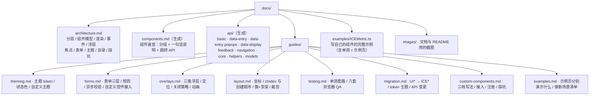

# ice-web-components 文档

> 组件库的完整文档：架构思路、组件速查、API 参考、主题/表单/浮层/布局/测试指南，以及破坏性变更记录。

## 一、从哪里开始

| 你在做什么 | 看这里 |
|---|---|
| 第一次接触这个库，想搞懂它怎么运转 | [架构思路](./architecture.md) |
| 找某个组件怎么用、有哪些参数 | [组件速查](./components.md)（80 个 UI 组件类，数字由源码生成）→ [API 参考](./api/README.md) |
| **想看完整业务场景怎么搭出来的** | [示例与场景](./guides/examples.md) |
| **写自己的组件、接进这套体系** | [写一个自己的组件](./guides/custom-components.md) |
| 想换配色 / 加一套主题 | [主题与配色](./guides/theming.md) |
| 做表单、写校验（含异步） | [表单与校验](./guides/forms.md) |
| 弹窗 / 抽屉 / 下拉 / 提示怎么用 | [浮层指南](./guides/overlays.md) |
| 自己排布局、被“组件不见了”坑过 | [画布内布局](./guides/layout.md) |
| 给库加组件、写测试（含八套浏览器 QA） | [测试](./guides/testing.md) |
| 从旧版本升上来 | [迁移说明](./guides/migration.md) |

## 二、文档地图



标了「生成」的文件由 `npm run docs:api` 从 `src/**` 的 JSDoc 与类型定义生成
（`scripts/gen-docs.mjs`）：组件说明取类注释，参数表取 `ICEXxxOptions` 字段，
方法表取 public 方法。**要改这些内容请改源码里的注释**，不要在生成物上直接改。

> **引擎侧还有一份「应用驱动的评估」**（在 ice-render 仓库）：
> [docs/architecture/15-app-driven-review.md](https://github.com/ice-render/ice-render/blob/master/docs/architecture/15-app-driven-review.md)
> —— 用本库的 admin 与 Windows XP 两个案例反推引擎的能力边界、短板归属与优先级。
> 想知道「哪些能力引擎已经有了、只是本库还没用上」，先看它。

```bash
npm run docs:api     # 重新生成 components.md 与 api/*.md
```

## 三、四个最容易踩的坑（先看，能省半天）

1. **创建顺序就是 zIndex**：先建容器再建子组件；不得不先建子组件时，把子树整体抬到容器之上。
2. **纯布局节点要 `interactive: false`**：内部的展示节点会抢走点击（按钮点不动、色块要点两次），
   而“后创建的布局容器”会把内部控件的命中检测整个挡掉（输入框点不进去、焦点环不出现）。
3. **浮层里点击行时不要用 `closeOnOutsideClick`**：它可能在 `click` 派发前就把浮层关掉；
   用 `closeOnOutsideClick: false` + 自己判点外。
4. **焦点环只在键盘聚焦时出现**：鼠标点击/拖动不该冒蓝框（`:focus-visible` 语义）；
   文本类控件声明 `focusRing: 'always'`。见[焦点与键盘](./architecture.md#六焦点与键盘)。

更多见[架构思路的踩坑表](./architecture.md#十踩过的坑写新组件时请先看这一节)。
