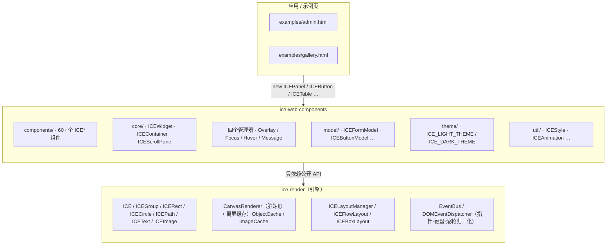
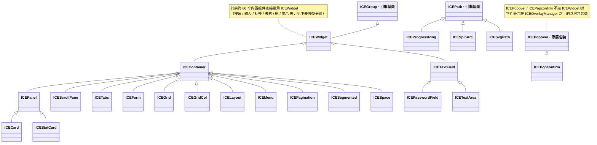
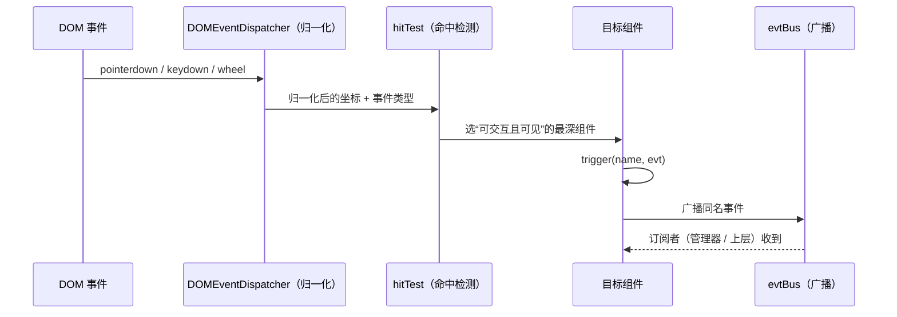
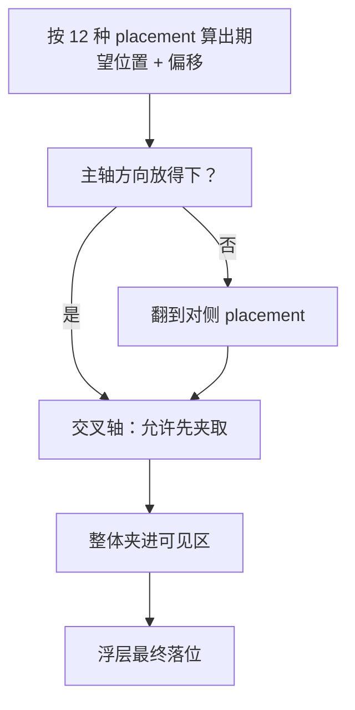
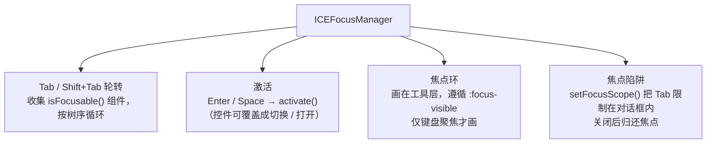
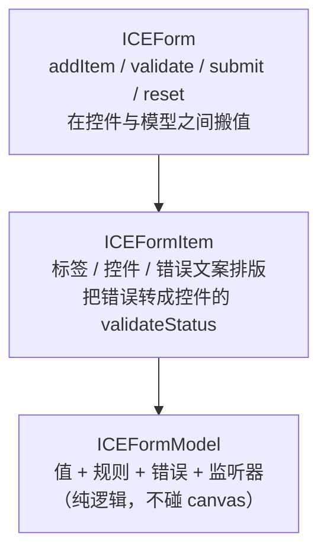

# 架构思路

这套组件库只做一件事：**在 `ice-render` 的图形能力之上，搭一层「UI 组件」的约定与基础设施**，
让写界面的人不用关心 canvas 的坐标、命中检测、重绘时机。

理解下面这几条，基本就理解了整个库：

1. **组件不是 DOM**：每个组件都是画布上的一棵子树，位置是 `state.left/top`，样式是 `state.style`；
2. **引擎管渲染，组件管语义**：脏矩形、zIndex、裁剪、离屏缓存都是引擎的事；组件只负责“长什么样、怎么响应”；
3. **一切跨组件的交互都收敛到四个管理器**：浮层、焦点、悬停、消息 —— 组件不自己造轮子；
4. **约定优于配置**：表单取值、状态色、节流/关闭策略、主题 token 都有统一约定，新增组件照着抄即可。

---

## 一、分层



两条硬边界：

* 组件库**不碰 canvas 的绘制原语**（不直接 `ctx.fillRect`）——需要画什么就组合引擎图元；
  只有少数需要特殊路径的组件（`ICESpin` 的圆弧、`ICEProgressBar` 的环形、`ICESvgIcon` 的 SVG 路径）
  才通过继承 `ICEPath` 自定义 `createPathObject()`。
* 引擎**不知道 UI 语义**（不知道什么是表单、浮层、焦点）——这些东西全部在组件库里实现。

## 二、组件模型

`ICEWidget` 是所有 UI 组件的基类（继承引擎的 `ICEGroup`），只加了四件事：

| 能力 | 说明 |
|---|---|
| `enabled` / `hovered` / `focused` | 交互态；对应 `__applyHoverState()` / `__applyFocusState()` 钩子 |
| `focusable` / `activate()` | 参与 Tab 轮转；`activate()` 默认等价一次 `click`，控件可覆盖（开关就覆盖成“切换”） |
| `validateStatus` | 表单错误态；`__applyValidateState()` 钩子是画红框的地方 |
| `getFormValue()` / `setFormValue()` | 表单取值约定；`UIFormItem` 只认这两个方法 |

再加一条很关键的约定：**组件构造函数结束时必须已经是“画好的”状态**。
没有延迟到首次渲染才建子节点的写法 —— 这样 `measure()`（例如示例页的流式布局）在构造后就能拿到真实包围盒。

生命周期只有两个钩子：

```ts
protected afterAddHandler()  // 组件挂进 ICE 场景后调用：在这里订阅 evtBus、绑定全局事件
protected __applyValidateState() // …
```

### 继承骨架（classDiagram）



> 内置组件分两条技术路线：
> 1. **画布组件**：`ICEWidget ← ICEContainer ← …` 与 `ICEPath ← …` 两条，最终落在引擎图元（`ICEGroup` / `ICEPath`）上，是真正的画布子树；
> 2. **浮层包装类**：`ICEPopover` / `ICEPopconfirm` 不是 `ICEWidget`，只负责在 `ICEOverlayManager` 之上编排浮层的定位 / 关闭 / 动画。

### 直接继承 `ICEWidget` 的内置组件（按类分组）

| 类别 | 组件 |
|---|---|
| 基础展示 / 排版 / 图标 | ICEAffix · ICEAlert · ICEAvatar · ICEAvatarGroup · ICEBackTop · ICEBadge · ICEBreadcrumb · ICEBreadcrumbItemNode · ICEComment · ICEEmpty · ICEFloatButton · ICEIcon · ICEIconTile · ICEImageView · ICELabel · ICESeparator · ICESkeleton · ICEStatistic · ICESvgIcon · ICETag · ICETypography · ICEWatermark |
| 按钮 / 开关 / 选择 | ICEButton · ICECheckBox · ICECheckboxGroup · ICERadioButton · ICERadioGroup · ICERate · ICESlider · ICESwitch |
| 输入 / 数据录入 | ICEAutoComplete · ICECascader · ICEColorPicker · ICEDatePicker · ICEDateRangePicker · ICEFormItem · ICEFormList · ICEInputNumber · ICESelect · ICETreeSelect · ICETimePicker |
| 数据展示 | ICECalendar · ICECarousel · ICECollapse · ICEDescriptions · ICEKanban · ICETable · ICETileMap · ICETimeline · ICEResult · ICESteps · ICEList · ICETree · ICETransfer · ICEVirtualList |
| 加载 / 进度 | ICEProgressBar · ICESpin |
| 窗口 | ICEWindow · ICEWindowButton |
| 上传 | ICEUpload |
| 布局 / 分隔（直接 Widget） | ICESplitter · ICESplitterDivider |
| 导航（直接 Widget） | ICEAnchor |

（上面未列出的 `ICEPanel`/`ICECard`/`ICEStatCard`/`ICEScrollPane`/`ICETabs`/`ICEForm`/`ICEGrid`/`ICEGridCol`/`ICELayout`/`ICEMenu`/`ICEPagination`/`ICESegmented`/`ICESpace` 都是 `ICEContainer` 子类；`ICEPasswordField`/`ICETextArea` 是 `ICETextField` 子类；`ICEProgressRing`/`ICESpinArc`/`ICESvgPath` 是引擎 `ICEPath` 子类——见上方继承骨架图。）

## 三、渲染与重绘

组件不做任何“每帧重绘”的事。改状态就 `setState()` / `revalidate()`，引擎的 `CanvasRenderer` 负责：

* 按 `zIndex` 全局排序（**同值内按创建顺序**）→ 这就是“容器必须先于子组件创建”的根因；
* 脏矩形局部重绘，遇到文本/点集/半透明/离屏缓存不干净等场景自动回退全量；
* `clipChildren` 的子树裁剪（`ICEScrollPane`、`ICEImageView` 的视口都靠它）；
* 子树不透明度 `opacity`（`ICEModal`/`ICEDrawer`/消息的淡入淡出）。

组件只在两种情况下需要额外动作：

1. 需要在**绘制期**重算路径（如环形进度）：把参数写进 `state`，`ICEPath.doRender()` 会在 `dirty` 时重跑 `createPathObject()`；
2. 需要**持续动画**（Spin）：交给引擎的 `props.animations`（点路径补间）或组件库的 `tween()`。

## 四、事件、命中与悬停

引擎的事件链是：`DOM 事件 → normalize → hitTest → 目标组件 trigger → evtBus 广播`。



* **点谁给谁**：命中检测只挑“可交互且可见”的最深组件；这带来两条组件库规范：
  * UI 组件内部的**纯展示节点一律 `interactive: false`**（比如按钮里的文字、色块的标签），
    否则它们会抢走点击；
  * 需要“整行可点”的组件（表格行、菜单项、树行）把行做成可交互节点，子文案交给它。
* **纯布局容器也要 `interactive: false`**：容器如果晚于内部控件创建（zIndex 更高）、
  又参与命中，它会先把点击吃掉，内部控件根本收不到事件。`ICEFormItem` / `ICEForm` /
  `ICESpace` / `ICEGrid` / `ICESplitter` 都属于这类「只负责摆位置」的节点，全部
  `interactive: false`。判断标准很简单：**这个节点的矩形本身需要响应鼠标吗？**
* **全局事件**：`keydown` / `wheel` / `mousedown` 这类需要跨组件协调的事件，组件在
  `afterAddHandler()` 里订阅 `ice.evtBus`，并在处理函数开头判空（组件可能已从场景摘掉）。
* **悬停要显式开启**：引擎为了性能不做 `mousemove` 全量命中，所以组件库提供了
  `ICEHoverManager` —— 它把指针位置换算成世界坐标、做一次命中测试，再把 `hovered`
  同步给组件；组件通过 `setHovered()` 触发的 `hoverchange` 事件做视觉反馈。

## 五、浮层：一套管理器，所有弹出层

`ICEOverlayManager` 把浮层挂到引擎的**工具层**（`ice.addTool`）：递归渲染、永远画在业务组件之上、
不参与业务层命中。所有弹出类组件（Modal / Drawer / Dropdown / Tooltip / Popover / Popconfirm /
Select / DatePicker / TimePicker / Cascader / TreeSelect / AutoComplete）都走它，于是这些行为只需实现一次：

* **定位**：12 种 placement + 偏移；空间不足自动翻到对侧，最后夹进可见区。
  判定按「主轴必须放得下、交叉轴允许先夹取」拆开 —— 否则贴右边界时会被误判成“空间不足”而整体翻转。
* **关闭策略**：点外关闭（`closeOnOutsideClick`）、Esc（`closeOnEsc`）、`exclusive`（新浮层关旧的）、
  `blocking`（模态遮罩挡住下层交互）。
* **键盘接管**：`keyboardCaptured` 让 `ICEFocusManager` 把 Enter/Space 让给浮层（比如下拉里的 Enter 选中）。
* **进/出场动画**：`enterAnimation: 'fade' | 'scale'`、`exitAnimation: 'fade'`。

定位的兜底逻辑用一张图更清楚：



有一个反复踩到的坑值得记住：**如果浮层里要点击行，别用 overlay 的 `closeOnOutsideClick`** ——
它按盒子判定，可能在 `click` 派发之前就把浮层关掉。这类组件的做法是
`closeOnOutsideClick: false` + 自己监听 `mousedown` 判点外（`UIDatePicker`/`UITimePicker`/`UICascader`/`UITreeSelect`/`UIAutoComplete` 都是这么写的）。

## 六、焦点与键盘

`ICEFocusManager` 负责四件事：



1. **Tab / Shift+Tab 轮转**：收集场景里所有 `isFocusable()` 的组件，按树序循环；
2. **激活**：Enter / Space 调用组件的 `activate()`（控件可覆盖成切换/打开）；
3. **焦点环**：画在工具层，跟着组件位置与视口平移/缩放移动。环遵循 **`:focus-visible` 语义** ——
   只有键盘聚焦才画；鼠标点按钮、拖滑块手柄都不会冒蓝框（否则观感很怪）；
4. **焦点陷阱**：模态类浮层用 `setFocusScope()` 把 Tab 限制在对话框内，关闭后把焦点还回去。

焦点环显示由控件自己的策略决定（`ICEWidget`）：

| 策略 | 何时画环 | 谁在用 |
|---|---|---|
| `keyboard`（默认） | 仅键盘（Tab / Shift+Tab）聚焦 | 按钮、滑块、复选框/单选框、开关、评分、分段控件、上传… |
| `always` | 鼠标聚焦也画 | 文本类控件：文本框 / 多行 / 密码 / 数字 / 选择器 / 日期时间 / 级联 / 树选择 / 取色器 |
| `never` | 从不画 | 按需（例如卡片里的小控件） |

声明方式：`new ICEButton({ focusRing: 'never' })`、`setFocusRingMode('always')`，
或自定义组件里实现 `shouldShowFocusRing(origin)`；调试可用
`getICEFocusManager(ice).getFocusOrigin()` / `isRingVisible()`。

## 七、表单

三层结构，各管一件事：



* 控件只要实现 `getFormValue()` / `setFormValue()` 并发 `change` 事件，就能被表单直接使用；
* 规则失败即停（取第一条错误）；`required` 把空串/空数组/`false` 都视为缺失；
* **异步校验**（`asyncValidator`）只在显式调用 `validateFieldAsync()` / `validateAsync()` / `submitAsync()` 时执行 ——
  值变化触发的自动校验只跑同步规则，避免每敲一个字就发请求；
* 校验期间 `isValidating()` 为真，`ICEFormItem` 显示“校验中…”。
* **跨字段依赖**：`ICEFormItem({ dependencies: ['other'] })`（`ICEFormModel.addField` 同名参数）
  让「被依赖字段变化 → 本字段立刻重算」，用来写“确认密码”“结束日期 ≥ 开始日期”“至少填一个”。
  配套行为：`getDependents(name)` 反向查依赖者；自定义 `validator` 在空值上**也会执行**
  （内置的 min/max/长度/pattern 才跳过）——这是“至少填一个”这类规则能写出来的前提。

## 八、主题

主题是**一张普通的 token 表**（`ICE_LIGHT_THEME` / `ICE_DARK_THEME`），`ICEManager`（单例 `iceUIManager`）
负责持有当前主题。组件在**构造时**读一次 token（`iceUIManager.getTheme()`），所以切主题要在建组件之前；
需要“热切换”的场景，重建组件即可。

配色刻意偏 Bootstrap 5：语义色 + subtle 背景/边框 + `*TextEmphasis` 强调文字色。
为什么需要强调文字色？因为亮黄（`#ffc107`）这种实色当文字压在浅底上几乎不可读 ——
所以 Alert/Tag/Badge 的浅底文字统一取深色档，实底（`.text-bg-*`）则按亮度自动配白字或黑字。

## 九、目录结构

```
src/
  components/   79 个文件 / 80 个组件类（一个组件一个文件，文件名＝类名）
  core/         ICEWidget / ICEContainer / ICEScrollPane / 四个管理器 / ICEManager
  layouts/      （已删除：布局直接用 ice-render 的 ICEFlowLayout / ICEBoxLayout）
  model/        ICEFormModel / ICEButtonModel / ICEToggleModel / ICESelectionModel / ICEBoundedRangeModel
  theme/        ICETheme.ts（token 表）
  util/         ICEStyle（文本与状态色） ICEAnimation（补间） ICEOverlayPosition ICEWorldBox
tests/          50 个 suite / 350+ 条单测（node 环境，不依赖浏览器）
examples/       gallery.html（全组件）、admin.html（多页后台）
scripts/        gen-docs.mjs（生成本目录）、qa-admin.mjs（浏览器端 QA）
docs/           本目录
```

## 十、踩过的坑（写新组件时请先看这一节）

| 坑 | 现象 | 正确做法 |
|---|---|---|
| 创建顺序即 zIndex | 后创建的容器把先创建的子组件盖住 | **先建容器，再建子组件**；确实要先建子组件的（如调用方传进来的节点、幻灯片、卡片 extra、弹窗内容），整棵子树 `zIndex` 抬到容器之上（同值即可，别逐个分配不同值） |
| 内部节点抢点击 | 点按钮没反应 / 点色块要点两次 | 组件内部的纯展示节点一律 `interactive: false` |
| 布局容器吃掉命中 | 表单里的输入框点不进去、焦点环不出现、`getFocused()` 是 null | **纯布局节点**（`ICEFormItem`/`ICEForm`/`ICESpace`/`ICEGrid`/`ICESplitter`）一律 `interactive: false`；判断标准：这个矩形本身需要响应鼠标吗 |
| 重排时忘了清空旧子节点 | 文字重影 / 内容重复叠在一起（改宽度、重复 setItems 后尤其明显） | 凡是「按尺寸或数据重排」的 `__render()`，第一件事就是 `removeChildren([...this.childNodes])`；这类组件还要补 `__afterStateMerge` 才能在宽度变化时自动重排 |
| 鼠标一点就冒蓝框 | 拖 Slider 手柄时整个组件被框住 | 焦点环按 `:focus-visible` 语义：默认只有键盘聚焦才画（`focusRing: 'keyboard'`），文本类控件用 `'always'` |
| 浮层被“点外关闭”提前关掉 | 下拉里点选项没反应 | `closeOnOutsideClick: false`，自己按 `mousedown` + 自己的命中盒判断 |
| hover 反馈静默失效 | `isHovered()` 是 true，但底色不动 | 引擎的 `trigger(name, evt, param)` 把载荷放在 `event.param`，读取时用 `readHovered()` 兼容两种形态 |
| 文本没有裁剪 | 中文标签压出色块 / 面板外面 | 用 `estimateTextWidth()`（中文按 1em）算容器宽度，别用 `length * fontSize * 0.62` |
| `props` 里塞组件实例 | 构造时抛栈溢出（cloneDeep 递归） | 组件实例不要放进 props；确实需要就用工厂函数，或在构造前把它从 props 里剥离 |
| 宽度刚好铺满被换行 | 620 + 16 + 556 时莫名换行 | 实测宽度会比标称宽零点几像素，比较时留 2~3px 容差 |
| 溢出内容画到容器外 | 候选列表第 7 项画在面板外 | 用 `ICEScrollPane`（子树裁剪）包住可变长内容 |

---

下一步建议阅读：[组件速查](./components.md)、[浮层指南](./guides/overlays.md)、[表单指南](./guides/forms.md)。
