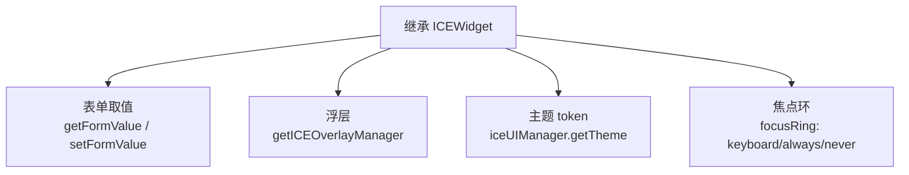
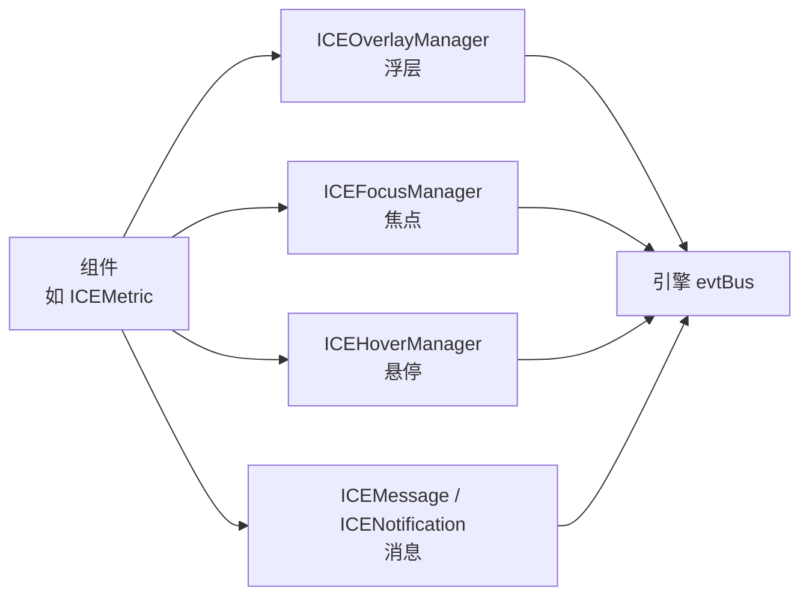

# 写一个自己的组件

先说结论：**大多数时候你不需要继承任何东西**。按「组合 → 继承控件 → 自定义绘制」三档来选：

| 场景 | 做法 | 例子 |
|---|---|---|
| 只是把现有组件拼成一个业务模块 | 继承 `ICEPanel`/`ICECard` 当容器，或在工厂函数里拼装后返回 | 「带标题的进度条卡片」「统计 + 趋势 + 跳转按钮」 |
| 需要一套新的交互/外观语义 | 继承 **`ICEWidget`** | 示例里的 `ICEMetric`、库里的 `ICETag`/`ICESwitch`/`ICERate` |
| 需要新图形（弧线、路径、自定义笔画） | 继承引擎的 **`ICEPath`**，实现 `createPathObject()` | 库里的 `ICESpin` 的圆弧、`ICEProgressBar` 的环形、`UISvgIcon` 的 SVG 路径 |

下面重点讲第二档 —— 也是「接入 ICE 体系」需要知道的全部约定。

写自己的组件总体心智模型：



---

## 一、完整示例：`ICEMetric`

一个指标卡：左侧状态色条 + 标题 + 大号数值；**点击整块 +1**、**聚焦后 ↑/↓ 调值**、
可以直接放进 `ICEForm` 参与校验。完整源码在 [`docs/examples/ICEMetric.ts`](../examples/ICEMetric.ts)，
在线效果在 [`examples/custom-component.html`](../../examples/custom-component.html)。


```ts
// 你自己的项目里从包名导入
import { ICELabel, ICEWidget, getStatusColors, iceUIManager } from 'ice-web-components';

export class ICEMetric extends ICEWidget {
  private valueNode: ICELabel | null = null;
  private min = -Infinity;
  private max = Infinity;

  constructor(props: ICEMetricOptions) {
    const theme = iceUIManager.getTheme();
    // ① 先展开 props（否则调用方传的 id 会被吞掉），再覆盖自己关心的字段
    super({
      ...props,
      fill: true,
      stroke: true,
      width: props.width ?? 200,
      height: props.height ?? 88,
      radius: theme.radius.md,
      style: { fillStyle: theme.colors.surface, strokeStyle: theme.colors.border },
    });
    // ② 先把依赖字段赋好，再算派生值（子类字段没有“提升”，顺序写反就是 NaN）
    this.min = props.min ?? -Infinity;
    this.max = props.max ?? Infinity;
    this.value = this.clamp(Number(props.value) || 0);
    this.focusable = true;      // ③ 参与 Tab 焦点轮转（不需要键盘就别开）
    // ④ 焦点环策略：默认 keyboard（只有 Tab 聚焦才画环）；文本类控件用 'always'，
    // 不想画就 'never' —— 鼠标点一下/拖一下也冒蓝框会很怪
    this.focusRingMode = 'keyboard';
    this.__render();            // ⑤ 构造期就把内容画好
  }
}
```

完整实现里还有下面这些「接入点」，逐条说明。

> 如果你是**写容器**（把别人的组件装进去），把 `interactive: false` 放进 `super({...})`：
> 纯布局容器如果参与命中，会把内部控件的点击整个吃掉（“输入框点不进去”“焦点环不出现”
> 基本都是这个原因）。判断标准：这个矩形本身需要响应鼠标吗？

## 二、必须遵守的四条构造约定

1. **构造结束即“画好了”**：`__render()` 在构造函数末尾跑，子节点当帧就存在。
   本库所有组件都这样，示例页的自动布局、截图脚本、单测都依赖这一点。
2. **`...props` 透传**：`super({ ...props, … })`，再覆盖 `fill/stroke/width/height/style` 这些你自己定义的。
   直接手写 `super({ fill: …, width: … })` 会把调用方的 `id`（以及 `zIndex` 等）丢掉。
3. **内部展示节点一律 `interactive: false`**：标题、数值、色条都是装饰，必须让点击落到整块上；
   否则点文字没反应、点颜色块要点两次。
4. **先赋字段、再算派生值**：子类字段没有声明提升。这个示例的第一版就是先算 `value` 再用到 `min/max`，
   结果 `NaN`（被单测当场抓住）。

## 三、状态与重绘

* 改状态用 `setState()`（会自动置脏并触发重绘）；改完尺寸/布局调 `this.revalidate()`。
* 需要重画子节点时，本库的写法是「清空 + 重建」：

  ```ts
  this.removeChildren([...this.childNodes]);
  this.addChild(new ICELabel({ … }), false);
  ```

* 别自己写每帧循环。持续动画交给引擎的 `props.animations`，一次性过渡用 `tween()`。

## 四、交互：点击、悬停、焦点、键盘

```ts
// 点击：整块可点（子节点都 interactive:false）
protected initEvents(): void {
  super.initEvents();                       // 保留引擎默认事件
  this.on('click', () => this.stepBy(this.step));
}

// 悬停：ICEHoverManager 会调 setHovered()，视觉变化写在钩子里
protected __applyHoverState(): void {
  this.setState({ style: { ...this.state.style, strokeStyle: this.hovered ? primary : border } });
}

// 焦点 + 键盘：Enter/Space 走 activate()，方向键走全局 evtBus
public activate(): void { this.stepBy(this.step); }

protected afterAddHandler(): void {
  super.afterAddHandler();
  this.ice?.evtBus?.on('keydown', this.__onKeyDown, this);
}

private __onKeyDown(evt: any): void {
  // 全局事件是广播的：先确认自己还在场景里、而且真的拿到焦点
  if (!this.ice || !this.isFocused() || !this.enabled) return;
  const key = (evt.originalEvent || evt).key;
  if (key === 'ArrowUp') this.stepBy(this.step);
  if (key === 'ArrowDown') this.stepBy(-this.step);
}
```

> 悬停要先在应用里 `new ICEHoverManager(ice).start()`；焦点要 `getICEFocusManager(ice).start()`。
> 读取 `hoverchange` 事件时用 `readHovered(evt)` —— 引擎把载荷放在 `event.param`，直接读 `evt.hovered` 会永远拿到
> undefined（**hover 会静默失效**，这是本库踩过的坑）。

四类交互管理器与引擎 evtBus 的关系：



## 五、接进表单

只要实现两个方法，并广播 `change`：

```ts
public getFormValue(): any { return this.value; }
public setFormValue(value: any): void { this.setValue(Number(value)); }

// 值真的变化时：
this.trigger('change', null, { value: next });
```

错误态交给 `__applyValidateState()`：

```ts
protected __applyValidateState(): void {
  this.setState({ style: { ...this.state.style, strokeStyle: this.validateStatus === 'error' ? error : border } });
}
```

`ICEFormItem` 会调用 `setValidateStatus('error')`，你负责把错误画出来。示例页里那张红框卡片就是这么来的。

## 六、接进浮层

需要弹出东西时**不要自己写定位**，用共享的浮层管理器：

```ts
import { getICEOverlayManager } from 'ice-web-components';

this.__handle = getICEOverlayManager(this.ice).open({
  anchor: this,                     // 锚点（你的组件）
  content: panel,                   // 浮层内容（建议在 open 时现建）
  placement: 'bottomLeft',
  offset: 4,
  keyboardCaptured: true,           // 打开期间接管 Enter/Space
  closeOnOutsideClick: false,       // 要点击浮层里的行时务必设 false
  enterAnimation: 'scale',
});

this.__handle.close();
```

点外关闭自己做（监听 `mousedown` 判自己的盒子与浮层盒子），细节见[浮层指南](./overlays.md)。

## 七、用主题与状态色

```ts
const theme = iceUIManager.getTheme();               // 构造时取一次
const colors = getStatusColors(theme, this.status);  // { background, border, text, strong, solid, onSolid }
```

* 浅底上的文字用 `strong`（`*-text-emphasis`），白底上的用 `text`，实底用 `solid` + `onSolid`；
* 需要按文字算容器宽度时用 `estimateTextWidth(text, fontSize)`（中文按 1em，别用 `length * 0.62`）；
* 文本节点可以直接用 `createTextNode({ text, width, align, verticalAlign, … })` 生成。

## 八、导出、注释与测试

```ts
// src/index.ts
export * from './components/ICEMetric';
```

| 事项 | 约定 |
|---|---|
| 文件 / 类名 | 一个组件一个文件，文件名＝类名（`ICEMetric.ts` → `ICEMetric`） |
| 类注释 | 写在**类上方或文件开头**（紧跟 Options 接口），会被 `npm run docs:api` 收进文档 |
| 参数注释 | `ICEMetricOptions` 每个字段写 `/** … */`，会进 API 参考的参数表 |
| 单测 | `tests/ICEMetric.test.ts`：默认态、值变化、回调、禁用、表单取值、校验态、键盘；**键盘要测“移出场景后不崩”** |
| 示例 | 在 `examples/` 里加一页并截图进 `docs/images/`，`npm run qa:admin` 会顺带跑关键交互 |

`npm run verify`（types:check + test + build + docs）会一次性把这些都过一遍。

## 九、要能被反序列化，还得注册类型

引擎序列化时写的是**类型名（canonical typeId）**，格式必须是 `namespace:Type`。自定义组件必须注册，
否则存出去的数据读不回来：

```ts
import { ICE } from 'ice-render';

// namespace 用你自己的小写包名；Type 用字母/下划线开头
ice.registerType('my-app:ICEMetric', ICEMetric);
```

要点：

- 注册要在**反序列化之前**调用；不注册的话引擎会回退写 `constructor.name`，而类名一旦被打包器
  mangle 就读不回来（此时 `Serializer.unregisteredTypes` 会记录并告警）。
- 类型名**只有 canonical 一种形式**：引擎不兼容无 namespace 的旧类名（ICE 家族仍在发布初期，
  引用者少、没有历史包袱）。
- 同一个 typeId 注册**不同**构造函数、或同一个构造函数注册**第二个** typeId 都会**明确抛错**，
  不会静默覆盖；同名重复注册（typeId 与构造函数都相同）是幂等的。
- 内置组件的 typeId 是 `ice-render:*`（如 `ice-render:Rect`），已经注册好，不用管。

## 十、常见坑

| 坑 | 现象 | 做法 |
|---|---|---|
| 先建子组件、后建容器 | 子组件全不见了（被容器底色盖住） | 容器先建；不得已时把子树 `zIndex` 抬到容器之上 |
| 子类字段顺序写反 | 值变成 `NaN` | 先赋依赖字段，再算派生值 |
| 内部节点没设 `interactive: false` | 点文字/图标没反应 | 展示节点一律不可交互 |
| 读 `evt.hovered` | hover 静默失效 | 用 `readHovered(evt)` |
| 全局事件没判空 | 组件被移出场景后一点鼠标就崩 | 处理函数开头 `if (!this.ice) return` |
| 浮层里点击行没反应 | 被 `closeOnOutsideClick` 提前关掉 | `closeOnOutsideClick: false` + 自己判点外 |
| 用 `length * k` 估算文本宽度 | 中文标签压出色块 | `estimateTextWidth()` |
| 把组件实例塞进 props | 构造时栈溢出（引擎深拷贝递归） | 用工厂函数，或在构造前把实例从 props 剥离 |
| 布局容器 `interactive` 没关 | 内部控件点不动 / 焦点环不出现 | 纯布局节点一律 `interactive: false` |
| 自己画焦点框 | 鼠标点一下、拖滑块都冒蓝框 | 交给 `ICEFocusManager`，只声明 `focusRing: 'keyboard' \| 'always' \| 'never'` |

更多细节见[架构思路](../architecture.md)与[测试指南](./testing.md)。
