# 示例与场景

仓库里有六个示例页，**都是纯 HTML + 一个 UMD 包**，不用打包工具就能打开看效果。
它们同时也是这套组件库的“验收现场”：每页都配了浏览器 QA 脚本（见[测试](./testing.md)）。

```bash
npm run build          # 先产出 dist/（示例页引用 ../dist/index.umd.js）
# 然后直接用浏览器打开，或起个静态服务器
npx serve .
```

| 示例 | 场景 | 主要用到的东西 |
|---|---|---|
| [`gallery.html`](../../examples/gallery.html) | 组件总览（一个个组件排开） | 几乎全部组件 + 手写「簇 + 货架」流式布局 |
| [`admin.html`](../../examples/admin.html) | 后台管理（6 页业务闭环） | 布局外壳、表格、表单、浮层、分栏、日历、引导… |
| [`workbench.html`](../../examples/workbench.html) | 客服工单工作台（三栏高频操作） | `ICESplitter`、`ICEList`、`ICEComment`、`ICETimeline`… |
| [`custom-component.html`](../../examples/custom-component.html) | 自己写组件并接进体系 | `ICEWidget` + 表单/焦点/主题约定 |
| [`windows-xp.html`](../../examples/windows-xp.html) | 全屏 Windows XP 桌面（好玩的那一个） | `ICEWindow`、`ICEIconTile` + 几乎全套组件 |
| [`arcade.html`](../../examples/arcade.html) | ICE Arcade 掌机（小游戏合集：俄罗斯方块 + 贪吃蛇 + 2048） | `ICETetrisModel` / `ICESnakeModel`（纯逻辑）+ 自绘棋盘/HUD，键盘全接管 |

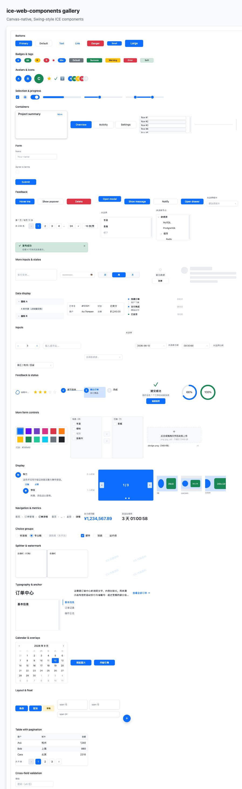

---

## `gallery.html`：组件总览

一页把库里能独立展示的组件都摆出来，用来快速“看长相、点交互”。

* 布局是手写的 **cluster + 货架** 流式排布（每个 demo 自带局部坐标，整体平移；
  放不下才换行）。思路与代码骨架见[画布内布局](./layout.md#示例页里的簇-货架流式布局)；
* 加新组件时：在对应 `sections` 里加一项、给它一个 `id`，然后在
  `scripts/qa-gallery.mjs` 里补一条断言即可。

> **虚拟列表那一格值得单独看一眼**：里面塞了 **10000 行**订单，但画布上真正存在的
> 只有 **12~15 个节点**（可视区 + 上下缓冲各 2 条）—— 这就是「大数据量」的正解：
> 内容盒按总高度撑开保证滚动条对得上，滚动时换窗口、节点复用。
> 窗口计算是纯函数 `computeVirtualRange`（缓冲、贴底、空列表、越界都在单测里守着），
> 组件 `ICEVirtualList` 只负责把窗口映射成节点。`qa:gallery` 里三条断言分别验证
> 「一万行只渲染可视区」「真实滚轮滚动后窗口跟着换」「`scrollToIndex` 跳到最后一万条」。
>
> 同一页的「表格」那格开了 `resizable`：**拖表头边界就能缩列**（最小 70px 夹住，
> 拖过头也不会把列拖没），拖完其余自动列会重新分配。列宽求解同样是纯函数
> `resolveColumnWidths`，交互那条链路由 QA 用真实鼠标拖出来。
>
> 页面里还接了**国际化**：`setICELocale('en-US')` 之后重建的组件用英文文案（表格空态、
> 弹窗按钮、上传提示、引导按钮……都走 `t()`），切回 `zh-CN` 即恢复。
>
> 页面末尾还挂了**无障碍镜像层**：`mountICEAccessibilityMirror(ice)` 把 canvas 里
> 「有哪些控件、叫什么名字、在什么位置」渲染成透明但真实存在的 DOM（`role` / `aria-label` /
> `tabindex`），点它等于点画布组件、focus 也会映射回组件 —— 屏幕阅读器和键盘用户才够得着
> canvas UI（canvas 本身对辅助技术完全不可见）。
>
> 「表格」那格还开了 `rowDraggable`：**按住行上下拖就能排序**，拖动时有落点指示线，
> 松手抛 `rowreorder`（分页表拖的是当前页内的行，内部会换算成绝对下标）。
>
> 再往上一格是 **「宽表」**：一万行 × 20 列，开了 `virtual: true` 并把前两列标成 `fixed`。
> 结果就是——表体只渲染 11~13 行（可视区 + 缓冲），横向滚动时**前两列钉在左边不动**，
> 表头跟着表体一起横向滚，滚轮/`scrollToRow` 都能用。表格为此多了一条「可滚动模式」
> 渲染路径（表头与表体各一个 `ICEScrollPane` + 冻结层），**旧的简单路径原样保留**，
> 所以现有几十处小表用法一点没变。

## `admin.html`：后台管理（6 页）

一个虚构的「ICE Shop」后台：**仪表盘 / 订单管理 / 履约中心 / 商品管理 / 客户管理 / 设置**。
它不是“控件陈列”，而是把组件放进真实业务流里：

| 页面 | 业务动作 | 用到的组件（节选） |
|---|---|---|
| 仪表盘 | 看指标、处理待办、盯库存、看最近订单 | `ICEStatCard`、`ICEStatistic`（倒计时）、`ICEProgressBar`、`ICECheckboxGroup`、`ICETable` + 分页、`ICEWatermark`、`ICECarousel` |
| 订单管理 | 筛选（关键字/区域/金额区间/只看异常）→ 勾选多行 → 批量发货 / 删除 / 导出 | `ICESegmented`、`ICESlider`（区间）、`ICECheckboxGroup`、`ICESwitch`、`ICETable`（多选 + 分页）、`ICEPopconfirm`、`ICEDropdown` |
| 履约中心 | 派单队列 → 看详情 / 物流轨迹 → 催办 | `ICESplitter`、`ICEList`、`ICEScrollPane`、`ICEAnchor`、`ICEDescriptions`、`ICETimeline`、`ICEComment` |
| 商品管理 | 上架/预售、改折扣、传主图、看大图预览 | `ICEUpload`、`ICEImagePreview`、`ICERadioGroup`、`ICESlider`、`ICETree`、`ICECascader`、`ICEColorPicker`、`ICETransfer` |
| 客户管理 | 看档案、跟进记录、打分、打标签 | `ICEList`、`ICEDescriptions`、`ICETimeline`、`ICEComment`、`ICERate`、`ICECheckboxGroup`、`ICEStatistic` |
| 设置 | 改资料 / 安全 / 通知偏好 / 业务偏好（含跨字段校验） | `ICEForm`、`ICEFormItem`、`ICETabs`、`ICETransfer`、`ICERadioGroup`、`ICESlider`、`ICECheckboxGroup`、`ICEAlert` |

外壳本身也用了不少东西：侧边栏 `ICEMenu`（带二级菜单）、面包屑 `ICEBreadcrumb`、
顶部搜索 `ICEAutoComplete`、通知 `ICEBadge` + `ICEDropdown`、右下角 `ICEFloatButton`
（新建订单 / 导出 / 新手引导）、`ICEBackTop`、首次进入的 `ICETour` 四步引导。

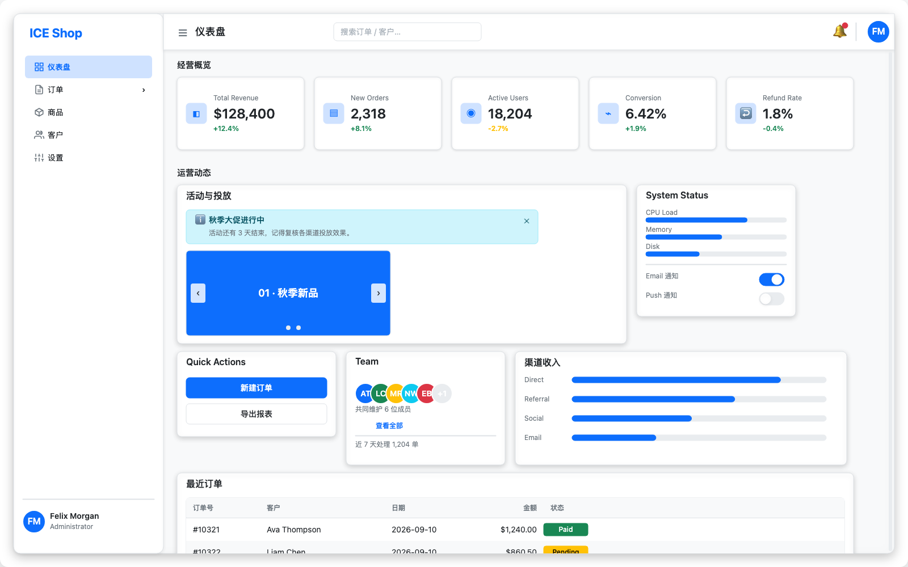

| 订单管理 | 履约中心 |
|---|---|
| 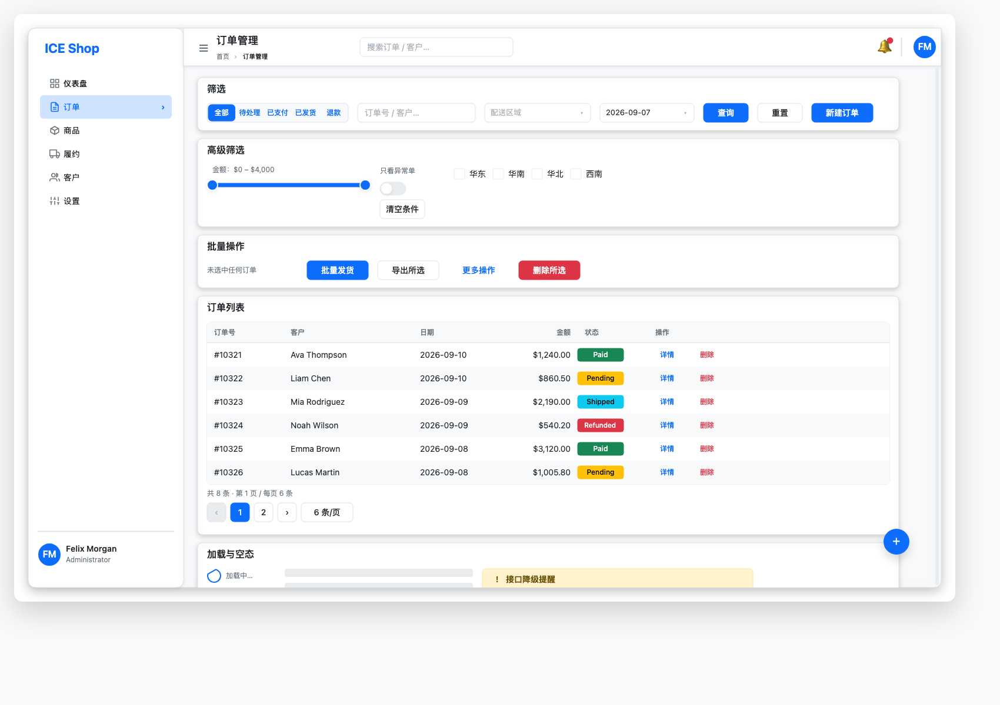 | 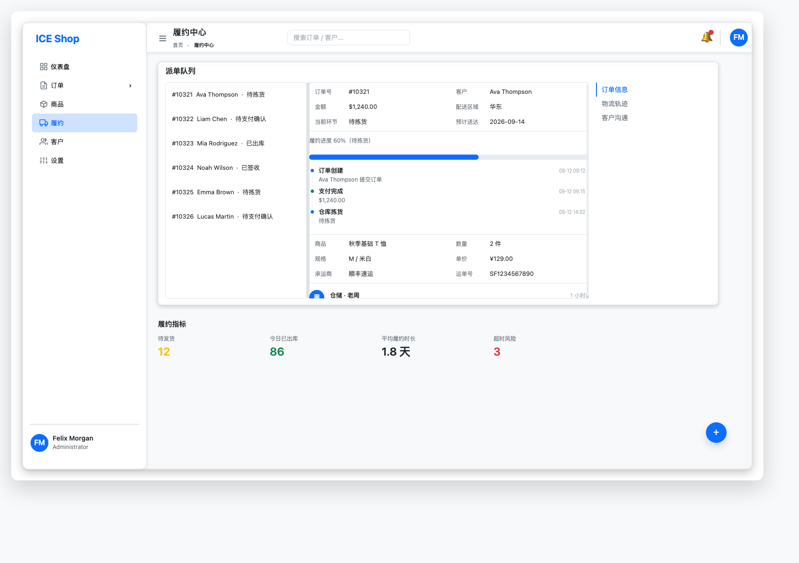 |

## `workbench.html`：客服工单工作台

**刻意做成“非后台列表”**的第二种场景：三栏、高频、以会话为中心。

* 左：工单队列 —— `ICESegmented` 筛选（全部/我的/未分配）、`ICEList`、加载时的
  `ICESkeleton`、筛空时的 `ICEEmpty`；
* 中：会话 —— `ICEComment` 气泡、`ICETextArea` 回复框（⌘/Ctrl+Enter 发送）、
  `ICEDropdown` 快捷回复模板、`ICEUpload` 附件、`ICECheckboxGroup` 工单标签；
* 右：客户档案 —— `ICEAvatar`、`ICETag`、`ICEDescriptions`、`ICERate` 满意度、
  `ICETimeline` 处理记录、`ICECollapse` 知识库；
* 三栏由 `ICESplitter` 分栏（可拖），会话区是可滚动的 `ICEScrollPane` +
  `ICEBackTop`，右下角 `ICEFloatButton` 里藏着 `ICETour` 三步引导。

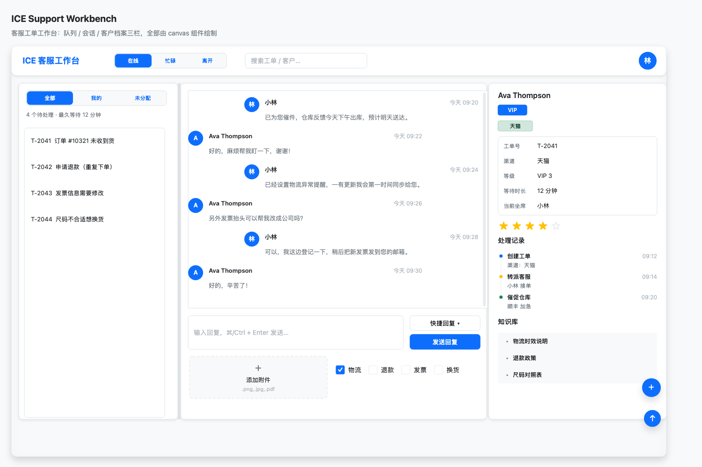

## `custom-component.html`：写自己的组件

一个手写的 `ICEMetric` 指标卡（点击 +1、聚焦后 ↑/↓ 调值、能进 `ICEForm` 校验），
把「接入 ICE 体系」的每个接入点都标了序号。完整讲解见
[写一个自己的组件](./custom-components.md)。

## `windows-xp.html`：全屏 Windows XP 桌面

一个纯 canvas 的 XP 桌面：壁纸、桌面图标、任务栏、开始菜单、可拖动/最小化/最大化/关闭的窗口，
外加七个能点的小程序 —— 全部用这套组件拼出来（壁纸和「画图」的笔画用的是引擎原语）。

### 开机 → 登录 → 桌面（含音效）

这一页现在**是开机的**。会话是个显式状态机：

```
boot ──(任意键/点击 或 2.2s)──▶ login ──(点用户磁贴)──▶ password ──(回车/登录)──▶ welcome ──▶ desktop
                                ▲                                                             │
                                └──────────────────(注销)─────────────────────────────────────┘
                                                desktop ──(关闭计算机)──▶ shutdown ──(重新开机)──▶ boot
```

* **开机画面**：黑底 + 自绘的四色小旗 + `Windows xp` 字标 + 一截来回跑的进度条
  （进度块位置由 `setInterval` 推，置 `ice.dirty = true` 触发重绘）；
* **欢迎界面**：蓝色渐变 + 顶部亮带 + 白色/橙色分隔线（XP 的两条标志线）+ 用户磁贴，
  磁贴 hover 有高亮底，点击进密码页；**任意账号、任意密码、甚至空密码都能进** ——
  密码只用来演示输入链路，不做任何校验；
* **登录音效**：开机 / 注销 / 关机 / 咔哒四种音效全是 **WebAudio 现场合成的原创音型**
  （`OscillatorNode` + 包络，没有音频文件，也没有微软的原版素材）。浏览器不允许无手势
  自动播放，所以 `AudioContext` 在第一次点击/回车时才创建 —— 正好就是「按任意键继续」那一下；
* **注销 / 关机**：开始菜单底部的「注销」「关闭计算机」是真的（透明热区压在标签上），
  注销回欢迎界面、关机进黑屏「现在可以安全地关闭计算机了」，那颗「重新开机」按钮会从
  开机画面重来一遍；
* **静音**：任务栏托盘里的 🔊 一键静音（图标变 🔇），开机音、注销音都归它管。

```js
// 会话状态机（示例页里的写法，省略绘制细节）
const session = { phase: 'boot', user: null, password: '', logins: 0 };
const pickUser = (user) => { session.user = user; setPhase('password'); focus(passwordField); };
const doLogin = () => {
  session.password = passwordField.getValue();   // 任意内容（含空）都放行
  playCue('startup');                            // WebAudio 合成的开机音
  desktop.setState({ display: true });           // 桌面在幕布后面就绪
  fadeOut(sessionRoot, { onFinish: () => setPhase('desktop') });
};
```

一个值得抄的实现细节：整块会话幕布（开机 / 登录 / 关机）是挂在 `ice` 上的**一个容器**，
`raise(sessionRoot, 9800)` 把它抬到任务栏（9000）之上，登录完成就 `fadeOut` 整棵子树 ——
引擎的**子树不透明度**让「整屏淡出」零成本，不必给每个节点单独做动画。

| 开机画面 | 欢迎界面 | 密码页 |
|---|---|---|
| 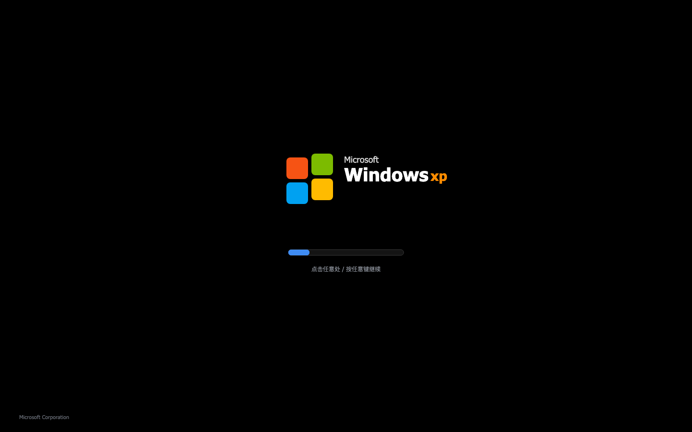 | 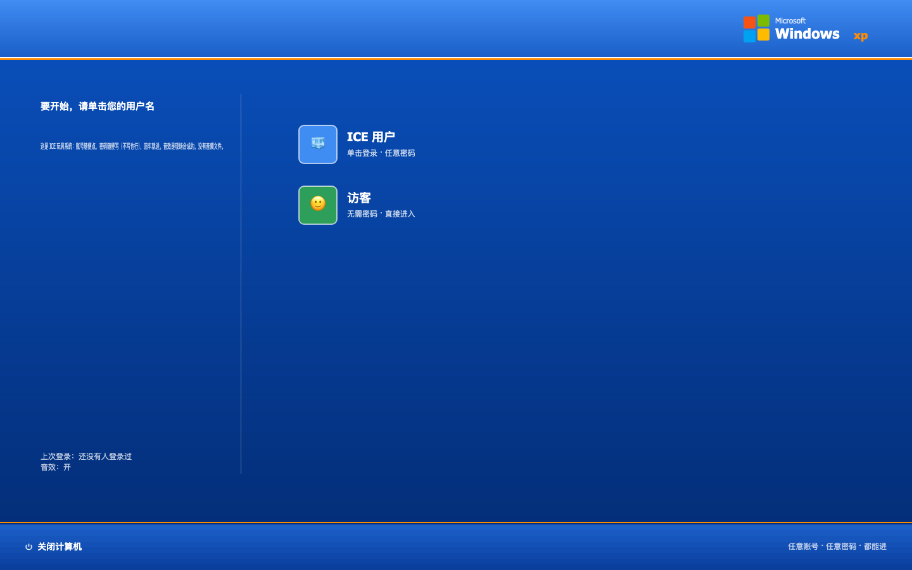 | 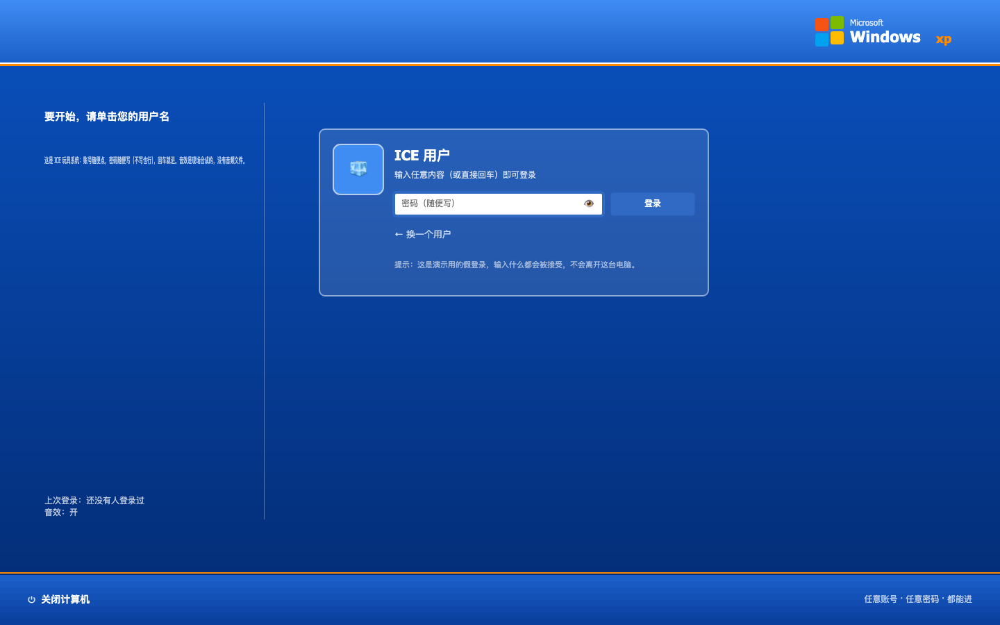 |

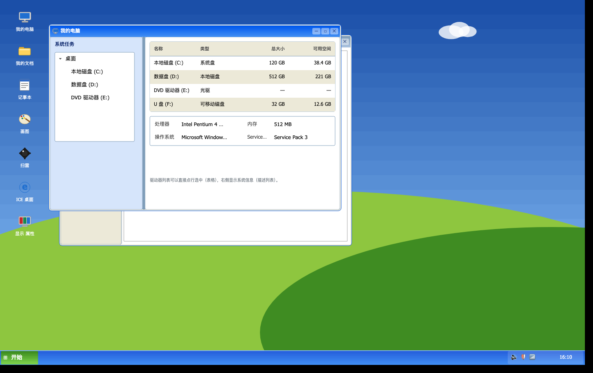

Windows 里的「IE」是真会抓网页的（下图是它 `fetch()` 本目录 `gallery.html` 后的渲染结果）：

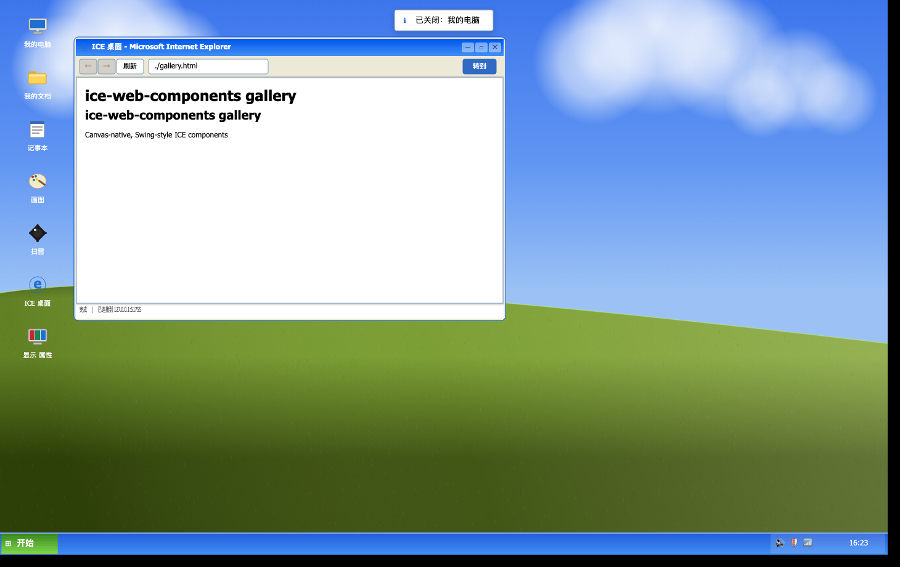

**为此新添的两个通用组件**：

| 组件 | 作用 |
|---|---|
| `ICEWindow` | 通用窗口外壳：标题栏（XP Luna 渐变，激活/非激活两套配色）+ 最小化/最大化/关闭 + 可拖动 + 右下角缩放 + 客户端内容区；`bounds` 限制拖动与最大化范围，`activate()` 广播事件给外部窗口管理器抬 zIndex |
| `ICEIconTile` | 图标磁贴：大图标字形 + 文字标签；单击选中（蓝底白字）、双击打开、Enter/Space 等价 |

**七个应用**（都在 `examples/windows-xp.html` 里，可直接抄）：

| 应用 | 用到的东西 |
|---|---|
| 我的电脑 | `ICESplitter` 双栏 + `ICETree` 文件夹树 + `ICETable` 驱动器列表 + `ICEDescriptions` 系统信息 |
| 我的文档 | `ICETable` + 分页（`pagination`）+ 工具栏按钮 |
| 记事本 | `ICETextArea` + 下拉菜单（`attachDropdown`）+ 状态栏 |
| 画图 | 页面内自定义的 `XPaintCanvas`（继承 `ICEWidget`，用引擎 `ICEPolyLine` 记录每一笔）+ 色板 + `ICESlider` 笔刷粗细 |
| 扫雷 | `ICEMinesweeperModel`（纯逻辑模型）+ 自绘格子：初级/中级/高级、首点安全、洪水填充、右键插旗（🚩/❓ 循环）、双击数字 chord、LED 计数、计时、笑脸重开、最佳成绩 |
| Internet Explorer | **真的会 `fetch()` 网页**：地址栏 + ←/→/刷新 + `DOMParser` 解析 HTML，再把标题/段落/链接/图片用 `ICETypography`、`ICEImageView` 画出来；抓不到时给 XP 风格错误页 |
| 显示 属性 | `ICERadioGroup` 选壁纸 + 预览块 + 应用/取消（应用后立即重绘桌面） |

**外壳交互**：任务栏（开始按钮 / 任务按钮 / 托盘时钟，时钟每秒走）、开始菜单（`ICEOverlayManager`
定位在开始按钮上方，点外关闭）、窗口焦点（点谁谁的标题栏变蓝、其余变灰）、最小化到任务栏、
双击桌面图标打开程序、点桌面空白取消图标选中。

### 第八个应用：ICE Arcade（掌机进窗口）

桌面/开始菜单里多了一个 **ICE Arcade**：它就是 `arcade.html` 那台掌机，跑在 `ICEWindow` 里。
两块卡带都复用**同一套纯逻辑模型**和**同一个 `ICETileMap`** —— 所以窗口里的棋盘依旧只有
**1 个节点**（`childNodes.length === 0`），换卡带照样 `fadeIn`、消行照样 `pulse`。

两个接进 XP 体系时必须处理的点，写在这里方便照抄：

* **键盘归属**：XP 的键盘平时归焦点管理器（Tab / Enter / Esc）。Arcade 窗口激活时
  （`activeKey === 'arcade'`）才把方向键/空格/WASD 转给游戏，窗口一失活或最小化就完全不拦；
* **生命周期**：应用可以声明 `onClosed`，`closeWindow()` 会回调它 —— 掌机用它停掉自己那个
  60ms 的步进定时器（否则关掉窗口后定时器还在后台跑）；
* **图标**：`xpIcon('arcade', size)` 多了掌机一档（自绘：机身 + 屏幕 + 十字键 + 两个按钮）。

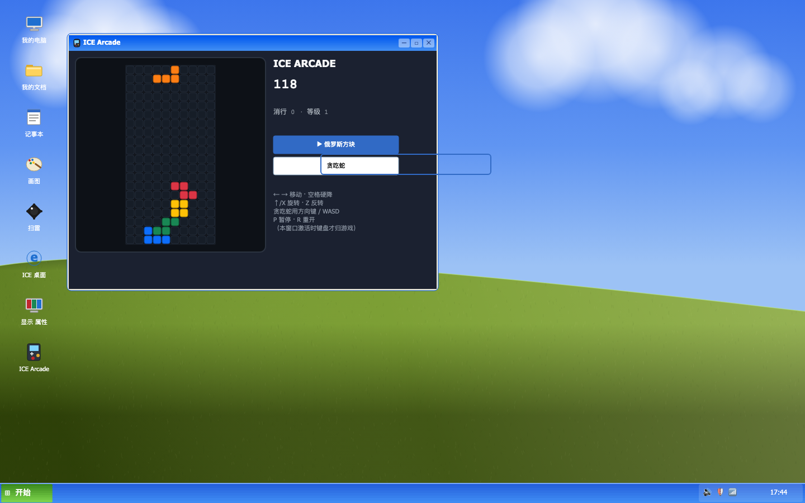

### 美化：主题、图标、Retina

- **主题**：注册并使用库内置的 `ICE_XP_THEME`（`iceUIManager.registerTheme('xp', …).setTheme('xp')`）——
  按钮/输入框/表格/单选等所有控件一次性换成 XP 经典配色，不用逐个传 `style`；
- **图标**：全部**自绘**（`examples/windows-xp.html` 里的 `xpIcon(kind, size)`：显示器、文件夹、
  记事本、调色盘、地雷、IE「e」、显示属性、开始徽标），用引擎图元拼出来 —— 离线可用、
  任意尺寸都清晰，也避开了 Windows 原版图标的版权问题（微软素材不能随仓库分发）；
- **壁纸**：Bliss 是微软的版权照片，不能打包。做法是先**量数据**——从参考图采样天空
  三段蓝（`#4680F2` → `#6095F2` → `#94BCF3`）、逐列测出山脊曲线（左 0.55 → 峰值 0.526
  → 右 0.64）、草地暗-亮-暗三段绿（`#38511C` / `#74992B` / `#364C0A`）与「光从右来」，
  再在**离屏 canvas** 上用原生线性/径向渐变 + 三次贝塞尔 + 颗粒笔触自己画一张
  （`renderWallpaper()`），以 `dpr` 分辨率生成后交给引擎的 `ICEImage` 铺满桌面。
  换壁纸 = 换一张生成图，三套预设（经典/落日/夜蓝）都是同一套代码；
- **Retina**：示例用 `ICE.init('canvas', { dpr: window.devicePixelRatio })` 初始化，
  高分屏下文字/描边不再发虚（否则 canvas 位图会被浏览器放大，看起来就是「文字变形」）。

> 这个页面也是「容器命中检测」规则的试金石：桌面根容器、任务栏、任务按钮容器、各应用的
> 布局面板全部 `interactive: false`，只有真正要响应鼠标的节点（图标、窗口、按钮、格子、画布）
> 才参与命中。第一版没这么做时，任务栏按钮点不动、扫雷格子点不动。
>
> 顺带修掉一个库级 bug：`ICETable` 在**只改宽度**（窗口缩放、分栏拖动）时不会重算列宽，
> 单元格文字会互相重叠 —— 现在宽度变化会触发整表重渲染（`tests/ICETable.resize.test.ts` 守着）。
> 同一类问题这一轮又修了三处：`ICESplitter` 构造时把调用方要的 `size` 夹取后丢掉（容器
> 后拿到真实尺寸无法恢复）、`ICEDescriptions` / `ICETimeline` / `ICEList` / `ICECollapse`
> 宽度变化不重排（值列宽度算成 0，文字直接消失）、引擎多行文本行距用了字形墨迹高（中文叠字）。
> 收尾时又抓到一条更隐蔽的：`ICEDescriptions` / `ICETimeline` 的 `__render()` **只 addChild
> 不清理**，每次重排都会把新内容叠在旧内容上（文字重影/重复）；另外描述列表的标签/值超宽
> 现在会自动截断成省略号，不再压到相邻列上。

### 扫雷：一个「游戏级」的例子

扫雷的规则有整整一套，所以逻辑单独抽成了模型 `ICEMinesweeperModel`
（在[模型 API](../api/models.md#iceminesweepermodel) 里，14 条单测覆盖全部规则），
UI 只负责把模型画出来：

```ts
import { ICEMinesweeperModel, ICE_MINESWEEPER_DIFFICULTIES } from 'ice-web-components';

const model = new ICEMinesweeperModel({ ...ICE_MINESWEEPER_DIFFICULTIES[0] });  // 初级 9×9 / 10 雷
model.addChangeListener(() => render());   // 掀开 / 插旗 / 胜负任意变化后重绘
model.reveal(row, col);                     // 左键
model.toggleFlag(row, col);                 // 右键：无 → 🚩 → ❓ → 无
model.chord(row, col);                      // 双击数字：周围旗数够就展开
setInterval(() => model.tick(), 1000);      // 计时（只有 playing 会累加）
```

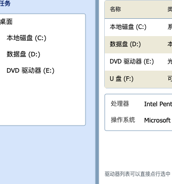

按 Windows XP 的规则：**首次点击才布雷**（排除首点及其 8 邻域，第一下永远不会炸）、
相邻雷为 0 时洪水填充、插旗循环、chord、胜负判定（胜利自动给雷插旗并记录最佳成绩）、
计时从第一次点击开始；三档难度 + 按难度分别保存最佳成绩（localStorage）。

> 右键插旗能生效，靠的是引擎侧一个修复：`ICE.init()` 原来在 canvas 上
> `preventDefault()` + `stopPropagation()` 屏蔽原生菜单，而 stopPropagation 让事件
> 到不了 `DOMEventInterceptor`，组件永远收不到 `contextmenu`。现在只 `preventDefault()`，
> 事件继续冒泡 → 组件能收到右键（ice-render 1.4.1）。

### IE：一个真的能上网的 canvas 浏览器

地址栏回车（或点「转到」）会 `fetch()` 那个 URL，用 `DOMParser` 解析 HTML，
然后把标题（`<title>`）、`h1~h3`、`p/li/blockquote`、`<a>`、`` 依次用
`ICETypography`（标题/正文自动折行、链接可点）、`ICEImageView` 渲染进 `ICEScrollPane`，
并带后退/前进/刷新与状态栏。

浏览器同源策略同样适用（这也是它和真 IE 的差别）：

- **同源页面一定行**：`./gallery.html`、`./workbench.html`、`./admin.html`、本页自身；
- **CORS 友好的站点行**，其它站点会像"没网"一样失败 → 落到 XP 风格错误页，页面上给出可点的本地示例链接；
- **必须用 http(s) 打开示例**（`npx serve .`），因为 `fetch` 在 `file://` 下不可用；
- 换句话说：能不能"真的访问"，取决于目标站点的 CORS 头，不是我们的渲染能力。

渲染范围与彩蛋：

| 网页元素 | 渲染成 |
|---|---|
| `title` / `h1~h3` / `p` / `li` / `blockquote` | `ICETypography`（标题层级、正文自动折行） |
| `a` | `ICETypography` 的 link 变体，点击即导航 |
| `img` | `ICEImageView` |
| `table` | `ICETable`（表头、斑马纹、点表头排序都是白送的） |
| `hr` | `ICESeparator` |

地址栏里输入 **`about:xp`** 有一个不联网也能看的本地页（介绍这个浏览器、并带一张
用 `ICETable` 渲染的能力表）；工具栏右侧的**收藏夹**下拉可以直接跳到几个本地示例页。

---

## `arcade.html`：ICE Arcade（小游戏合集，两块卡带）

同样是「把组件当积木」，但换了个方向：做的不是业务页面，而是一台**掌机**。
机壳、屏幕框、HUD 卡片（`ICEPanel`）/数值（`ICELabel`）/进度（`ICEProgressBar`）/按钮
（`ICEButton`）/音效开关（`ICESwitch`）全是组件，画面里没有一个位图资源。顶部是卡带位：
**俄罗斯方块**（第 1 弹）、**贪吃蛇**（第 2 弹）、**2048**（第 3 弹）都能玩，第四格「中国象棋」先占位禁用。

| 俄罗斯方块 | 贪吃蛇 |
|---|---|
| 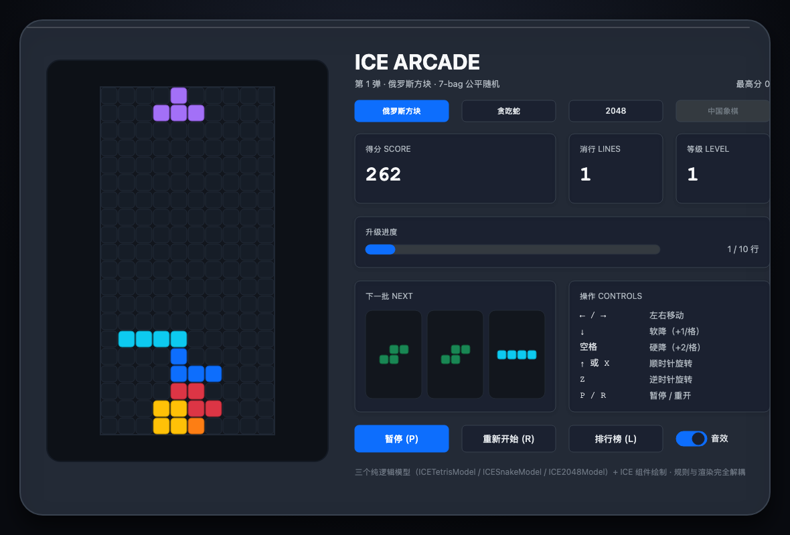 | 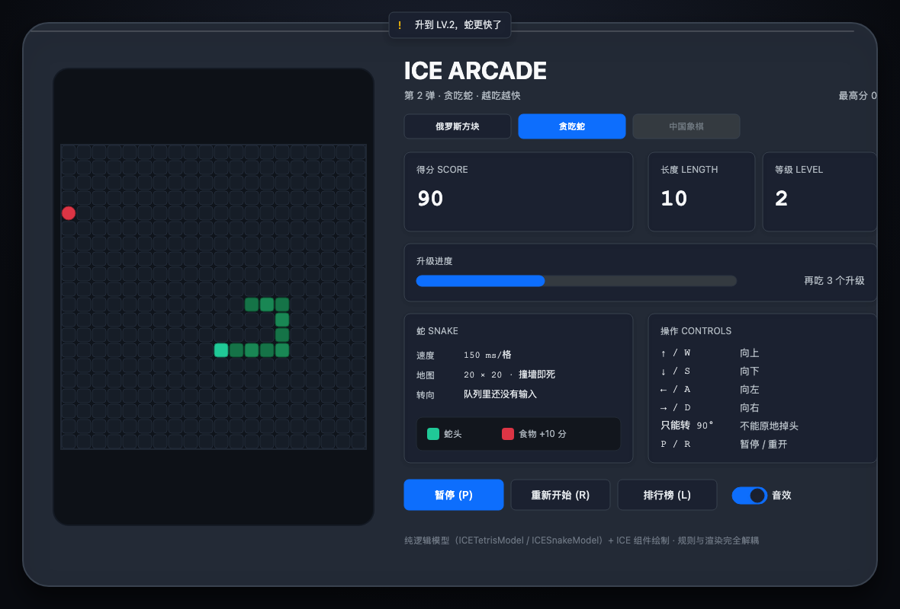 |

### 两块卡带共用一套契约

卡带写在 `GAMES` 注册表里，每块卡带的 `mount(ctx)` 返回**同一套运行时契约**：

```js
{
  model,                    // 主模型（页面负责挂 change 监听 → 重画 HUD）
  paint(),                  // 重画自己的棋盘
  hud(),                    // { score, mid, right, progress } → 三张 HUD 卡片 + 进度条
  keydown(key, repeating),  // 键盘（P 暂停 / R 重开由页面统一处理）
  frame(dt, now),           // 每帧：重力 / 步进
  setOverlay(paused, over), // 屏幕上的「已暂停 / GAME OVER」提示层
  destroy(),                // 换卡带时拆掉自己
}
```

换卡带就是「销毁旧的 → 清空屏幕与侧栏 → 建新的 → 重挂监听 → 重画 HUD」，连卡片标题
（`消行 LINES` ↔ `长度 LENGTH`）和操作说明都是卡带自己声明的。加第三块卡带只需要：
写一个可单测的模型 + 在 `GAMES` 里加一项。

### 这一页用到的引擎 / 组件能力

| 能力 | 用在哪 | 为什么值得看 |
|---|---|---|
| `ICETileMap`（自绘格子图） | 三块棋盘各是**一个**节点（2048 的数字走标签层） | 以前「一格一个 ICEWidget」= 400 个节点；现在格子在自己的 `doRender()` 里用引擎 ctx 画，数据没变就不置 dirty。QA 直接断言 `childNodes.length === 0` 且有自绘计数 |
| `registerTheme('arcade', ICE_ARCADE_THEME)` | HUD + 棋盘配色 | 方块 / 蛇 / 食物的颜色以 `ICE_ARCADE_PALETTE` 形式进 token，不再是页面里的硬编码 hex；换主题整套跟着走 |
| `tween` / `fadeIn` / `scaleIn` | 消行与吃食物脉冲、换卡带淡入、GAME OVER 弹出 | 动画走库里的 `ICEAnimation`，不再手搓衰减；`ICETileMap.pulse()` 内部就是 tween |
| `ICEHighScoreModel` | 每块卡带各一份 Top 5 | 纯逻辑（排序 / 截断 / 并列 / 存档容错 / 注入 storage），有单测；页面只负责展示 |
| `ICEModal` + `ICETable` + `ICEScrollPane` | 「排行榜 (L)」 | 排行榜 = 弹窗里的表格（榜长了能滚），内容建在内容工厂里，避开 zIndex 坑 |
| `ICETileMap` 的 `cellclick` | 贪吃蛇点格子转向 | 组件内部做「组件坐标 → 格子」换算，外部只接事件 |

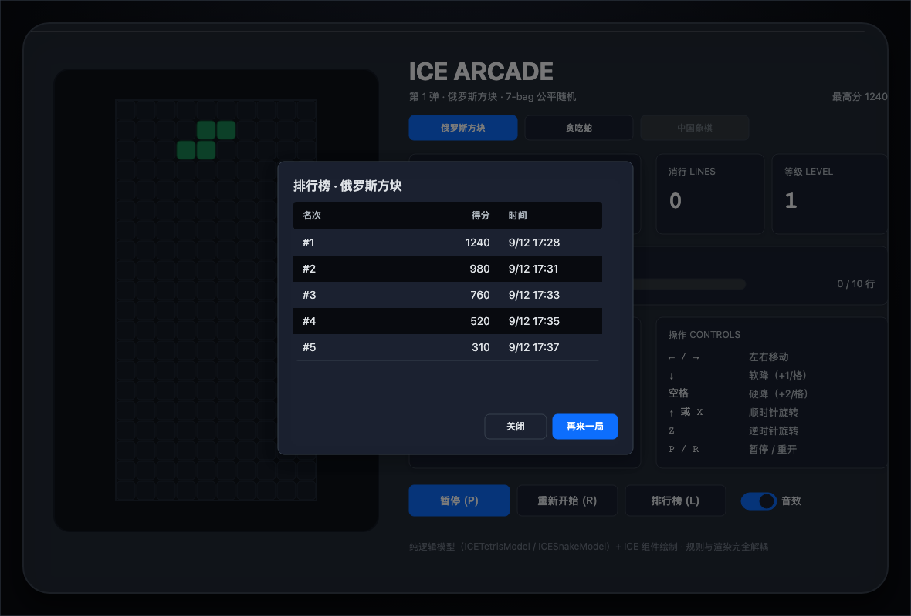

> **自绘组件的必知坑**：`super.doRender()` 会把 CTM 换成「世界 → 设备」去画调试包围盒，
> 所以在它**之后**自绘必须调 `this.applyActiveTransform()` 把本渲染通道的完整变换取回来，
> 否则画出来的东西会跑到画布左上角（这条是引擎专门为「super 之后再画」留的口子）。

> 卡带按钮的选中态不靠改属性实现：`ICEButton` 的 `variant` 是构造期定的（没有
> `setVariant`），所以切换时**重建这一行按钮**最省心 —— 反正只有三格。

### 卡带 1：俄罗斯方块

规则全部落在纯逻辑模型里（[模型 API](../api/models.md#icetetrismodel)，
16 条单测覆盖 7-bag 随机、移动与踢墙旋转、软/硬降、消行计分与升级、暂停与重置）：

```ts
import { ICETetrisModel } from 'ice-web-components';

const model = new ICETetrisModel({ rows: 20, cols: 10 });
model.addChangeListener(() => render());   // 移动 / 旋转 / 落地 / 消行任意变化后重绘
model.moveLeft();  model.moveRight();       // ← →
model.rotateCW();  model.rotateCCW();       // ↑ / Z（带 0 / ±1 / ±2 踢墙）
model.softDrop();  model.hardDrop();        // ↓（+1/格） / 空格（+2/格）
model.tick();                               // 重力：由页面按 getDropInterval() 驱动
model.pause();     model.resume();          // P
```

页面侧只做三件事：**读模型画格子**（含 `getGhost()` 幽灵落点）、**按等级间隔调 `tick()`**、
**把键盘事件翻译成模型调用**。几个实现上的取舍写在这里，方便照抄：

* **不启动 `ICEFocusManager`**：它用 Enter/Space 激活「有焦点的按钮」，会和空格硬降打架。
  游戏页把键盘完全留给自己，鼠标 hover 仍然由 `ICEHoverManager` 接管；
* **换方块时把重力计时归零**：否则新方块可能「一出生就掉一格」（这条是 QA 抓出来的，
  见[测试](./testing.md)）；
* **只对变化的格子 `setState`**：200 个格子上缓存一个「填充/描边」签名，签名没变就跳过，
  移动方块时每帧只碰几个节点；
* **消行闪屏**用棋盘上方一层半透明遮罩 + 帧循环里的衰减值驱动，`ICE_TETRIS_LINE_SCORES`
  给连消提示用（四行消除弹 TETRIS 提示）。

### 卡带 2：贪吃蛇

第二个模型 `ICESnakeModel`（[模型 API](../api/models.md#icesnakemodel)，18 条单测）：

```ts
import { ICESnakeModel } from 'ice-web-components';

const model = new ICESnakeModel({ rows: 20, cols: 20 });
model.setDirection('up');     // 可以排队两个转向；180° 掉头会被拒绝
model.tick();                 // 前进一步：吃食物长身子，撞墙 / 撞自己就结束
model.getTickInterval();      // 170ms 起、每级变快，下限 70ms
model.getBody();              // [[row, col], …]，头在最前；getFood() 给食物坐标
```

几个「不写出来就会踩」的规则细节，都在模型里测过：

* **不能 180° 掉头**：转向先入队（最多两个），一步一步兑现，避免一键急转弯；
* **撞到「正在移开的尾巴」不算死** —— 不吃食物时尾巴这一步就腾出来了；
* **食物永远不落在蛇身上**：从所有空格里挑，挑不到（棋盘填满）算通关；
* 想换玩法的话，`wrap: true` 就是穿墙模式（测试里也覆盖了）。

### 卡带 3：2048

第三个模型 `ICE2048Model`（[模型 API](../api/models.md#ice2048model)，19 条单测）：

```ts
import { ICE2048Model } from 'ice-web-components';

const model = new ICE2048Model({ rows: 4, cols: 4 });
model.move('left');            // 推得动才返回 true：计一步 + 生成新块，推不动什么都不变
model.getCells();              // 一维盘面（行优先），空格是 null；getBestTile() 给最大块
model.getScore();              // 合并得分 = 合并出来的值
model.pause(); model.resume(); // 和其它卡带共用同一套暂停契约
```

2048 的规则坑都写进用例了：

* **同一次移动里每个块最多合并一次**：`2,2,2,2` 往左是 `4,4`（不是 `8`），`2,2,4` 往左是 `4,4`；
* **推不动的那一下不算一步、不生成新块**：四个方向都试，全是 `false` 才算结束；
* 合并出目标（默认 2048）即 `isWon()`，但**不结束**，可以继续冲高分；
* 生成新块的 4 的概率、位置都由注入的 `random` 决定，测试可复现。

数字怎么画？`ICETileMap` 的**标签层**：`setLabels()` 和 `setTiles()` 一一对应，
调色板里的格子样式带 `fontSize` / `fontWeight` / `textColor` —— 所以「4×4 的棋盘 + 16 个数字」
依旧只有 **1 个节点**。这一层是这轮为 2048 加的（单测用假 ctx 记 `fillText` 的坐标与字体）。

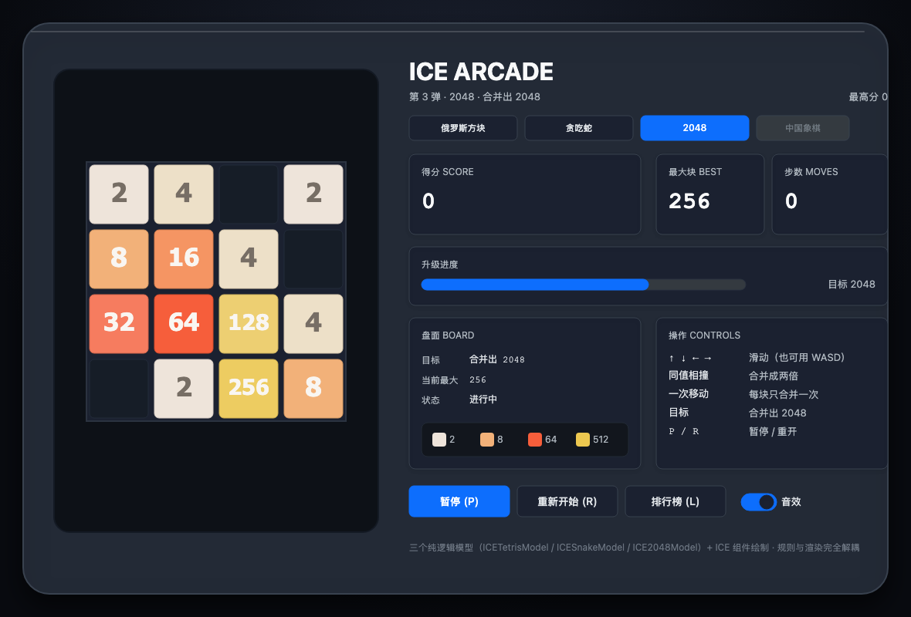

> 顺手修的一个真实 UX 问题：`ICEMessage` 默认是**堆叠**的，掌机连着弹三四个提示就会盖住
> 下面的卡带行 —— QA 里「点卡带」真的被气泡吃掉了。现在掌机只保留**一条状态线**
> （新提示先关掉上一条），既能看清又不挡操作。

> **自绘组件的第二个必知坑（写 2048 时踩到的）**：内部状态变了，只置组件自己的 `dirty` 是
> **不够**的 —— 引擎渲染循环看的是 `ice.dirty`（`CanvasRenderer.frameEvtHandler` 里
> `if (this.ice.dirty)` 才排队），组件的 `dirty` 只决定「这一趟要不要重画我」。所以 `pulse()`
> 的 tween 每帧回调如果只置自己的 dirty，画面根本不会更新：白色脉冲会**卡在格子上**，
> 直到别的原因触发一次重绘（表现成「小方块外层的盒子一直在动/不动」）。
> 现在 `ICETileMap` 所有内部改动都走 `requestPaint()`（组件 + ice 双置脏），单测用假 ICE
> 守住这条，QA 也加了「脉冲必须亮起 → 淡出」的断言。

---

## 照着做一个新场景的清单

1. **先定场景，再选组件**：把业务动作列成表（谁在什么界面做什么），再往里填组件 ——
   `admin.html` 的六个页面就是这么拆出来的；
2. **外壳先搭**：顶栏/侧边栏/内容区用的 `ICEPanel` 要**先创建**，内容晚于它创建
   （引擎按创建顺序定 zIndex，反了会被底色盖住，见[画布内布局](./layout.md#zindex-与创建顺序最常见的坑)）；
3. **内容区用 `ICEScrollPane`**：页面比视口高时的标准做法，顺便能挂 `ICEBackTop`；
4. **纯布局容器一律 `interactive: false`**：否则它会挡住内部控件的命中检测
   （`ICEFormItem` / `ICESpace` / `ICEGrid` / `ICESplitter` 都是这么处理的）；
5. **弹层走 `ICEOverlayManager`**，别自己算定位（见[浮层指南](./overlays.md)）；
6. **给关键交互配 QA**：在 `scripts/qa-*.mjs` 里加断言，`npm run qa:xxx` 会真开浏览器点一遍。
