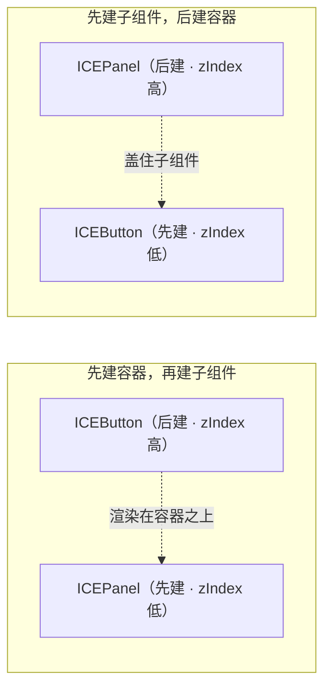
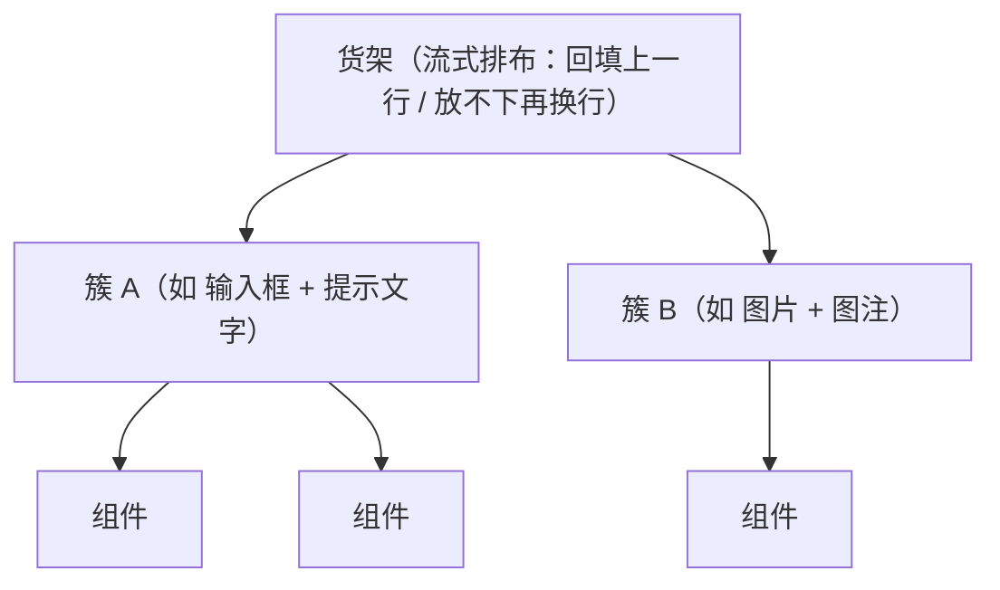

# 画布内布局

## 一、坐标从哪来

组件的 `left` / `top` 是**相对父容器**的偏移，`state.width/height` 是自己的盒子。
渲染与命中都按这个盒子来，所以“位置算错”通常就是盒子算错。

引擎提供两种现成的排布方式：

```ts
import { ICEFlowLayout, ICEBoxLayout } from 'ice-render';   // 属于引擎，不在本库导出

panel.setLayout(new ICEFlowLayout({ gap: 8, align: 'left' }));              // 流式（可换行）
panel.setLayout(new ICEBoxLayout({ axis: 'y', gap: 12, align: 'stretch' })); // 盒式（交叉轴拉满）
```

引擎侧本轮补上的两项能力（2026-09-15）：

* `ICEBoxLayout.align`：`start`（默认）/ `center` / `end` / **`stretch`**（交叉轴撑满，
  就是 Swing BoxLayout 的默认口径）；
* `ICEFlowLayout.crossAlign`：行内交叉轴对齐（一行里矮的项居中/贴底）；
  它的 `getPreferredSize()` 也按 Swing `preferredLayoutSize` 口径**计入换行**。

本库的**容器型组件**里，这三个把排列交给了引擎布局器（自己只保留组件级策略）：

| 组件 | 用的布局 | 组件自己保留的策略 |
|---|---|---|
| `ICELayout`（顶栏/侧栏/内容/页脚） | `ICEBorderLayout`（north / west\|east / center / south） | 区高/区宽声明；侧栏收起 = `display:false` |
| `ICEForm` | `ICEBoxLayout({ axis: 'y', align: 'stretch' })` | 高度 = 内容高度 |
| `ICESpace` | 横向 → `ICEBoxLayout`；换行 → `ICEFlowLayout`；纵向 → `ICEBoxLayout` | 没给宽/高的那一轴按内容自适应 |
| `ICESegmented` | `block` → `ICEGridLayout({ cellSizing: 'equal' })`；否则 `ICEBoxLayout(axis x)` | 段宽（非 block 时按文字估算）；内缩由 `padding` 承担 |

其余三个**组件级**排布工具仍是各自的语义（引擎布局器没有对应能力）：

```ts
// 1) 间距容器：横/纵排列 + 交叉轴对齐 + 换行，尺寸按内容自适应（内部走引擎布局器）
const space = new ICESpace({ direction: 'horizontal', size: 8, align: 'center' });
space.addItem(saveButton).addItem(cancelButton).addItem(tag);

// 2) 24 栅格：一行放不下 24 格自动换行，gutter 计在列之间（需要跨列的分数列宽，引擎 GridLayout 表达不了）
const grid = new ICEGrid({ width: 480, gutter: 16 });
grid.addCol(new ICEGridCol({ span: 12, content: leftCard }));
grid.addCol(new ICEGridCol({ span: 12, content: rightCard }));

// 3) 分栏：可拖的分隔条，size 是第一栏像素宽，min 夹取（尺寸由拖拽驱动，不是布局算出来的）
const splitter = new ICESplitter({ width: 900, height: 460, size: 300, first: queue, second: detail });
```

选型建议：**同一行/列的等距排列用 `ICESpace`**；**页面骨架（12/12、8/8/8）用 `ICEGrid`**；
**两块内容要手动分配空间用 `ICESplitter`**；整页外壳用 `ICELayout`；表单纵向堆叠用 `ICEForm`。
要自己拼版式时直接用引擎的 `ICEFlowLayout` / `ICEBoxLayout` / `ICEBorderLayout`（它们直接写子节点的 left/top）。

> ⚠️ 这三个都是**纯布局容器**，构造时 `interactive: false`。自己写布局容器时也要这样：
> 容器如果晚于内部控件创建（zIndex 更高）又参与命中，会把内部控件的点击整个吃掉
> （输入框点不进去、焦点环不出现）。

### 引擎布局不继承（2026-09-15 起，对齐 Swing）

给容器 `setLayout()` 只影响**它自己怎么摆子项**，不会把策略传给子容器 —— 对齐 Java Swing 的
`Container.setLayout()`（父布局只给子容器摆位置，子容器用自己的策略排自己的子项）。两条推论：

* 子容器要自动排布，**自己** `setLayout(...)`；不设就保持手摆坐标（本库多数组件就是这样）。
* 给面板挂布局**不会**再穿透组件内部。引擎 2.7 及以前会把策略递归灌给所有后代容器，而本库每个
  组件都是 `ICEGroup` 子类、内部零件（按钮文字、输入框前后缀 / 清除按钮）都在同一个 `childNodes` 里，
  于是一次 `setLayout()` 等于把整个界面的内部零件重摆一遍（实测输入框的文本 `12 → 0`、
  清除按钮 `(170,6) → (316,0)`）。回归用例见 `tests/engineLayout.integration.test.ts`。

尺寸协商也走引擎的 Swing 口径：布局问子项的 `getPreferredSize()`；容器**没显式声明**首选尺寸时
报布局算出的内容尺寸，声明过 `setPreferredSize([w, h])` 就报声明值。**构造期给的 `width/height`
只算边界**（Swing 的 `setBounds`），要让父布局按你给的尺寸留位请用 `setPreferredSize()`。

### 组件的内部装饰走 painter，不进 `childNodes`

「给组件挂布局」能不能安心的另一半，取决于组件的 `childNodes` 里装了什么：

* **装内容**（调用方传进来的节点、自己的子控件）→ 正确，布局就该排它们；
* **装装饰**（组件自己画的造型）→ 布局会把装饰也当成内容排一遍。

装饰一律交给 `painter`（Swing 的 `ComponentUI` 位，见
[写一个自己的组件](./custom-components.md#内部装饰不要做成子节点用-painter)）：
`ICEAvatar` 的圆底与首字、`ICESkeleton` 的占位条已经迁过去，它们的 `childNodes` 现在是空的，
怎么挂布局都不会碰到装饰。

## 二、zIndex 与创建顺序（最常见的坑）

引擎按 `zIndex` **全局**排序渲染，而 `zIndex` 默认取**创建顺序**。所以：

* 正确顺序：**先建容器，再建子组件**；
* 反例：`new ICEPanel()` 之前先 `new ICEButton()`（比如把按钮当参数传进面板），
  按钮的 zIndex 更低 → 被面板底色整块盖住，表现为「组件不见了」。

两种创建顺序的渲染结果（创建顺序即 zIndex：先建者低、后建者高）如下：



确实需要「先有子组件」的场景（调用方传入的节点、轮播幻灯片、卡片 `extra`、弹窗内容），
做法是把**整棵子树统一抬到容器之上**：

```ts
const raise = (node: any, z: number) => {
  if (!node || !node.state) return;
  node.state.zIndex = z;
  (node.childNodes || []).forEach((child: any) => raise(child, z));
};
raise(callerProvidedNode, (Number(panel.state.zIndex) || 0) + 1);
```

> 用**同一个值**是有讲究的：同 zIndex 内按树的“先父后子”顺序绘制；逐个分配不同值反而会把子节点压到父节点下面。

## 三、示例页里的“簇 + 货架”流式布局

两个示例页都用了一段手写布局（约 60 行），思路是把页面拆成 **cluster**：

* cluster = 一组「必须贴在一起」的组件（「输入框 + 它的提示文字」「图片 + 图注」）；
* cluster **内部保持相对位置**（作者按局部坐标写，整体平移）；
* cluster 之间按“货架”排：优先回填到还放得下的上一行，放不下才换行，行内可顶对齐或垂直居中；
* 度量一个 cluster 的包围盒时**要含后代**（如 Spin 右侧的 tip 文字），
  但遇到 `clipChildren` 容器就以它自身为界（否则轮播里排在屏外的幻灯片会把宽度撑爆）。

结构关系如下：



```js
// examples/gallery.html / admin.html 里的 flowSections()：可直接抄
flow(node, [
  { title: '筛选', items: [segmented, keywordField, searchButton] },   // 每个 item 一个簇
  { title: '订单列表', items: [table, pagination] },
]);
```

两个实践细节：

1. 宽度比较留 **2~3px 容差**：文字实测宽度常比标称宽零点几像素，恰好铺满时会莫名换行；
2. 内容会变的组件（时间轴、描述列表）首帧后才算出高度 —— 布局函数写成**幂等**的，
   首帧渲染后再跑一次即可（示例页用 `requestAnimationFrame` 跑第二遍）。

## 四、裁剪与滚动

`ICEScrollPane` 是画布里的滚动视口：内容超出视口的部分靠引擎的 `clipChildren` 裁掉，
滚出去的子组件也命不中。

```ts
const pane = new ICEScrollPane({ width: 300, height: 120, scrollbar: true });
pane.setContent(contentNode);                 // 内容尺寸自动跟随该节点
pane.setScroll(0, 40); pane.scrollBy(0, 20);  // 程序式滚动（滚轮也支持）
```

需要「浮层/预览被容器裁掉」的效果，直接给容器 `clipChildren: true` 也行
（`ICEImageView` 的 cover 裁剪就是这么做的）。

## 五、尺寸什么时候才准

* 组件在**构造结束**时就应该有正确的 `state.width/height`（本库的约定）；
* 例外是要靠 ctx 量文本的（`ICETable` 的单元格对齐、`ICELabel` 未显式给宽时），
  它们会在首次渲染后再校正一次；
* 因此在“构造后立刻测量”的场景（流式布局、截图脚本），最好在**首帧之后**再量一遍。
