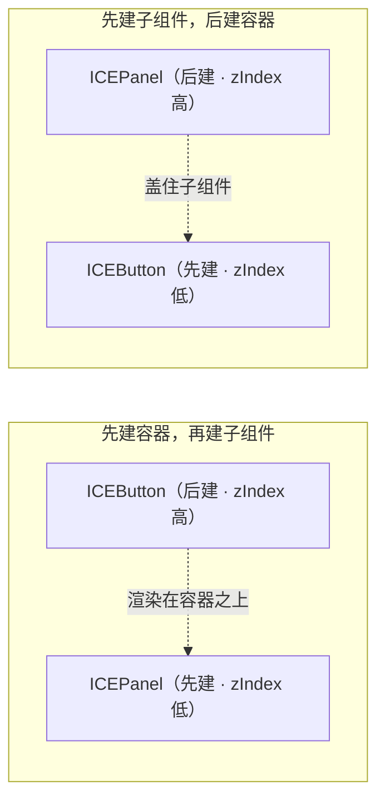
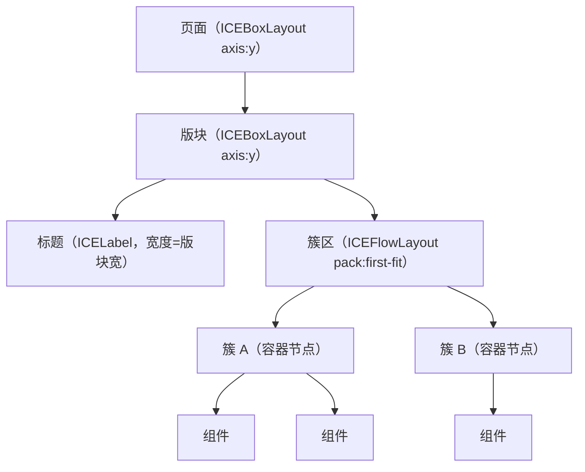

# 画布内布局

## 一、坐标从哪来

组件的 `left` / `top` 是**相对父容器**的偏移，`state.width/height` 是自己的盒子。
渲染与命中都按这个盒子来，所以“位置算错”通常就是盒子算错。

引擎提供两种现成的排布方式：

```ts
import { ICEFlowLayout, ICEBoxLayout } from 'ice-render';   // 属于引擎，不在本库导出

panel.setLayout(new ICEFlowLayout({ gap: 8, align: 'left' }));              // 流式（可换行）
panel.setLayout(new ICEBoxLayout({ axis: 'y', gap: 12, align: 'stretch' })); // 盒式（交叉轴拉满）
```

引擎侧本轮补上的两项能力（2026-09-15）：

* `ICEBoxLayout.align`：`start`（默认）/ `center` / `end` / **`stretch`**（交叉轴撑满，
  就是 Swing BoxLayout 的默认口径）；
* `ICEFlowLayout.crossAlign`：行内交叉轴对齐（一行里矮的项居中/贴底）；
  它的 `getPreferredSize()` 也按 Swing `preferredLayoutSize` 口径**计入换行**。

本库的**容器型组件**里，这三个把排列交给了引擎布局器（自己只保留组件级策略）：

| 组件 | 用的布局 | 组件自己保留的策略 |
|---|---|---|
| `ICELayout`（顶栏/侧栏/内容/页脚） | `ICEBorderLayout`（north / west\|east / center / south） | 区高/区宽声明；侧栏收起 = `display:false` |
| `ICEForm` | `ICEBoxLayout({ axis: 'y', align: 'stretch' })` | 高度 = 内容高度 |
| `ICESpace` | 横向 → `ICEBoxLayout`；换行 → `ICEFlowLayout`；纵向 → `ICEBoxLayout` | 没给宽/高的那一轴按内容自适应 |
| `ICESegmented` | `block` → `ICEGridLayout({ cellSizing: 'equal' })`；否则 `ICEBoxLayout(axis x)` | 段宽（非 block 时按文字估算）；内缩由 `padding` 承担 |
| `ICEScrollPane` | 自持 `ICEScrollPaneLayout`（Swing `ScrollPaneLayout` 位） | 内容多大 / 能不能滚 / 滚动条显不显示 |
| `ICETabs` | 自持 `ICETabsLayout`（Swing `JTabbedPane` 位） | 页签有哪些 / 要不要溢出 / 滚到哪 |
| `ICEPagination` | `ICEBoxLayout(axis x)` | 页码窗口、高度（含 8px 下边距） |
| `ICEFormItem`（复合叶子） | 自持 `ICEFormItemLayout` | 形态（水平/垂直）、标签宽、行高与间距 |

⚠️ **`stretch` 拉的是"子项"，不是"子项里的控件"**（2026-09-18 补）：`ICEForm` 的
`stretch` 把每个 `ICEFormItem` 撑到表单宽度，但控件的位置与尺寸由 `ICEFormItem`
按 `control.state.width` 摆（缺省 200）—— 父布局只摆位置、不缩放子组件（引擎的既有契约，
与 Swing 的 `Container.setLayout` 一致）。所以只写 `stretch` 时，同一张表单里的控件
宽度仍会各不相同（`ICETextField` 200 / `ICEInputNumber` 140 / `ICEButton` 112），
症状是"画出来了、但右边空掉一大截"，**不报错**。
要让控件跟着容器变宽，显式给控件宽度，或在宿主层于容器尺寸变化时整棵树重新对齐
（`ice-web-components-dsl` 的 `setWidth()` 就是这个角色，见其 README §8.1）。

其余三个**组件级**排布工具仍是各自的语义（引擎布局器没有对应能力）：

```ts
// 1) 间距容器：横/纵排列 + 交叉轴对齐 + 换行，尺寸按内容自适应（内部走引擎布局器）
const space = new ICESpace({ direction: 'horizontal', size: 8, align: 'center' });
space.addItem(saveButton).addItem(cancelButton).addItem(tag);

// 2) 24 栅格：一行放不下 24 格自动换行，gutter 计在列之间（需要跨列的分数列宽，引擎 GridLayout 表达不了）
const grid = new ICEGrid({ width: 480, gutter: 16 });
grid.addCol(new ICEGridCol({ span: 12, content: leftCard }));
grid.addCol(new ICEGridCol({ span: 12, content: rightCard }));

// 3) 分栏：可拖的分隔条，size 是第一栏像素宽，min 夹取（尺寸由拖拽驱动，不是布局算出来的）
const splitter = new ICESplitter({ width: 900, height: 460, size: 300, first: queue, second: detail });
```

选型建议：**同一行/列的等距排列用 `ICESpace`**；**页面骨架（12/12、8/8/8）用 `ICEGrid`**；
**两块内容要手动分配空间用 `ICESplitter`**；整页外壳用 `ICELayout`；表单纵向堆叠用 `ICEForm`。
要自己拼版式时直接用引擎的 `ICEFlowLayout` / `ICEBoxLayout` / `ICEBorderLayout`（它们直接写子节点的 left/top）。

> ⚠️ 这三个都是**纯布局容器**，构造时 `interactive: false`。自己写布局容器时也要这样：
> 容器如果晚于内部控件创建（zIndex 更高）又参与命中，会把内部控件的点击整个吃掉
> （输入框点不进去、焦点环不出现）。

### 引擎布局不继承（2026-09-15 起，对齐 Swing）

给容器 `setLayout()` 只影响**它自己怎么摆子项**，不会把策略传给子容器 —— 对齐 Java Swing 的
`Container.setLayout()`（父布局只给子容器摆位置，子容器用自己的策略排自己的子项）。两条推论：

* 子容器要自动排布，**自己** `setLayout(...)`；不设就保持手摆坐标（本库多数组件就是这样）。
* 给面板挂布局**不会**再穿透组件内部。引擎 2.7 及以前会把策略递归灌给所有后代容器，而本库每个
  组件都是 `ICEGroup` 子类、内部零件（按钮文字、输入框前后缀 / 清除按钮）都在同一个 `childNodes` 里，
  于是一次 `setLayout()` 等于把整个界面的内部零件重摆一遍（实测输入框的文本 `12 → 0`、
  清除按钮 `(170,6) → (316,0)`）。回归用例见 `tests/engineLayout.integration.test.ts`。

尺寸协商也走引擎的 Swing 口径：布局问子项的 `getPreferredSize()`；容器**没显式声明**首选尺寸时
报布局算出的内容尺寸，声明过 `setPreferredSize([w, h])` 就报声明值。**构造期给的 `width/height`
只算边界**（Swing 的 `setBounds`），要让父布局按你给的尺寸留位请用 `setPreferredSize()`。

### 组件的内部装饰走 painter，不进 `childNodes`

「给组件挂布局」能不能安心的另一半，取决于组件的 `childNodes` 里装了什么：

* **装内容**（调用方传进来的节点、自己的子控件）→ 正确，布局就该排它们；
* **装装饰**（组件自己画的造型）→ 布局会把装饰也当成内容排一遍。

装饰一律交给 `painter`（Swing 的 `ComponentUI` 位，见
[写一个自己的组件](./custom-components.md#内部装饰不要做成子节点用-painter)）：
`ICEAvatar` 的圆底与首字、`ICESkeleton` 的占位条已经迁过去，它们的 `childNodes` 现在是空的，
怎么挂布局都不会碰到装饰。

## 二、zIndex 与创建顺序（最常见的坑）

引擎按 `zIndex` **全局**排序渲染，而 `zIndex` 默认取**创建顺序**。所以：

* 正确顺序：**先建容器，再建子组件**；
* 反例：`new ICEPanel()` 之前先 `new ICEButton()`（比如把按钮当参数传进面板），
  按钮的 zIndex 更低 → 被面板底色整块盖住，表现为「组件不见了」。

两种创建顺序的渲染结果（创建顺序即 zIndex：先建者低、后建者高）如下：



确实需要「先有子组件」的场景（调用方传入的节点、轮播幻灯片、卡片 `extra`、弹窗内容），
做法是把**整棵子树统一抬到容器之上**：

```ts
const raise = (node: any, z: number) => {
  if (!node || !node.state) return;
  node.state.zIndex = z;
  (node.childNodes || []).forEach((child: any) => raise(child, z));
};
raise(callerProvidedNode, (Number(panel.state.zIndex) || 0) + 1);
```

> 用**同一个值**是有讲究的：同 zIndex 内按树的“先父后子”顺序绘制；逐个分配不同值反而会把子节点压到父节点下面。

## 三、“簇 + 货架”流式布局（引擎布局器版）

示例页（`gallery.html` / `admin.html`）用的还是**簇 + 货架**这个思路，但**排布已经交给引擎的布局器**
（2026-09-15 起，此前是两页各约 100 行手写代码）：

* **簇（cluster）**= 一组「必须贴在一起」的组件（「输入框 + 它的提示文字」「图片 + 图注」）。
  做法是把它建成**一个真正的容器节点**（`ICEWidget`，`fill:false / stroke:false / interactive:false`），
  成员按局部坐标放进去 —— 只有这样布局器才会把整簇当成**一个子项**（引擎排的是子节点，不是数组）。
* **货架**= `ICEFlowLayout({ pack: 'first-fit', crossAlign, gap, gapY })`：
  从左到右排，放不下换行；`first-fit` 会**优先回填到还放得下的上一行**（把零碎小簇塞回上一行，
  页面不容易被撑高）；`crossAlign` 决定行内高矮不一的簇怎么对齐（`start` 顶对齐 / `center` 垂直居中）；
  `gap` 是列间距、`gapY` 独立控制行间距。

## 四、手写布局的审计口径（2026-09-15 第二轮）

第三轮之前的口径是"**能交给布局器就交给布局器**"，第二轮反过来逐个复核：**每一处手写 `left/top`
到底该不该手写**。结论是四类，判据是**语义**而不是"用没用布局器"：

| 口径 | 判据 | 处理 |
|---|---|---|
| **engine** | 排布本来就是"怎么排"的策略（容器型组件、自持 `ICELayoutManager` 子类） | 必须交给布局器 |
| **canvas** | 几何**是内容**：行号 × 行高再叠滚动偏移、按日期算格子、按当前页平移轨道、背景平铺 | **保留手写**（位置要能反查命中，迁成布局反而多一层映射） |
| **anatomy** | 固定构件的解剖几何（标题栏色带、头像叠放、多行文本行盒），与子项数量无关 | **保留手写** |
| **derived** | **派生排列仍手写**：N 个子项等距/网格排，位置随数据变化 | **待迁**（登记在案，按收益排序） |

这张表不是文档里的散文，而是**棘轮**：`tests/layoutConvention.test.ts` 的 `COMPOUND_DECIDED`
逐个登记文件里"会自建子节点 + 按序号/游标推导位置"的类，**新组件漏做决定就红**。
同一文件里另外几条管着容器型组件（`MIGRATED` / `PENDING`）与复合叶子。

**被判成 `derived` 的那批已经全部迁完**（2026-09-15 同日第三批，共 11 个组件）：
`ICERate` / `ICEResult` / `ICEBreadcrumb` / `ICEColorPicker` / `ICEAnchor` / `ICETimeline` /
`ICEDescriptions` / `ICEFormList` / `ICEUpload` / `ICECascader` / `ICESteps`。
迁移口径是**坐标与历史手写版逐项一致**（不是"看起来差不多"），逐条钉在
`tests/derivedLayoutMigration.test.ts` 里（期望值就按历史公式算：`index × 行高`、
`padding + col × (格 + 缝)`）。

三处值得记下的手法：

* **装饰与排布分开**：`ICETimeline` 的竖线 / 圆点是"相对本行"算的，就把它们收进**行内**
  （行自己由 BoxLayout 排）—— 否则布局会把装饰当成内容再摆一遍；
* **宿主隔离**：`ICEUpload` 的上传区是固定内缩 3px 的单体构件、文件行从它下方起且行间无缝，
  两段间距不是同一个数 → 只给**文件行宿主**挂 BoxLayout，上传区保持自身坐标；
* **容器宽度是这一趟算出来的**：`ICEBreadcrumb` 的宽度自适应会改写自己的 `width`，
  而 `addChild` 已经按旧宽度排过一遍（宽度不够会折行）→ 末尾必须 `doLayout()` **立刻**再排一次，
  只调 `revalidate()`（下一帧）会先闪一帧错版。

`derived` 这个口径本身留着：以后新增组件若一时迁不动，就在棘轮里登记成 `derived：<理由>`，
它会被"改判检查"盯着（迁完必须改写成 `engine：`）。

**示例页**这一轮也按同一把尺子过了一遍：

* 改成布局器的：`pixel-editor.html`（工具列 / 快捷键列 / 状态两列表 / 动作按钮行 / 尺寸按钮行）、
  `algorithm-sandbox.html`（模式切换 / 算法列 / 数据列 / 状态表 / 回放行 / 速度行）、
  `arcade.html`（卡带行、机壳按钮行、操作说明两列表、NEXT 预览槽、侧栏「项名/值」行）、
  `windows-xp.html`（桌面图标列、开始菜单左右两列、难度行、调色板网格、卡带列、登录磁贴列）；
* 明确**保留手写**的：全部"屏幕内容"（俄罗斯方块/扫雷/CHIB-8 的棋盘与显存、画笔画布、
  迷宫格、BIOS 文本屏、任务栏时钟）—— 那些是画布几何，位置就是内容。

> ⚠️ 顺手挖出来一个真 bug：`ICEList` 的行是**画在内部内容盒上**的，而那个内容盒当时是
> `interactive: true` —— 它会**吃掉真实鼠标点击**，于是"点行选中"在真机上根本没反应
> （旧的 QA 用程序式 `getRowNode(...).trigger('click')`，正好绕开了命中路径，所以一直没暴露）。
> 已修（内容盒 `interactive: false`，与 `ICEVirtualList` 同口径），并把 QA 改成**真实鼠标**
> 点 `getRowBox(key)` 算出来的行中心。
* **版块**= 再套一层 `ICEBoxLayout({ axis: 'y', gap })`：标题一行、簇区一行；整页也是
  `ICEBoxLayout({ axis: 'y' })` 把版块纵向堆起来。

结构关系：



```js
// 版块 → 簇区 → 簇（examples/gallery.html / admin.html 同款写法）
container.setLayout(new ICE.ICEBoxLayout({ axis: 'y', gap: sectionGap }));
const sectionBox = new W.ICEWidget({ width: avail, fill: false, stroke: false, interactive: false });
sectionBox.setLayout(new ICE.ICEBoxLayout({ axis: 'y', gap: headingGap }));
sectionBox.addChild(heading(section.title), false);

const flowArea = new W.ICEWidget({ width: avail, height: 0, fill: false, stroke: false, interactive: false });
flowArea.setLayout(new ICE.ICEFlowLayout({ gap: gapX, gapY, crossAlign: 'center', pack: 'first-fit' }));
sectionBox.addChild(flowArea, false);
container.addChild(sectionBox, false);

// 每个簇 = 一个容器（成员保持局部坐标）
const cluster = new W.ICEWidget({ fill: false, stroke: false, interactive: false });
cluster.addChild(keywordField, false);
cluster.addChild(searchButton, false);
flowArea.addChild(cluster, false);
```

**只剩两件事是页面自己的**（引擎不该管）：

1. **量簇**：成员保持局部坐标，所以要算包围盒（含后代 —— 如 Spin 右侧的 tip 文字；
   遇到 `clipChildren` 容器就以它自身为界，否则轮播里排在屏外的幻灯片会把宽度撑爆），
   再把量到的尺寸写回簇容器、把成员整体平移到局部原点；
2. **尺寸协商**：`flowArea.setState({ height: flowArea.getPreferredSize()[1] })`（引擎按它当前宽度算出
   **换行后**的行高之和）→ 版块高度 = `sectionBox.getPreferredSize()[1]` → 容器高度同理。
   这比手写累加更稳：宽度变了不用改公式。

两个实践细节：

1. **容差**：`first-fit` 里内置了 0.5px 容差（文字实测宽度常比标称宽零点几像素，恰好铺满时不该换行）；
   自己写布局器时记得留同样的余量；
2. **动态文案**：内容会变的组件（时间轴、描述列表）首帧后才算出高度 —— 示例页的做法是
   `requestAnimationFrame` 跑第二遍（重排函数写成**幂等**的：只重新量簇，结构只建一次）。
   引擎自己的失效链路会在尺寸变化时重排位置，但"簇的包围盒"只有页面知道，所以量簇要重跑。

## 四、裁剪与滚动

`ICEScrollPane` 是画布里的滚动视口：内容超出视口的部分靠引擎的 `clipChildren` 裁掉，
滚出去的子组件也命不中。

```ts
const pane = new ICEScrollPane({ width: 300, height: 120, scrollbar: true });
pane.setContent(contentNode);                 // 内容尺寸自动跟随该节点
pane.setScroll(0, 40); pane.scrollBy(0, 20);  // 程序式滚动（滚轮也支持）
```

需要「浮层/预览被容器裁掉」的效果，直接给容器 `clipChildren: true` 也行
（`ICEImageView` 的 cover 裁剪就是这么做的）。

## 五、尺寸什么时候才准

* 组件在**构造结束**时就应该有正确的 `state.width/height`（本库的约定）；
* 例外是要靠 ctx 量文本的（`ICETable` 的单元格对齐、`ICELabel` 未显式给宽时），
  它们会在首次渲染后再校正一次；
* 因此在“构造后立刻测量”的场景（流式布局、截图脚本），最好在**首帧之后**再量一遍。

## 六、容器的契约（应用层基类，2026-09-17 立）

应用层写页面、写容器组件时**默认继承 `ICEContainer`**。契约如下（源码注释是入口，
这里给完整口径）。

### 继承它 = 声明三件事

1. **我能持有子节点，也能被嵌套**；
2. **我负责把子节点排到正确位置**：优先挂布局策略（`setLayout`），不挂才由调用方给绝对
   坐标（等价 Swing 的 `setLayout(null)`）；
3. **子节点坐标相对本容器的内容区**（已扣 `padding`），因此可以无限嵌套。

### 选哪条线

| 我要写的东西 | 继承 |
|---|---|
| 页面、面板、工作区、任何要 `addChild` 并负责排布的东西 | `ICEContainer` |
| 不持有子节点、也不负责排布的叶子控件（指针、状态灯…） | `ICEWidget` |

判定只需问一句：**我要不要给它 `addChild` 并负责排布？** 这也是库内那条棘轮测试
（`tests/layoutConvention.test.ts`）用的分类口径 —— 新增容器必须「挂布局」或「写清豁免
原因」二选一，忘做决定直接红。这是全部条款里**唯一真正有牙齿**的一条，其余是文档约定。

### 变化怎么通知：生命周期钩子

钩子在 `ICEWidget` 上分发，全部可选实现（鸭子类型，实现即生效）：

| 钩子 | 什么时候调 |
|---|---|
| `onMount()` / `onUnmount()` | 挂进场景后一次 / 被移出场景前一次（引擎 `AFTER_ADD` / `AFTER_REMOVE`） |
| `onShow()` / `onHide()` | **自身** `display` 翻转（对齐 Swing 的 `componentShown` / `componentHidden`；祖先隐藏不算） |
| `onResize()` | 自身宽或高变化，**包含父容器布局器摆位算出来的尺寸** |

`onUpdate(deps)` **不是**引擎回调，是应用层自己的约定：页面自己声明关心哪些值、自己调用。
库不替应用决定“什么算数据变了”。

### 这里不出现「页面」这个概念

谁挂载一个容器、什么时候让它出现，是**宿主**的决定：宿主用 `setState({ display })` 切换
可见性，容器通过 `onShow` / `onHide` 收到通知。库里没有页面类型、没有路由、没有“激活”，
这些都属于宿主策略 —— 契约定在 `ICEContainer` 上是为了让应用层有唯一入口，而不是为了把
导航语义塞进组件库。

> **应用页面怎么写**（一页一类、`onUpdate()` 由谁在什么时候调、入口决策表、验收清单）见
> [应用层：一个页面怎么写](./app-pages.md) —— 那层约定是应用侧的自律条款，写在这里容易和
> 库的能力混起来。

### 嵌套是能力，不是义务

本类支持无限嵌套，但**具体工程**可以选择扁平挂载（页面节点直接挂根、全工程一套绝对坐标）
还是逐层嵌套 —— 那是挂载方的策略，两者不冲突。

值得一提的是我们自己的选择：既有工程一律扁平挂载。原因是嵌套容器会把坐标再叠一层偏移
（踩过「卡片偏 264px、岛的洞对不上」），而画布类应用的图元本来就带一套世界坐标。这条不是
引擎限制，是我们为自己选的策略。

### 序列化

`ICEContainer` **不**覆盖 `toJSON()`：容器是结构，属于文档本身，应当被序列化。那些「几何
由形态和尺寸推导、内部零件不该进快照」的组件（`ICEMenu` / `ICETabs` / `ICEScrollPane`…）
各自返回 `null`，不必让基类承担这个语义。
