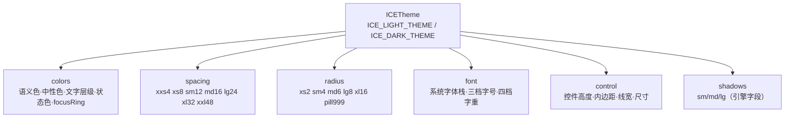
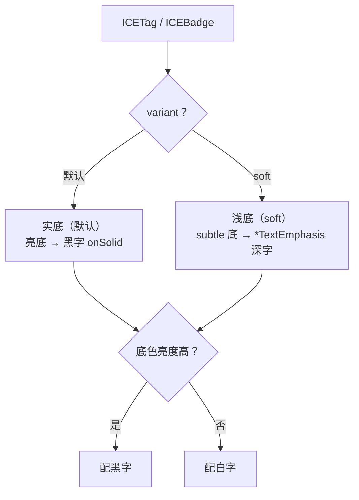

# 主题与配色

主题就是一张普通对象：`src/theme/ICETheme.ts` 里的 `ICE_LIGHT_THEME` / `ICE_DARK_THEME`。
`iceUIManager`（`ICEManager` 单例）持有“当前用哪套”，组件在**构造时**读一次。

```ts
import { iceUIManager } from 'ice-web-components';

iceUIManager.setTheme('dark');     // 'light' | 'dark'
const theme = iceUIManager.getTheme();
theme.colors.primary;              // '#0d6efd'
```

> ⚠️ 组件是**构造时**取色的：`setTheme` 之后新建的组件才会用新主题。需要热切换就重建组件树
> （示例页的做法是切页/重建；`ICEMessage`/`ICEModal` 这类每次打开都新建的组件天然跟随）。

## 一、token 分组

### 1.1 哪个底用哪一档（2026-09-17 立，改主题前先看这张表）

同一支语义色在不同底上有**不同的名字**，用错档就是"颜色不对"（而且不报错）。这张表由
`tests/theme-contrast.test.ts` 逐条钉住，**五套出厂主题（浅 / 深 / 高对比 / 街机 / XP）全部要过**：

| 我要画的东西 | 用哪个 token | 判据（WCAG 2.1） |
|---|---|---|
| 正文 | `text` | ≥ 4.5:1（对 surface / background / elevated 三种底） |
| 次级正文 | `textSecondary` | ≥ 4.5:1 |
| **链接 / 数值 / 强调标题 / ✓✕ 这类字形** | **`link`** | ≥ 4.5:1 |
| 提示语 / 占位符 / 辅助说明 | `textTertiary` | ≥ 3:1（**不承担正文**，但也别低到看不见） |
| 状态**实色底**（Alert / Tag 实底、进度条填充） | `success` / `warning` / … | 与相邻色的边界 ≥ 3:1 |
| 状态**浅底上的文字** | `successTextEmphasis` / … | ≥ 4.5:1（对各自的 `*Bg`） |
| **主色底上的文字**（按钮标签） | `primaryText` | ≥ 4.5:1 |
| 填充 / 描边（按钮底、选中框、滑块轨道、拖拽指示条） | `primary` 及状态实色 | 填充不参与文字判据 |
| 聚焦环 / 选中框 | `focusRing` | ≥ 3:1（非文本 UI 部件） |
| 描边 | `border` / `borderSecondary` | **不设阈值**：装饰性（要立"边界必须可见"的产品口径才能测） |

⚠️ **`primary` 与 `link` 是两支，别互相顶替**。`primary`（`#0d6efd`）是饱和色，当**填充**没问题；
当**文字**压在暗色 `surface` 上实测只有 **2.96:1**（连大字的 3:1 都差一点）—— `link` 就是为这件事
存在的：浅色 `#0a58ca`（6.4:1）、暗色 `#6ea8fe`（5.5:1）。这条是实测挖出来的：在 `ice-smart-water`
的深色主题里数出 **49866 个 `#0d6efd` 像素**压在深底上，逐个都是"把 primary 当文字用"的地方。

同类修正（都是这次体检抓到的，改前都不会让任何测试变红）：

- `textTertiary`：浅色 `#adb5bd`（2.07）、暗色 `#6c757d`（2.84）都不到 3:1 → `#868e96` / `#8a9199`；
- 浅色 `focusRing` 原来取 Bootstrap 的 `#86b7fe`，白底上只有 **2.06:1** —— 那是个**看不见的
  聚焦提示** → `#3d8bfd`（3.33）；
- 浅色 `textSecondary` 在**页面底**（`#f8f9fa`）上是 4.45，差 0.05 不过 AA → `#6a7178`（4.69）；
- XP 主题的链接蓝在它的米色页面底上 4.31 → `#2d61b5`（4.93）。

| 分组 | 说明 |
|---|---|
| `colors` | 语义色、中性色、文字层级、状态色的 subtle 背景/边框与强调文字色、`focusRing` |
| `spacing` | `xxs` 4 / `xs` 8 / `sm` 12 / `md` 16 / `lg` 24 / `xl` 32 / `xxl` 48 |
| `radius` | `xs` 2 / `sm` 4 / `md` 6 / `lg` 8 / `xl` 16 / `pill` 999 |
| `font` | 系统字体栈 + 三档字号 + 四档字重 |
| `control` | 控件高度（24 / 32 / 40）、内边距、线宽、开关/复选/单选/进度/滑块尺寸 |
| `shadows` | `sm` / `md` / `lg`，值是引擎认的 `{ shadowColor, shadowBlur, shadowOffsetX, shadowOffsetY }` |

token 分组归属如下：



## 二、为什么需要 `*TextEmphasis`

配色刻意偏 Bootstrap 5，而 Bootstrap 的 `warning` 是**亮黄 `#ffc107`** —— 这种颜色当文字压在浅黄底上
几乎读不出来。所以每个状态色都有两组文字色：

* `text`：状态**实色**，用在白底上（统计卡的涨跌数字、图标）；
* `*TextEmphasis`：`*-text-emphasis` 深色档，用在 subtle 浅底上（Alert 标题、Tag/Badge 文字）。

`getStatusColors(theme, status)` 会把一组都给你：

```ts
const colors = getStatusColors(theme, 'warning');
// {
//   background: '#fff3cd',  // subtle 底
//   border:     '#ffe69c',
//   text:       '#ffc107',  // 白底上用
//   strong:     '#664d03',  // 浅底上用（Alert / Tag 文字）
//   solid:      '#ffc107',  // 实底填充（.text-bg-*）
//   onSolid:    '#000000',  // 实底上的文字：亮色配黑字
// }
```

## 三、实底还是浅底

`ICETag` / `ICEBadge` 默认是 Bootstrap 的实底风格，`variant: 'soft'` 切回浅底：

```ts
new ICETag({ text: 'Paid', status: 'success' });                  // 绿底白字
new ICETag({ text: 'Paid', status: 'success', variant: 'soft' }); // 浅绿底 + 深绿字
```

实底 / 浅底 的取舍与文字配色逻辑如下：



## 四、改一套自己的主题

两套内置主题都是导出的普通对象，改字段即可（全局生效，建议在应用入口做）：

```ts
import { ICE_LIGHT_THEME } from 'ice-web-components';

ICE_LIGHT_THEME.colors.primary = '#7c3aed';
ICE_LIGHT_THEME.colors.primaryHover = '#6d28d9';
ICE_LIGHT_THEME.colors.primaryBg = '#ede9fe';
ICE_LIGHT_THEME.colors.primaryBorder = '#c4b5fd';
```

颜色值可以是任意 CSS 颜色字符串（`#rrggbb`、`rgba(...)`）。`shadows` 是引擎字段，不是 CSS 文本。

## 五、注册自定义主题（不污染内置主题）

直接改 `ICE_LIGHT_THEME` 是全局副作用；更干净的做法是**注册一套新 token** 再切过去：

```ts
import { ICE_XP_THEME, iceUIManager } from 'ice-web-components';

// 先注册 + 切主题，再创建组件（组件在构造时读一次主题）
iceUIManager.registerTheme('xp', ICE_XP_THEME).setTheme('xp');
```

- `registerTheme(name, tokens)` / `hasTheme(name)` / `getThemeNames()` 都是 `iceUIManager` 上的方法；
- `setTheme('未注册的名字')` 会被忽略（不抛异常，也不改变当前主题）；
- 库内置了 `ICE_XP_THEME`（Windows XP 经典：Luna 蓝 `#316ac5` + 米灰控件面 `#ece9d8`、
  小圆角、紧凑控件尺寸），`examples/windows-xp.html` 就是靠它整体换肤的。

> 想热切换主题就重建组件 —— 组件只在构造时读一次 token（这是刻意的：绘制阶段零 token 查表）。

## 六、焦点色

## 七、热切换（2026-09-17 起支持，不用重建组件树）

以前组件是**构造期**把 token 抄成字面量的，所以"换主题"只能重建整棵树 ——
`ice-smart-water` / `ice-agent-console` 两个应用都因此退到"存偏好 + 重新加载"。现在两条腿都通了：

```ts
import { iceUIManager, applyThemeToEngine } from 'ice-web-components';

applyThemeToEngine(ice);            // ① 把主题（含整份 UI token 树）打到引擎实例上
iceUIManager.setTheme('dark');      // ② 换主题：广播到所有登记过的实例 + 通知订阅者
// ③ 引擎标脏 → 下一帧按新色重画。**组件树没动**。
```

原理是引擎的**主题引用**（`src/theme/ICETheme.ts` ④）：样式里的 `token('ui.colors.text')` 是
**paint 时**解析的，所以换主题只要"改表 + 标脏"。库内**直接进样式槽**的 238 处已经全部改成这种写法
（真机判据：`e2e/theme-hot-switch.spec.ts` —— 同一棵组件树、画面指纹变化、颜色换成新主题那一档）。

### 7.1 三件东西各管什么

| 件 | 作用 | 谁调 |
|---|---|---|
| `applyThemeToEngine(ice)` | 把 UI token 树（`semantic.ui`）+ 语义色 + 交互外壳打进**这个引擎实例** | 应用（每个 `new ICE()` 一次）。**忘了也不要紧**：组件挂载时会按主题版本号兜底补一次 |
| `iceUIManager.setTheme(name)` | 换主题 + **广播**到所有登记过的实例 + 通知订阅者 | 应用（切主题时一次） |
| `ICEWidget.onThemeChange()` | 派生色组件的重算钩子（挂载时订阅、卸载时退订） | 组件自己（**只有算出来的颜色才需要**） |

### 7.2 什么时候还需要 `onThemeChange()`

只有**算出来的颜色**才需要 —— 它们没法写成一条引用：

```ts
class Fancy extends ICEWidget {
  protected onThemeChange(): void {
    const theme = iceUIManager.getTheme();
    // 派生色：混色 / 压暗 / 加透明度 / 按状态查表
    this.setState({ style: { ...this.state.style, fillStyle: shade(theme.colors.primary, -0.35) } });
  }
}
```

直接用 token 的地方**不要**实现它（引擎会自己重画，重复设置只是白费）。

### 7.3 迁移进度与棘轮（别让新代码走回头路）

`tests/theme-refs.test.ts` 按文件记了"构造期取色"的**预算**（当前 **354 处 / 52 个文件**，
集中在 `ICEStyle.ts`（状态色表）、`ICEMenu`、`ICEDateRangePicker`、`ICEButton` 这些派生色多的地方）：
某个文件用量涨了会红；降下来不登记也会红（棘轮只进不退）。

自己写组件时：**颜色能写成 `token('ui.colors.x')` 就写成引用** —— 那样热切换、多实例主题、
暗色适配三件事一起解决；确实要算的（`mix` / `shade` / alpha）再加 `onThemeChange()`。

`colors.focusRing`（浅色 `#86b7fe` / 深色 `#6ea8fe`）用于**焦点环**与**输入框聚焦边框** ——
浅蓝而不是主色，是 Bootstrap 的取值。
